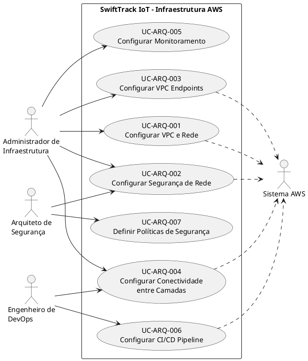

# Casos de Uso Arquequiteturais

| **Informações** |  |
| :--- | :--- |
| **Projeto** | SwiftTrack IoT - Plataforma de Telemetria e Gestão Logística |
| **Documento** | Modelo de Casos de Uso Arquiteturais |
| **Versão** | 1.0 |
| **Data** | [DD/MM/AAAA] |
| **Status** | Em Desenvolvimento |
| **Responsável** | [Nome do Grupo] |
| **Disciplina** | Projeto de Cloud |

## 1. Introdução

### 1.1. Propósito

Este documento descreve os Casos de Uso Arquiteturais para a infraestrutura em nuvem AWS da plataforma **SwiftTrack IoT**. Os casos de uso arquiteturais focam em requisitos de infraestrutura, segurança, operações e governança, diferentemente dos casos de uso funcionais que descrevem interações de usuários finais com o sistema.

### 1.2. Escopo

Os casos de uso arquiteturais abrangem a configuração, operação e manutenção da infraestrutura AWS, incluindo:

- Rede (VPC, sub-redes, rotas, endpoints)
- Segurança (Security Groups, NACLs, IAM)
- Conectividade entre camadas (ALB, EC2, RDS, Lambda)
- Integração com serviços gerenciados (DynamoDB, S3, Secrets Manager)
- Automação e deploy (CI/CD)

### 1.3. Referências

- Documento de Visão - SwiftTrack IoT (v1.0)
- Documento de Requisitos Suplementares - SwiftTrack IoT (v1.0)
- AWS Well-Architected Framework
- Amazon VPC Documentation

## 2. Visão Geral dos Casos de Uso

### 2.1. Atores

| **Ator** | **Descrição** | **Responsabilidades** |
| :--- | :--- | :--- |
| **Administrador de Infraestrutura** | Profissional responsável por configurar e gerenciar a infraestrutura AWS. | Criar VPC, sub-redes, security groups, endpoints. |
| **Engenheiro de DevOps** | Profissional responsável por automação e CI/CD. | Configurar pipelines, deploys, rollbacks. |
| **Sistema AWS** | Serviços gerenciados da AWS (DynamoDB, S3, etc.). | Prover serviços, endpoints, logs. |
| **Arquiteto de Segurança** | Profissional responsável por políticas de segurança e compliance. | Definir políticas IAM, criptografia, auditoria. |

### 2.2. Diagrama de Casos de Uso

## 3. Especificação dos Casos de Uso

**UC-ARQ-001: Configurar VPC e Rede**

| **Elemento** | **Especificação** |
| :--- | :--- |
| **Identificador** | UC-ARQ-001 |
| **Nome** | Configurar VPC e Rede SwiftTrack |
| **Versão** | 1.0 |
| **Data** | [DD/MM/AAAA] |
| **Status** | Aprovado |
| **Ator Principal** | Administrador de Infraestrutura |
| **Ator Secundário** | Sistema AWS |
| **Pré-condição** | 1. Conta AWS ativa. 2. Permissões IAM para criar VPC, sub-redes, IGW, NAT Gateway, Route Tables. |
| **Pós-condição** | 1. VPC criada com CIDR 10.0.0.0/16. 2. 4 sub-redes criadas (2 públicas, 2 privadas) em 2 AZs. 3. Internet Gateway anexado. 4. NAT Gateways configurados. 5. Route Tables configuradas. |

| **Fluxo Principal** | **Passos** |
| :--- | :--- |
| 1. | Administrador acessa o Console AWS. |
| 2. | Navega até o serviço VPC. |
| 3. | Cria VPC com CIDR 10.0.0.0/16 e habilita DNS hostnames. |
| 4. | Cria 2 sub-redes públicas (uma por AZ) com CIDR 10.0.1.0/24 e 10.0.2.0/24. |
| 5. | Cria 2 sub-redes privadas (uma por AZ) com CIDR 10.0.3.0/24 e 10.0.4.0/24. |
| 6. | Cria e anexa Internet Gateway à VPC. |
| 7. | Cria NAT Gateways (um por AZ) nas sub-redes públicas. |
| 8. | Configura Route Table pública: 10.0.0.0/16 → local, 0.0.0.0/0 → IGW. |
| 9. | Configura Route Table privada: 10.0.0.0/16 → local, 0.0.0.0/0 → NAT Gateway. |
| 10. | Associa sub-redes públicas à Route Table pública. |
| 11. | Associa sub-redes privadas à Route Table privada. |
| 12. | Valida conectividade: instância pública → Internet, instância privada → NAT. |

| **Fluxos Alternativos** | **Descrição** |
| :--- | :--- |
| Alt 1 | CIDR da VPC conflita com outra VPC ou rede on-premises (erro de criação). |
| Alt 2 | Limite de VPCs por região é atingido (5 VPCs por região). |
| Alt 3 | Permissões IAM insuficientes (erro de autorização). |
| Alt 4 | NAT Gateway falha (instância privada perde acesso à Internet). |

| **Requisitos Não-Funcionais** | **Métrica** |
| :--- | :--- |
| **Desempenho** | VPC criada e configurada em < 15 min. |
| **Disponibilidade** | Multi-AZ com 2 AZs (redundância). |
| **Segurança** | Sub-redes privadas sem rota direta para Internet. |
| **Custo** | NAT Gateway: ~$0.045/hora por AZ (~$64/mês para 2 AZs). |

| **Riscos** | **Mitigação** |
| :--- | :--- |
| Endereçamento conflitante | Planejar CIDR com folga (10.0.0.0/16). |
| Custo elevado do NAT Gateway | Avaliar uso de NAT Instance (mais barato, menos gerenciado). |
| Erro de roteamento | Testar conectividade com `ping` ou `traceroute`. |

**UC-ARQ-002: Configurar Segurança de Rede**

| **Elemento** | **Especificação** |
| :--- | :--- |
| **Identificador** | UC-ARQ-002 |
| **Nome** | Configurar Segurança de Rede SwiftTrack |
| **Versão** | 1.0 |
| **Data** | [DD/MM/AAAA] |
| **Status** | Aprovado |
| **Ator Principal** | Administrador de Infraestrutura |
| **Ator Secundário** | Arquiteto de Segurança, Sistema AWS |
| **Pré-condição** | 1. VPC e sub-redes criadas (UC-ARQ-001). 2. IAM configurado. |
| **Pós-condição** | 1. Security Groups configurados para cada camada. 2. NACLs configuradas. 3. IAM roles definidas para serviços. |

| **Fluxo Principal** | **Passos** |
| :--- | :--- |
| 1. | Administrador acessa o Console AWS. |
| 2. | Navega até Security Groups. |
| 3. | Cria SG-ALB com regras de entrada: Portas 80, 443 (0.0.0.0/0). |
| 4. | Cria SG-EC2-API com regras de entrada: Porta 8000 (origem: SG-ALB). |
| 5. | Cria SG-RDS com regras de entrada: Porta 5432 (origem: SG-EC2-API). |
| 6. | Cria SG-Lambda com regras de saída: DynamoDB, S3. |
| 7. | Cria NACLs para sub-redes públicas e privadas (camada extra de segurança). |
| 8. | Define IAM roles para EC2, Lambda e RDS. |

| **Fluxos Alternativos** | **Descrição** |
| :--- | :--- |
| Alt 1 | Porta 8000 exposta acidentalmente → revisão das regras. |
| Alt 2 | IAM role com permissões excessivas → aplicar princípio de menor privilégio. |

| **Requisitos Não-Funcionais** | **Métrica** |
| :--- | :--- |
| **Segurança** | Princípio de menor privilégio implementado. |
| **Segurança** | Criptografia em trânsito (TLS 1.3). |
| **Compliance** | Conformidade com LGPD. |

| **Riscos** | **Mitigação** |
| :--- | :--- |
| Security Groups permissivos | Revisão periódica das regras. |
| Acesso não autorizado | MFA obrigatório para admins. |

**UC-ARQ-003: Configurar VPC Endpoints**

| **Elemento** | **Especificação** |
| :--- | :--- |
| **Identificador** | UC-ARQ-003 |
| **Nome** | Configurar VPC Endpoints SwiftTrack |
| **Versão** | 1.0 |
| **Data** | [DD/MM/AAAA] |
| **Status** | Aprovado |
| **Ator Principal** | Administrador de Infraestrutura |
| **Ator Secundário** | Sistema AWS (DynamoDB, S3, Secrets Manager) |
| **Pré-condição** | 1. VPC e sub-redes privadas criadas (UC-ARQ-001). 2. IAM configurado. |
| **Pós-condição** | 1. DynamoDB Gateway Endpoint configurado. 2. S3 Interface Endpoint configurado. 3. Secrets Manager Interface Endpoint configurado. 4. Políticas de endpoint restritivas aplicadas. |

| **Fluxo Principal** | **Passos** |
| :--- | :--- |
| 1. | Administrador acessa o Console AWS. |
| 2. | Navega até VPC Endpoints. |
| 3. | Cria Gateway Endpoint para DynamoDB (tipo: Gateway). |
| 4. | Associa às sub-redes privadas (10.0.3.0/24, 10.0.4.0/24). |
| 5. | Atualiza Route Table privada com rota para DynamoDB. |
| 6. | Cria Interface Endpoint para S3 (tipo: Interface). |
| 7. | Cria Interface Endpoint para Secrets Manager (tipo: Interface). |
| 8. | Aplica políticas de endpoint para restringir acesso a buckets/segredos específicos. |
| 9. | Valida conectividade: EC2 → DynamoDB, Lambda → S3. |

| **Fluxos Alternativos** | **Descrição** |
| :--- | :--- |
| Alt 1 | Serviço não suporta Gateway Endpoint (ex: Secrets Manager) → usar Interface Endpoint. |
| Alt 2 | Política de endpoint bloqueia acesso → revisar e ajustar. |

| **Requisitos Não-Funcionais** | **Métrica** |
| :--- | :--- |
| **Segurança** | Tráfego não sai da VPC. |
| **Custo** | Interface Endpoints: $0.01/hora cada (~$14/mês). |
| **Desempenho** | Latência reduzida vs acesso via Internet. |

| **Riscos** | **Mitigação** |
| :--- | :--- |
| Custo elevado | Usar Gateway Endpoint para serviços suportados (DynamoDB, S3). |
| Políticas restritivas | Testar políticas com usuários específicos antes de aplicar. |

**UC-ARQ-004: Configurar Conectividade entre Camadas**

| **Elemento** | **Especificação** |
| :--- | :--- |
| **Identificador** | UC-ARQ-004 |
| **Nome** | Configurar Conectividade entre Camadas SwiftTrack |
| **Versão** | 1.0 |
| **Data** | [DD/MM/AAAA] |
| **Status** | Aprovado |
| **Ator Principal** | Administrador de Infraestrutura |
| **Ator Secundário** | Engenheiro de DevOps |
| **Pré-condição** | 1. VPC e sub-redes criadas (UC-ARQ-001). 2. Security Groups configurados (UC-ARQ-002). 3. VPC Endpoints configurados (UC-ARQ-003). |
| **Pós-condição** | 1. Application Load Balancer (ALB) configurado. 2. EC2 (API) configurada e comunicando com ALB. 3. RDS acessível apenas pela EC2. 4. Lambda acessando DynamoDB e S3 via endpoints. |

| **Fluxo Principal** | **Passos** |
| :--- | :--- |
| 1. | Administrador acessa o Console AWS. |
| 2. | Configura Application Load Balancer (ALB) na sub-rede pública. |
| 3. | Configura listener: porta 443 (HTTPS) → porta 8000 (EC2). |
| 4. | Configura Target Group com EC2-API (porta 8000). |
| 5. | Cria Launch Template para EC2-API com User Data (Gunicorn, Nginx). |
| 6. | Configura Auto Scaling Group com mínimo 2 instâncias (Multi-AZ). |
| 7. | Configura RDS PostgreSQL em Multi-AZ com Security Group SG-RDS. |
| 8. | Configura Lambda com VPC (sub-redes privadas) e VPC Endpoints. |
| 9. | Testa fluxo completo: ALB → EC2 → RDS, EC2 → DynamoDB. |

| **Fluxos Alternativos** | **Descrição** |
| :--- | :--- |
| Alt 1 | EC2 não alcança RDS (erro de SG) → revisar regras. |
| Alt 2 | Lambda não acessa DynamoDB (erro de endpoint) → revisar IAM. |

| **Requisitos Não-Funcionais** | **Métrica** |
| :--- | :--- |
| **Disponibilidade** | 99,95% (Multi-AZ + ALB + Auto Scaling). |
| **Desempenho** | Latência < 80ms para ingestão. |
| **Segurança** | Comunicação entre camadas via rede privada. |

| **Riscos** | **Mitigação** |
| :--- | :--- |
| ALB como ponto único de falha | ALB é gerenciado e altamente disponível. |
| Auto Scaling mal configurado | Definir CloudWatch alarms para escalonamento. |

### UC-ARQ-005: Configurar Monitoramento

| **Elemento** | **Especificação** |
| :--- | :--- |
| **Identificador** | UC-ARQ-005 |
| **Nome** | Configurar Monitoramento SwiftTrack |
| **Versão** | 1.0 |
| **Data** | [DD/MM/AAAA] |
| **Status** | Aprovado |
| **Ator Principal** | Administrador de Infraestrutura |
| **Ator Secundário** | Engenheiro de DevOps |
| **Pré-condição** | 1. VPC e recursos configurados. |
| **Pós-condição** | 1. CloudWatch dashboards configurados. 2. Alarmes definidos. 3. Logs centralizados. |

| **Fluxo Principal** | **Passos** |
| :--- | :--- |
| 1. | Administrador acessa o Console AWS. |
| 2. | Navega até CloudWatch. |
| 3. | Cria Dashboard com métricas: CPU, Memória, Latência, TPS. |
| 4. | Configura alarmes: CPU > 80%, Latência > 80ms, TPS < 1000. |
| 5. | Configura CloudWatch Logs para EC2, RDS, Lambda. |
| 6. | Cria Log Groups centralizados. |
| 7. | Define métricas customizadas para ingestão de telemetria. |

| **Requisitos Não-Funcionais** | **Métrica** |
| :--- | :--- |
| **Observabilidade** | 100% de cobertura de logs. |
| **Resposta a incidentes** | Tempo de resposta < 15 min. |

**UC-ARQ-006: Configurar CI/CD Pipeline**

| **Elemento** | **Especificação** |
| :--- | :--- |
| **Identificador** | UC-ARQ-006 |
| **Nome** | Configurar CI/CD Pipeline SwiftTrack |
| **Versão** | 1.0 |
| **Data** | [DD/MM/AAAA] |
| **Status** | Aprovado |
| **Ator Principal** | Engenheiro de DevOps |
| **Ator Secundário** | Sistema AWS (CodePipeline, CodeBuild, CodeDeploy) |
| **Pré-condição** | 1. Código da API no repositório GitHub. 2. EC2 e RDS configurados. |
| **Pós-condição** | 1. Pipeline automatizado funcionando. 2. Deploy < 10 minutos. 3. Rollback < 5 minutos. |

| **Fluxo Principal** | **Passos** |
| :--- | :--- |
| 1. | Engenheiro acessa o Console AWS. |
| 2. | Configura CodePipeline com Source (GitHub), Build (CodeBuild), Deploy (CodeDeploy). |
| 3. | Configura CodeBuild com buildspec.yml (instalação de dependências, testes). |
| 4. | Configura CodeDeploy com AppSpec.yml (deploy da API no EC2). |
| 5. | Configura rollback automático em caso de falha. |
| 6. | Testa pipeline com commit no branch main. |
| 7. | Configura aprovação manual para produção. |

| **Fluxos Alternativos** | **Descrição** |
| :--- | :--- |
| Alt 1 | Build falha → notificação via SNS. |
| Alt 2 | Deploy falha → rollback automático. |

| **Requisitos Não-Funcionais** | **Métrica** |
| :--- | :--- |
| **Desempenho** | Deploy < 10 minutos. |
| **Confiabilidade** | Rollback < 5 minutos. |

**UC-ARQ-007: Definir Políticas de Segurança**

| **Elemento** | **Especificação** |
| :--- | :--- |
| **Identificador** | UC-ARQ-007 |
| **Nome** | Definir Políticas de Segurança SwiftTrack |
| **Versão** | 1.0 |
| **Data** | [DD/MM/AAAA] |
| **Status** | Aprovado |
| **Ator Principal** | Arquiteto de Segurança |
| **Ator Secundário** | Administrador de Infraestrutura |
| **Pré-condição** | 1. Conta AWS configurada. 2. IAM configurado. |
| **Pós-condição** | 1. Políticas IAM definidas. 2. Criptografia configurada. 3. Conformidade com LGPD. |

| **Fluxo Principal** | **Passos** |
| :--- | :--- |
| 1. | Arquiteto de Segurança define políticas IAM (princípio de menor privilégio). |
| 2. | Configura MFA obrigatório para todos os usuários. |
| 3. | Configura criptografia em repouso: RDS (AES-256), S3 (AES-256), DynamoDB (AES-256). |
| 4. | Configura criptografia em trânsito: TLS 1.3 (ALB), API Gateway. |
| 5. | Configura Secrets Manager para credenciais do banco de dados. |
| 6. | Define políticas de rotação de chaves (a cada 90 dias). |
| 7. | Configura CloudTrail para auditoria de acessos. |
| 8. | Valida conformidade com LGPD. |

| **Requisitos Não-Funcionais** | **Métrica** |
| :--- | :--- |
| **Segurança** | Criptografia AES-256 em repouso. |
| **Segurança** | TLS 1.3 em trânsito. |
| **Compliance** | Conformidade com LGPD. |

| **Riscos** | **Mitigação** |
| :--- | :--- |
| Chaves comprometidas | Rotação a cada 90 dias. |
| Acesso não autorizado | MFA + auditoria. |

## 4. Matriz de Rastreamento

| **Caso de Uso** | **Requisitos Suplementares** | **Documento de Visão** | **Serviços AWS** |
| :--- | :--- | :--- | :--- |
| UC-ARQ-001 | Confiabilidade (Multi-AZ), Custo | Infraestrutura Híbrida | VPC, Sub-redes, IGW, NAT, Route Tables |
| UC-ARQ-002 | Segurança (LGPD), Manutenibilidade | Segurança e Privacidade | Security Groups, NACLs, IAM |
| UC-ARQ-003 | Segurança (LGPD), Custo | Arquitetura Híbrida | VPC Endpoints (DynamoDB, S3, Secrets Manager) |
| UC-ARQ-004 | Desempenho (Latência), Disponibilidade (99,95%) | API Administrativa + Ingestão | ALB, EC2, RDS, Lambda |
| UC-ARQ-005 | Manutenibilidade, Disponibilidade | Monitoramento | CloudWatch, Logs, Alarms |
| UC-ARQ-006 | Manutenibilidade (Deploy/Rollback) | Automação | CodePipeline, CodeBuild, CodeDeploy |
| UC-ARQ-007 | Segurança (LGPD), Compliance | Segurança e Privacidade | IAM, KMS, Secrets Manager, CloudTrail |

## 5. Aprovações

| **Função** | **Nome** | **Data** | **Assinatura** |
| :--- | :--- | :--- | :--- |
| Arquiteto de Soluções | | | |
| Professor Responsável | | | |
| Coordenador do Curso | | | |

## 6. Histórico de Versões

| **Versão** | **Data** | **Autor** | **Descrição das Alterações** |
| :--- | :--- | :--- | :--- |
| 0.1 | [DD/MM/AAAA] | [Nome do Grupo] | Criação inicial do documento. |
| 1.0 | [DD/MM/AAAA] | [Nome do Grupo] | Versão completa com todos os casos de uso. |
