# CONSOLIDAÇÃO DA ARQUITETURA

**Modelo de Design (Diagramas de Sequência/Comunicação)**

**SwiftTrack IoT — Plataforma de Telemetria e Gestão Logística**

---

| **Informação do Documento** | |
| :--- | :--- |
| **Projeto** | SwiftTrack IoT - Plataforma de Telemetria e Gestão Logística |
| **Documento** | Modelo de Design (Diagramas de Sequência/Comunicação) - Consolidação da Arquitetura |
| **Versão** | 1.0 |
| **Data** | [DD/MM/AAAA] |
| **Status** | Em Desenvolvimento |
| **Responsável** | [Nome do Grupo] |
| **Disciplina** | Projeto de Cloud - Semana 7 |
| **Fase RUP/UP** | Elaboration |

---

## 1. INTRODUÇÃO

### 1.1. Propósito

Este documento apresenta o **Modelo de Design (Diagramas de Sequência/Comunicação)** para a consolidação da arquitetura da plataforma **SwiftTrack IoT** na AWS. O modelo demonstra as **interações entre os componentes** em fluxos críticos do sistema, validando a coerência da arquitetura projetada nas semanas anteriores (VPC, Segurança, RDS, EC2) e servindo como base para a implementação.

O modelo é derivado diretamente dos seguintes artefatos:
- **Documento de Visão** (Semana 1) - Seção "Recursos do Produto (Arquitetura AWS)"
- **Documento de Requisitos Suplementares** (Semana 2) - Seções "Desempenho" e "Disponibilidade"
- **Modelo de Casos de Uso Arquiteturais** (Semana 3) - UC-ARQ-001 a UC-ARQ-007
- **Modelo de Análise (Pacotes/Subsistemas)** (Semana 4) - Pacotes de Segurança
- **Modelo de Análise (Classes) - RDS** (Semana 5) - `DatabaseInstance`, `ReadReplica`, `BackupPolicy`
- **Modelo de Análise (Classes) - EC2** (Semana 6) - `ComputeInstance`, `AutoScalingGroup`, `LoadBalancer`

### 1.2. Escopo

O modelo abrange os **fluxos críticos** da SwiftTrack IoT, demonstrando as interações entre os componentes:
- **Fluxo 1:** Ingestão de Telemetria (Serverless) - IoT → API Gateway → Lambda → DynamoDB
- **Fluxo 2:** Requisição Administrativa (IaaS) - Operador → ALB → EC2 → RDS
- **Fluxo 3:** Autenticação - Usuário → API Gateway → Cognito → IAM → EC2
- **Fluxo 4:** Deploy Automatizado (CI/CD) - GitHub → CodePipeline → CodeBuild → EC2/ECS
- **Fluxo 5:** Failover do RDS (Multi-AZ) - RDS Primary → RDS Standby → DNS → API
- **Fluxo 6:** Upload de Comprovante (S3) - Motorista → API → S3 → CloudFront → Cliente

**Fora do escopo:** Fluxos de Big Data (EMR, Redshift), que serão tratados em disciplinas posteriores.

### 1.3. Definições e Siglas

| **Sigla** | **Definição** |
| :--- | :--- |
| **UML** | Unified Modeling Language |
| **ALB** | Application Load Balancer |
| **ASG** | Auto Scaling Group |
| **EC2** | Elastic Compute Cloud |
| **RDS** | Relational Database Service |
| **S3** | Simple Storage Service |
| **CDN** | Content Delivery Network |
| **JWT** | JSON Web Token |
| **MFA** | Multi-Factor Authentication |
| **TPS** | Transactions Per Second |
| **RPO** | Recovery Point Objective |
| **RTO** | Recovery Time Objective |
| **SLA** | Service Level Agreement |
| **LGPD** | Lei Geral de Proteção de Dados |

### 1.4. Referências

- Documento de Visão - SwiftTrack IoT (v1.0)
- Documento de Requisitos Suplementares - SwiftTrack IoT (v1.0)
- Modelo de Casos de Uso Arquiteturais - SwiftTrack IoT (v1.0)
- Modelo de Análise (Pacotes/Subsistemas) - SwiftTrack IoT (v1.0)
- Modelo de Análise (Classes) - RDS - SwiftTrack IoT (v1.0)
- Modelo de Análise (Classes) - EC2 - SwiftTrack IoT (v1.0)
- UML Distilled (Martin Fowler)
- AWS Well-Architected Framework - Operational Excellence Pillar

---

## 2. VISÃO GERAL DOS FLUXOS CRÍTICOS

### 2.1. Mapa de Fluxos

| **Fluxo** | **Descrição** | **Ator** | **Componentes Principais** | **Prioridade** | **Requisitos** |
| :--- | :--- | :--- | :--- | :--- | :--- |
| **Fluxo 1** | Ingestão de Telemetria | Motorista (IoT) | API Gateway, Lambda, DynamoDB, CloudWatch, SNS | Crítica | 5.000 TPS, < 80ms |
| **Fluxo 2** | Requisição Administrativa | Operador | Route 53, ALB, EC2, RDS, Redis, CloudWatch | Crítica | 1.000 TPS, < 200ms |
| **Fluxo 3** | Autenticação | Usuário | API Gateway, Cognito, IAM, EC2, RDS | Alta | MFA, tokens 1h |
| **Fluxo 4** | Deploy Automatizado | DevOps | GitHub, CodePipeline, CodeBuild, ECR, ECS, ALB | Média | < 10min, rollback < 5min |
| **Fluxo 5** | Failover do RDS | Sistema AWS | RDS Primary, RDS Standby, Route 53, CloudWatch, SNS | Alta | RPO 15min, RTO 1h |
| **Fluxo 6** | Upload de Comprovante | Motorista | API, S3, CloudFront, KMS | Média | < 2s, criptografia |

### 2.2. Diagrama de Contexto Geral

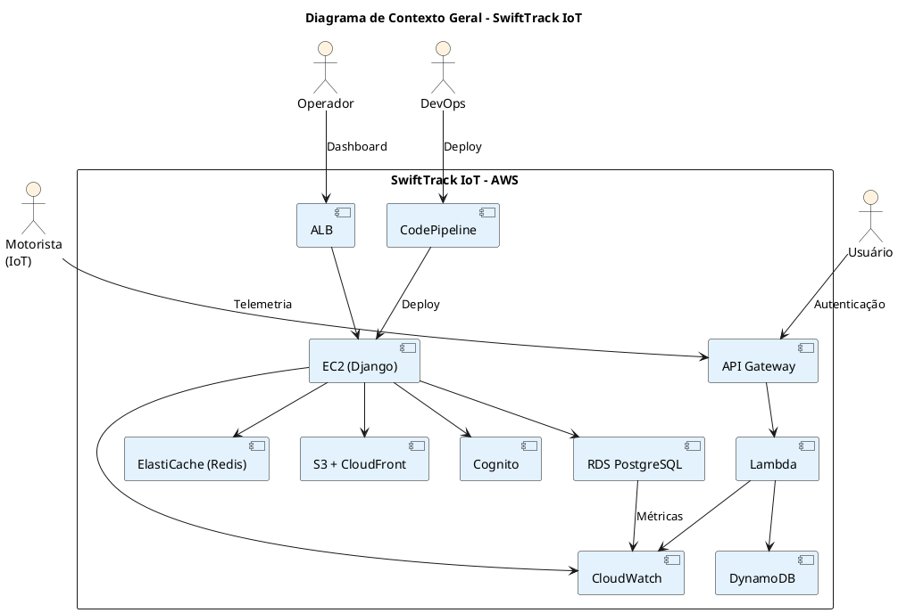

---

## 3. ESPECIFICAÇÃO DOS FLUXOS

---

### 3.1. FLUXO 1: INGESTÃO DE TELEMETRIA (SERVERLESS)

#### 3.1.1. Descrição

O motorista (dispositivo IoT) envia dados de telemetria (GPS, velocidade, status) para a plataforma SwiftTrack. A ingestão é feita de forma **serverless** (API Gateway + Lambda), garantindo escalabilidade automática e baixo custo.

#### 3.1.2. Requisitos Atendidos

| **Requisito** | **Valor** | **Fonte** |
| :--- | :--- | :--- |
| Throughput | 5.000 eventos/segundo | Requisitos Suplementares |
| Latência | p95 < 80ms | Requisitos Suplementares |
| Disponibilidade | 99,9% | Requisitos Suplementares |
| Custo por evento | < US$ 0,001 | Requisitos Suplementares |

#### 3.1.3. Diagrama de Sequência

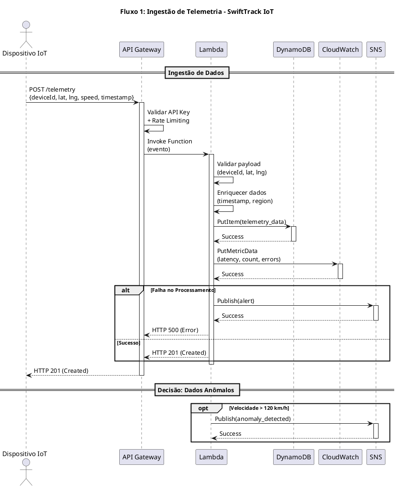

#### 3.1.4. Diagrama de Comunicação

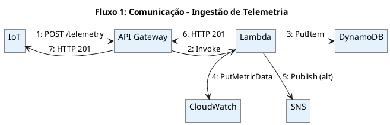

#### 3.1.5. Tabela de Mensagens

| **#** | **De** | **Para** | **Mensagem** | **Protocolo** | **Requisito** |
| :--- | :--- | :--- | :--- | :--- | :--- |
| 1 | IoT | API Gateway | POST /telemetry | HTTPS | 5.000 TPS |
| 2 | API Gateway | Lambda | Invoke Function | AWS SDK | < 80ms |
| 3 | Lambda | DynamoDB | PutItem | AWS SDK | - |
| 4 | Lambda | CloudWatch | PutMetricData | AWS SDK | - |
| 5 | Lambda | SNS | Publish (alt) | AWS SDK | - |
| 6 | Lambda | API Gateway | HTTP 201 | - | - |
| 7 | API Gateway | IoT | HTTP 201 | HTTPS | - |

#### 3.1.6. Riscos e Mitigações

| **Risco** | **Probabilidade** | **Impacto** | **Mitigação** |
| :--- | :--- | :--- | :--- |
| Cold start do Lambda | Média | Médio | Provisioned Concurrency. |
| Timeout do Lambda (15 min) | Baixa | Alto | Processamento em lotes. |
| Throttling do API Gateway | Média | Alto | Aumentar quota, caching. |
| Falha na escrita do DynamoDB | Baixa | Alto | Retry com backoff exponencial. |

---

### 3.2. FLUXO 2: REQUISIÇÃO ADMINISTRATIVA (IaaS)

#### 3.2.1. Descrição

O operador acessa o dashboard administrativo da SwiftTrack via HTTPS. A requisição é distribuída pelo ALB para as instâncias EC2 (Django), que consultam o RDS (PostgreSQL) e retornam a resposta.

#### 3.2.2. Requisitos Atendidos

| **Requisito** | **Valor** | **Fonte** |
| :--- | :--- | :--- |
| Latência | p95 < 200ms | Requisitos Suplementares |
| Disponibilidade | 99,95% | Requisitos Suplementares |
| TPS | 1.000 (pico) | Requisitos Suplementares |
| Criptografia | TLS 1.3 | Requisitos Suplementares |

#### 3.2.3. Diagrama de Sequência

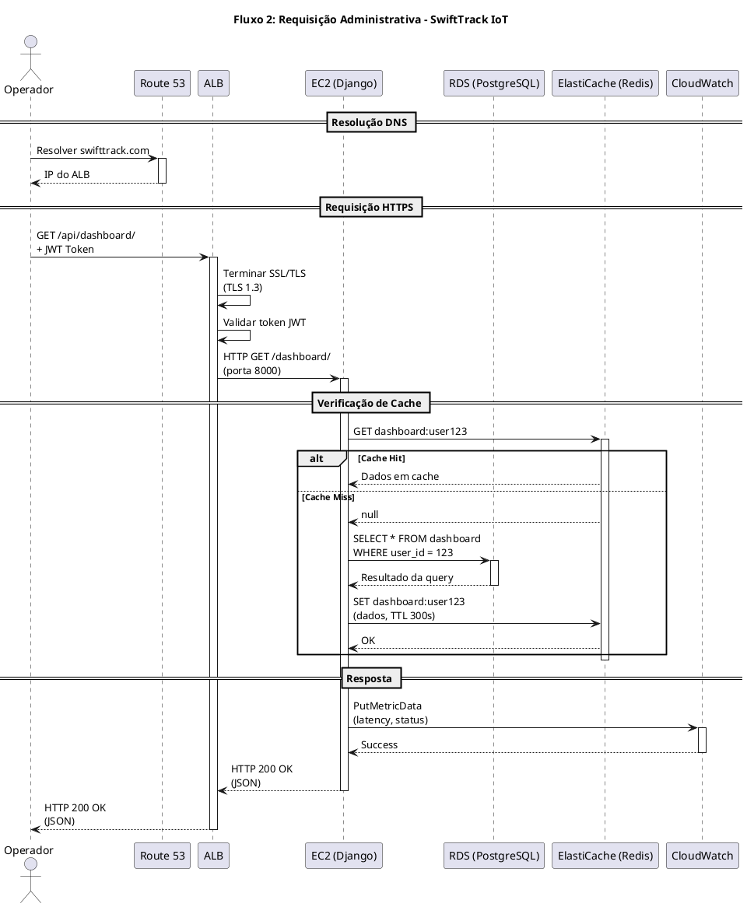

#### 3.2.4. Diagrama de Comunicação

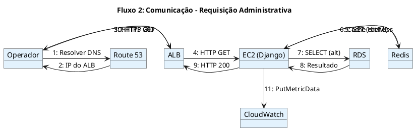

#### 3.2.5. Tabela de Mensagens

| **#** | **De** | **Para** | **Mensagem** | **Protocolo** | **Requisito** |
| :--- | :--- | :--- | :--- | :--- | :--- |
| 1 | Operador | Route 53 | Resolver DNS | DNS | - |
| 2 | Route 53 | Operador | IP do ALB | DNS | - |
| 3 | Operador | ALB | HTTPS GET | HTTPS | TLS 1.3 |
| 4 | ALB | EC2 | HTTP GET | HTTP | < 200ms |
| 5 | EC2 | Redis | GET (cache) | Redis | < 5ms |
| 6 | Redis | EC2 | Cache Hit/Miss | Redis | - |
| 7 | EC2 | RDS | SELECT (alt) | SQL | < 30ms |
| 8 | RDS | EC2 | Resultado | SQL | - |
| 9 | EC2 | ALB | HTTP 200 | HTTP | - |
| 10 | ALB | Operador | HTTP 200 | HTTPS | - |
| 11 | EC2 | CloudWatch | PutMetricData | AWS SDK | - |

#### 3.2.6. Riscos e Mitigações

| **Risco** | **Probabilidade** | **Impacto** | **Mitigação** |
| :--- | :--- | :--- | :--- |
| Cache miss frequente | Média | Médio | Aumentar TTL, pré-aquecer cache. |
| Gargalo no RDS | Média | Alto | Read Replicas, connection pooling. |
| ALB como ponto único | Baixa | Alto | ALB é gerenciado (Multi-AZ). |
| Token JWT expirado | Média | Baixo | Refresh token. |

---

### 3.3. FLUXO 3: AUTENTICAÇÃO

#### 3.3.1. Descrição

O usuário faz login na plataforma SwiftTrack. A autenticação é feita via **Amazon Cognito**, que valida as credenciais, aplica MFA (para admins) e gera um token JWT.

#### 3.3.2. Requisitos Atendidos

| **Requisito** | **Valor** | **Fonte** |
| :--- | :--- | :--- |
| Autenticação | MFA para admins | Requisitos Suplementares |
| Tokens | Expiram em 1 hora | Requisitos Suplementares |
| Senhas | Complexidade mínima | Requisitos Suplementares |
| Conformidade | LGPD | Requisitos Suplementares |

#### 3.3.3. Diagrama de Sequência

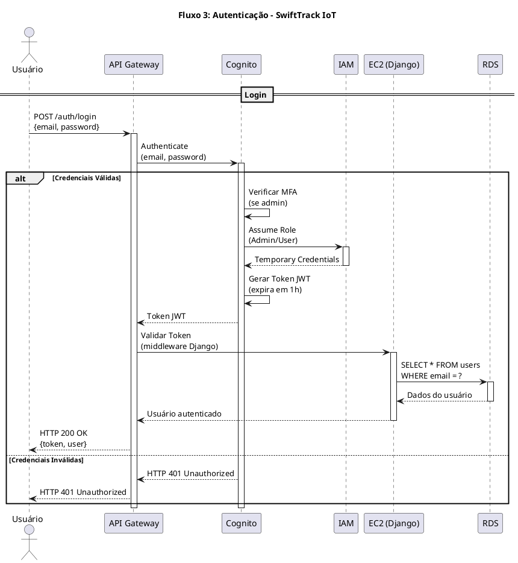

#### 3.3.4. Diagrama de Comunicação

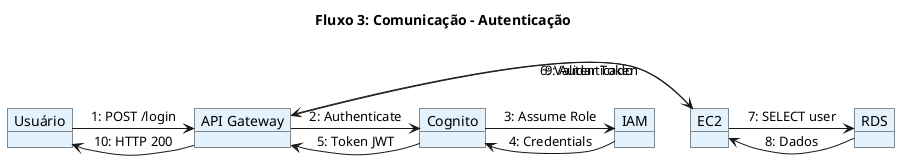

#### 3.3.5. Tabela de Mensagens

| **#** | **De** | **Para** | **Mensagem** | **Protocolo** | **Requisito** |
| :--- | :--- | :--- | :--- | :--- | :--- |
| 1 | Usuário | API Gateway | POST /auth/login | HTTPS | - |
| 2 | API Gateway | Cognito | Authenticate | AWS SDK | - |
| 3 | Cognito | IAM | Assume Role | AWS SDK | MFA |
| 4 | IAM | Cognito | Credentials | AWS SDK | - |
| 5 | Cognito | API Gateway | Token JWT | - | 1h |
| 6 | API Gateway | EC2 | Validar Token | HTTP | - |
| 7 | EC2 | RDS | SELECT user | SQL | - |
| 8 | RDS | EC2 | Dados | SQL | - |
| 9 | EC2 | API Gateway | Autenticado | HTTP | - |
| 10 | API Gateway | Usuário | HTTP 200 | HTTPS | - |

#### 3.3.6. Riscos e Mitigações

| **Risco** | **Probabilidade** | **Impacto** | **Mitigação** |
| :--- | :--- | :--- | :--- |
| Cognito indisponível | Baixa | Alto | Cognito é gerenciado (Multi-AZ). |
| Token expirado | Média | Baixo | Refresh token. |
| Ataque de força bruta | Média | Alto | Rate limiting + MFA. |
| Vazamento de credenciais | Baixa | Crítico | MFA + monitoramento. |

---

### 3.4. FLUXO 4: DEPLOY AUTOMATIZADO (CI/CD)

#### 3.4.1. Descrição

O engenheiro de DevOps faz push do código para o GitHub. O CodePipeline detecta a mudança, dispara o CodeBuild (build + testes) e faz o deploy no EC2/ECS via CodeDeploy (Blue-Green).

#### 3.4.2. Requisitos Atendidos

| **Requisito** | **Valor** | **Fonte** |
| :--- | :--- | :--- |
| Tempo de deploy | < 10 minutos | Requisitos Suplementares |
| Tempo de rollback | < 5 minutos | Requisitos Suplementares |
| Zero downtime | Sim | Requisitos Suplementares |
| Automação | 100% | Requisitos Suplementares |

#### 3.4.3. Diagrama de Sequência

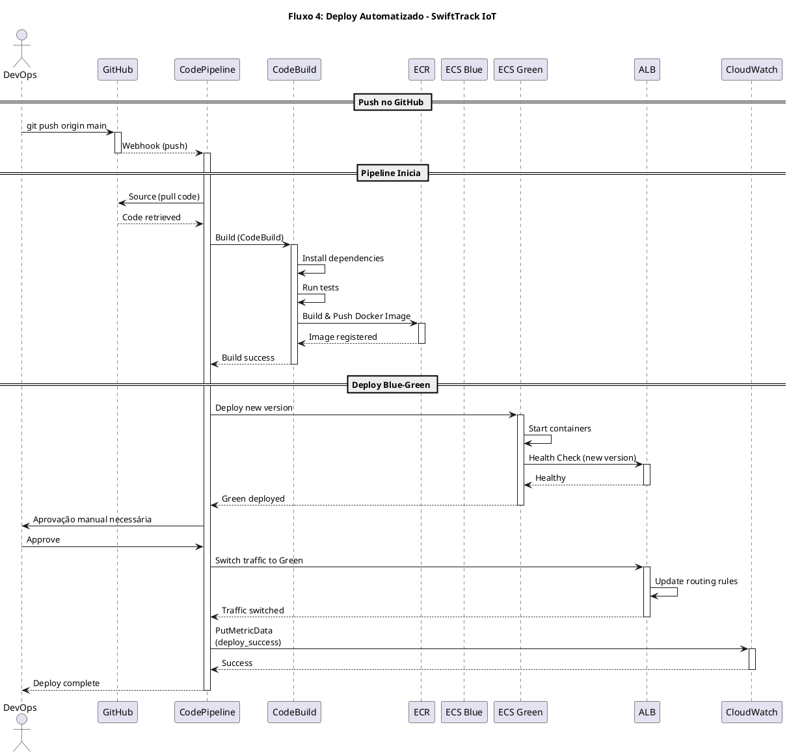

#### 3.4.4. Diagrama de Comunicação

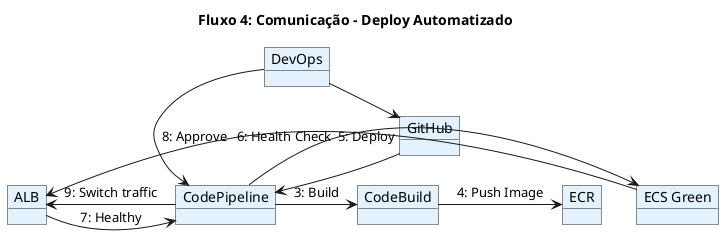

#### 3.4.5. Tabela de Mensagens

| **#** | **De** | **Para** | **Mensagem** | **Protocolo** | **Requisito** |
| :--- | :--- | :--- | :--- | :--- | :--- |
| 1 | DevOps | GitHub | git push | HTTPS | - |
| 2 | GitHub | CodePipeline | Webhook | HTTPS | - |
| 3 | CodePipeline | CodeBuild | Build | AWS SDK | < 10min |
| 4 | CodeBuild | ECR | Push Image | AWS SDK | - |
| 5 | CodePipeline | ECS Green | Deploy | AWS SDK | - |
| 6 | ECS Green | ALB | Health Check | HTTP | - |
| 7 | ALB | CodePipeline | Healthy | HTTP | - |
| 8 | DevOps | CodePipeline | Approve | Console | - |
| 9 | CodePipeline | ALB | Switch traffic | AWS SDK | - |

#### 3.4.6. Riscos e Mitigações

| **Risco** | **Probabilidade** | **Impacto** | **Mitigação** |
| :--- | :--- | :--- | :--- |
| Build falha | Média | Médio | Testes automatizados. |
| Deploy falha | Baixa | Alto | Rollback automático. |
| Downtime no switch | Baixa | Alto | Blue-Green (zero downtime). |
| Custo do CI/CD | Média | Baixo | Monitorar uso do CodeBuild. |

---

### 3.5. FLUXO 5: FAILOVER DO RDS (MULTI-AZ)

#### 3.5.1. Descrição

Em caso de falha na AZ primária do RDS, o AWS detecta automaticamente e promove a instância standby (em outra AZ) a primária, atualizando o endpoint DNS.

#### 3.5.2. Requisitos Atendidos

| **Requisito** | **Valor** | **Fonte** |
| :--- | :--- | :--- |
| RPO | 15 minutos | Requisitos Suplementares |
| RTO | 1 hora | Requisitos Suplementares |
| Disponibilidade | 99,95% | Requisitos Suplementares |

#### 3.5.3. Diagrama de Sequência

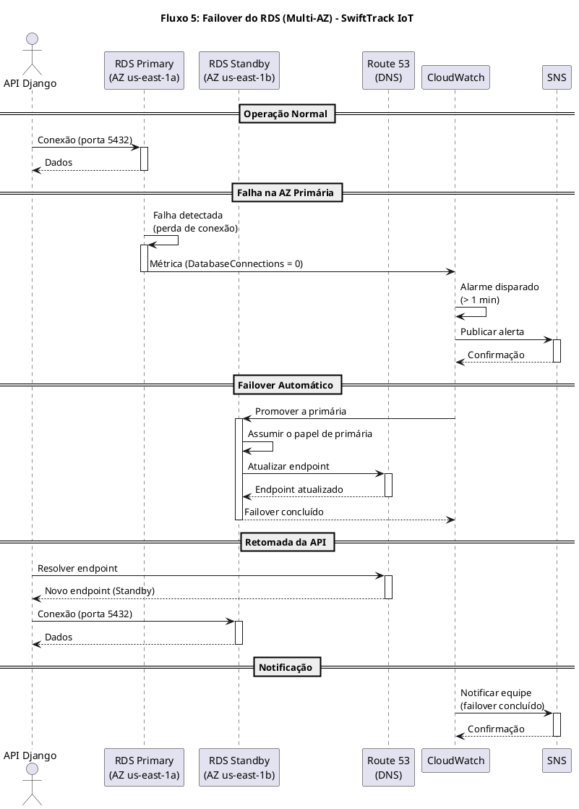

#### 3.5.4. Diagrama de Comunicação

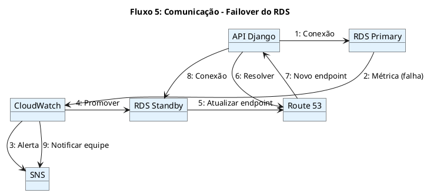

#### 3.5.5. Tabela de Mensagens

| **#** | **De** | **Para** | **Mensagem** | **Protocolo** | **Requisito** |
| :--- | :--- | :--- | :--- | :--- | :--- |
| 1 | API | RDS Primary | Conexão | TCP/5432 | - |
| 2 | RDS Primary | CloudWatch | Métrica (falha) | AWS SDK | - |
| 3 | CloudWatch | SNS | Alerta | AWS SDK | - |
| 4 | CloudWatch | RDS Standby | Promover | AWS SDK | RTO 1h |
| 5 | RDS Standby | Route 53 | Atualizar endpoint | AWS SDK | - |
| 6 | API | Route 53 | Resolver | DNS | - |
| 7 | Route 53 | API | Novo endpoint | DNS | - |
| 8 | API | RDS Standby | Conexão | TCP/5432 | - |
| 9 | CloudWatch | SNS | Notificar | AWS SDK | - |

#### 3.5.6. Riscos e Mitigações

| **Risco** | **Probabilidade** | **Impacto** | **Mitigação** |
| :--- | :--- | :--- | :--- |
| Falha em ambas as AZs | Muito Baixa | Crítico | Multi-AZ + backups. |
| DNS não atualiza | Baixa | Alto | TTL curto (60s). |
| Perda de dados | Baixa | Crítico | Replicação síncrona. |
| Downtime prolongado | Baixa | Alto | Testes regulares de failover. |

---

### 3.6. FLUXO 6: UPLOAD DE COMPROVANTE (S3)

#### 3.6.1. Descrição

O motorista envia uma foto do comprovante de entrega. A imagem é armazenada no S3 (criptografada com KMS) e distribuída via CloudFront.

#### 3.6.2. Requisitos Atendidos

| **Requisito** | **Valor** | **Fonte** |
| :--- | :--- | :--- |
| Latência | < 2s | Requisitos Suplementares |
| Criptografia | AES-256 | Requisitos Suplementares |
| Conformidade | LGPD | Requisitos Suplementares |

#### 3.6.3. Diagrama de Sequência

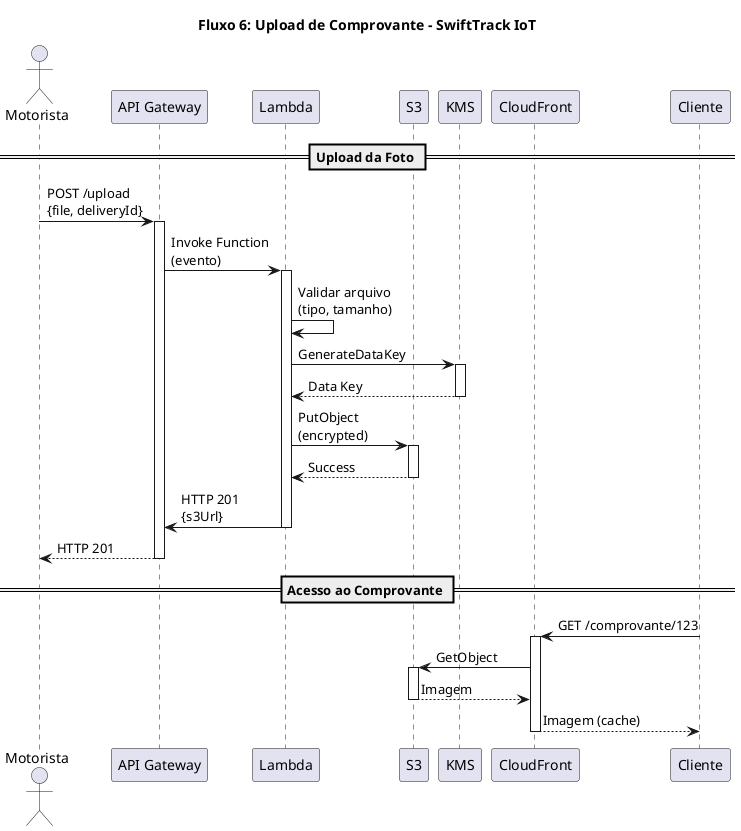

#### 3.6.4. Diagrama de Comunicação

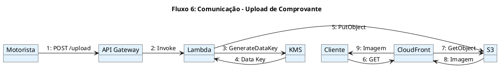

#### 3.6.5. Tabela de Mensagens

| **#** | **De** | **Para** | **Mensagem** | **Protocolo** | **Requisito** |
| :--- | :--- | :--- | :--- | :--- | :--- |
| 1 | Motorista | API Gateway | POST /upload | HTTPS | < 2s |
| 2 | API Gateway | Lambda | Invoke | AWS SDK | - |
| 3 | Lambda | KMS | GenerateDataKey | AWS SDK | AES-256 |
| 4 | KMS | Lambda | Data Key | AWS SDK | - |
| 5 | Lambda | S3 | PutObject | AWS SDK | - |
| 6 | Cliente | CloudFront | GET | HTTPS | - |
| 7 | CloudFront | S3 | GetObject | AWS SDK | - |
| 8 | S3 | CloudFront | Imagem | AWS SDK | - |
| 9 | CloudFront | Cliente | Imagem | HTTPS | - |

#### 3.6.6. Riscos e Mitigações

| **Risco** | **Probabilidade** | **Impacto** | **Mitigação** |
| :--- | :--- | :--- | :--- |
| Arquivo malicioso | Média | Alto | Validação de tipo + antivírus. |
| Vazamento de dados | Baixa | Crítico | Criptografia KMS + bucket policy. |
| Custo de armazenamento | Média | Médio | Lifecycle para S3 Glacier. |
| Latência no upload | Média | Médio | Multipart upload + CDN. |

---

## 4. DIAGRAMA DE CLASSES CONSOLIDADO

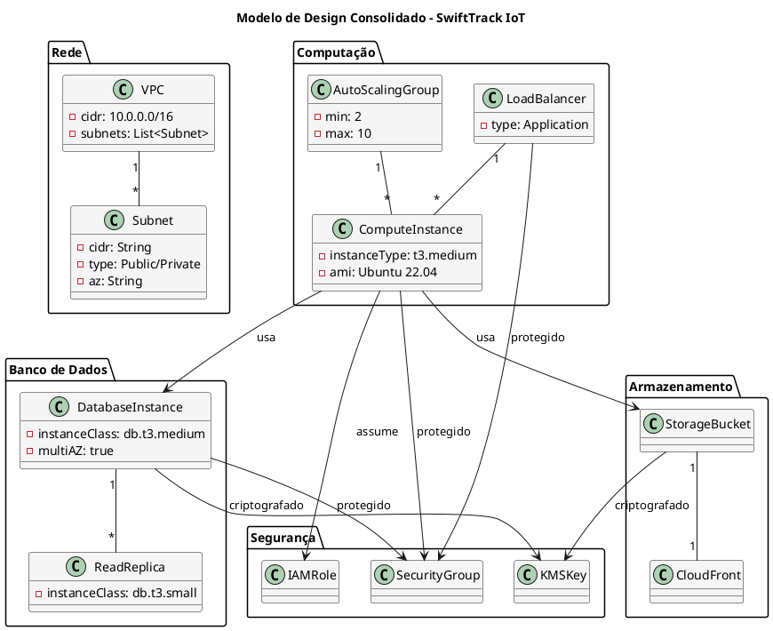

---

## 5. MATRIZ DE RASTREAMENTO CONSOLIDADA

| **Fluxo** | **Requisito (Doc. Suplementar)** | **Caso de Uso (Semana 3)** | **Pacote (Semana 4)** | **Classe (Semana 5/6)** | **Serviços AWS** |
| :--- | :--- | :--- | :--- | :--- | :--- |
| Fluxo 1 | 5.000 TPS, < 80ms | UC-ARQ-004 | Network Security | - | API Gateway, Lambda, DynamoDB |
| Fluxo 2 | 1.000 TPS, < 200ms | UC-ARQ-004 | Network Security | `ComputeInstance`, `DatabaseInstance` | ALB, EC2, RDS, Redis |
| Fluxo 3 | MFA, tokens 1h | UC-ARQ-002 | Identity & Access | - | Cognito, IAM, EC2 |
| Fluxo 4 | < 10min, < 5min | UC-ARQ-006 | Audit & Compliance | `LaunchTemplate`, `AutoScalingGroup` | CodePipeline, CodeBuild, ECS |
| Fluxo 5 | RPO 15min, RTO 1h | UC-ARQ-004 | Data Protection | `DatabaseInstance`, `BackupPolicy` | RDS Multi-AZ, Route 53 |
| Fluxo 6 | < 2s, AES-256 | UC-ARQ-003 | Data Protection | - | S3, CloudFront, KMS |

---

## 6. CONSIDERAÇÕES FINAIS

### 6.1. Lições Aprendidas

- Os **diagramas de sequência** demonstram a ordem cronológica das mensagens entre componentes.
- Os **diagramas de comunicação** complementam a visão estrutural das interações.
- Os **fluxos críticos** (ingestão, administrativo, autenticação, deploy) cobrem os principais cenários da SwiftTrack.
- A **consolidação da arquitetura** valida a coerência entre todos os artefatos produzidos.
- O **CloudWatch** aparece em todos os fluxos como componente transversal de monitoramento.

### 6.2. Próximos Passos

- **Semana 8:** Consolidação Final do Modelo de Design e Revisão do DAS.
- **Semana 9:** Estratégias de Deploy (Blue-Green, Canary, Rolling) e CI/CD.
- **Semana 10:** Introdução a Containers (Docker) e Orquestração (ECS/EKS).

---

## 7. APROVAÇÕES

| **Função** | **Nome** | **Data** | **Assinatura** |
| :--- | :--- | :--- | :--- |
| Arquiteto de Soluções | | | |
| Arquiteto de Design | | | |
| Professor Responsável | | | |
| Coordenador do Curso | | | |

---

## 8. HISTÓRICO DE VERSÕES

| **Versão** | **Data** | **Autor** | **Descrição das Alterações** |
| :--- | :--- | :--- | :--- |
| 0.1 | [DD/MM/AAAA] | [Nome do Grupo] | Criação inicial do documento. |
| 1.0 | [DD/MM/AAAA] | [Nome do Grupo] | Versão completa com todos os fluxos. |

---

**FIM DO DOCUMENTO**

---

## INSTRUÇÕES DE PREENCHIMENTO

### Como Utilizar Este Modelo

1. **Substitua os placeholders** `[NOME DO PROJETO]`, `[DD/MM/AAAA]`, `[Nome do Grupo]` pelas informações do seu projeto.
2. **Adapte os fluxos** conforme as necessidades específicas do seu projeto (nem todos terão 6 fluxos).
3. **Preencha as tabelas de mensagens** com os detalhes do seu caso.
4. **Utilize os diagramas PlantUML** como base, adaptando os participantes e mensagens.
5. **Documente os riscos** e mitigações para cada fluxo.
6. **Valide a consistência** com os artefatos das semanas anteriores.

### Critérios de Avaliação

| **Critério** | **Peso** | **Descrição** |
| :--- | :--- | :--- |
| **Completude dos Fluxos** | 25% | Todos os fluxos críticos estão modelados? |
| **Diagramas PlantUML** | 20% | Os diagramas estão corretos e completos? |
| **Tabelas de Mensagens** | 20% | As mensagens estão detalhadas e corretas? |
| **Justificativas Técnicas** | 20% | As decisões são bem fundamentadas? |
| **Riscos e Mitigações** | 15% | Os riscos estão identificados e mitigados? |