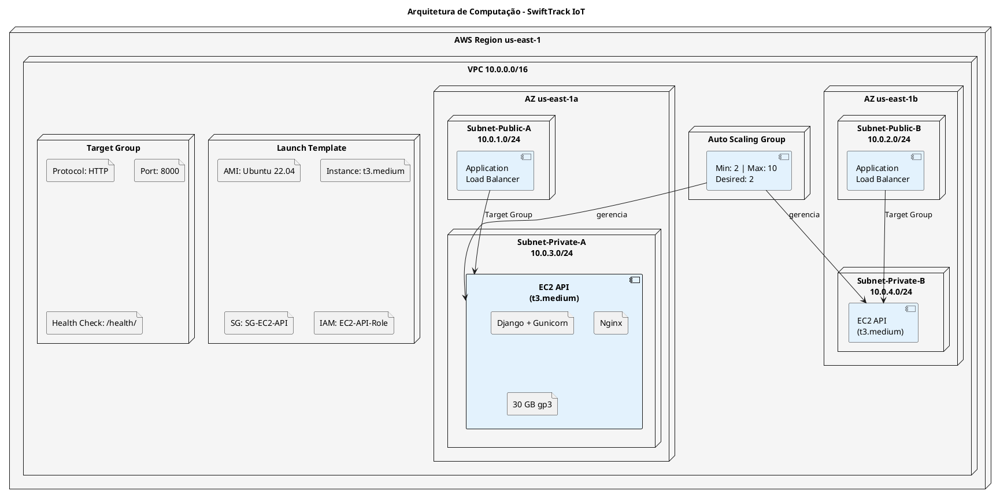
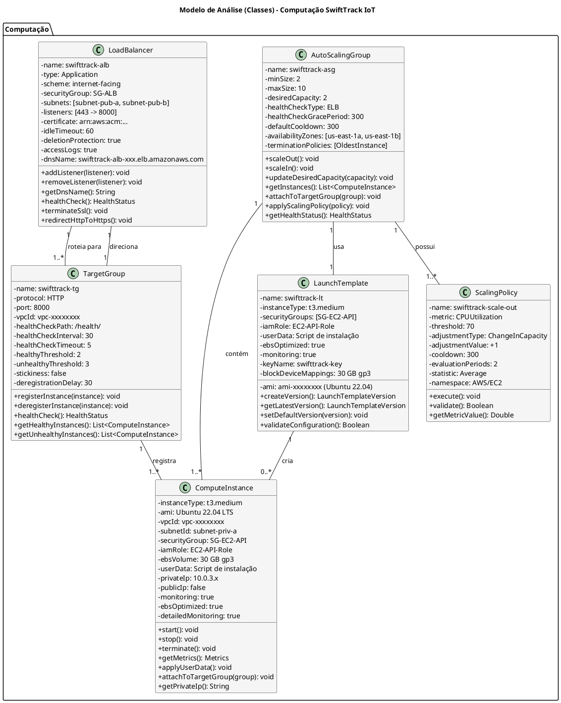
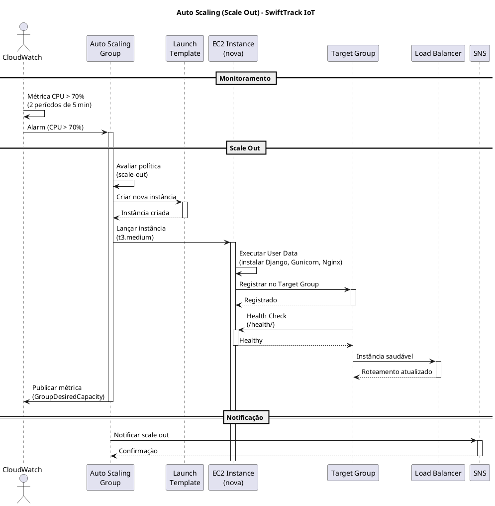
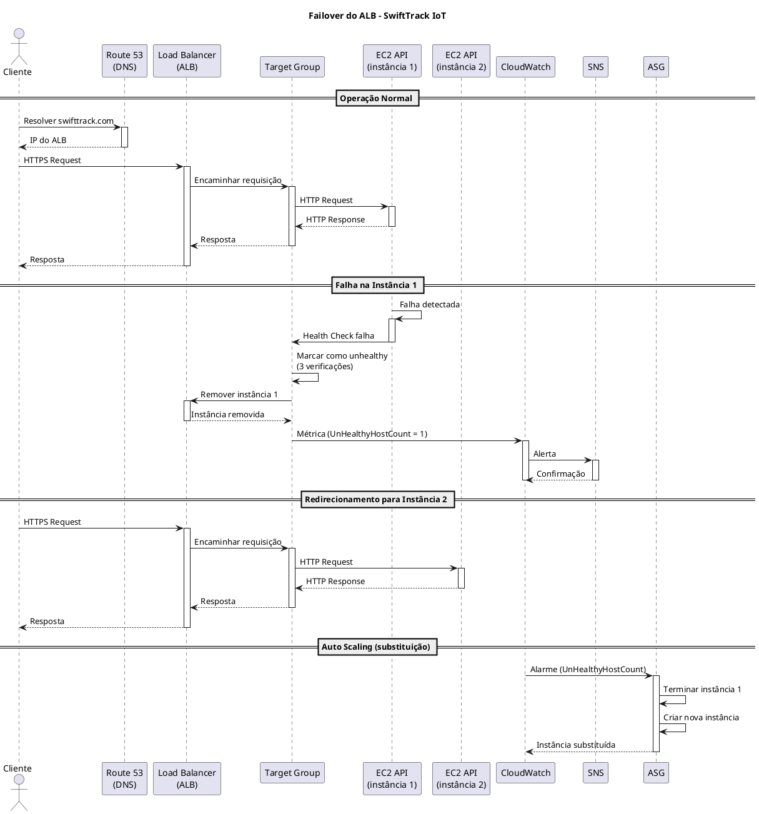
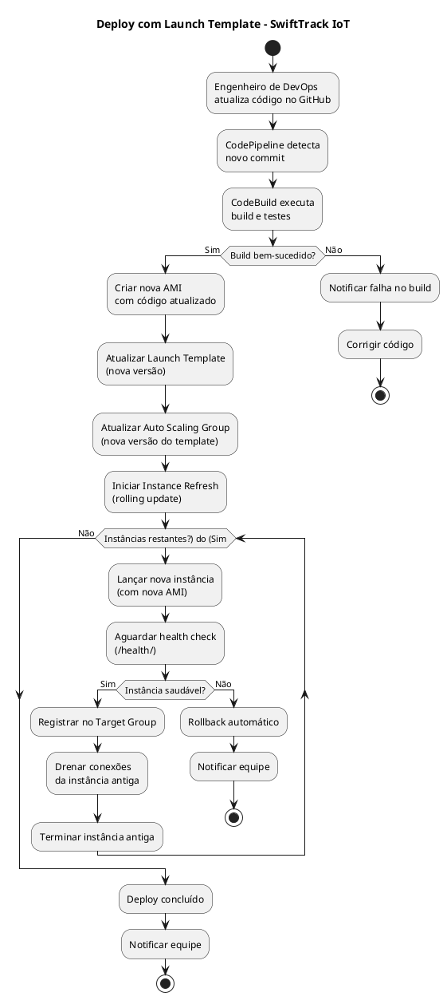

# MODELO DE ANÁLISE (CLASSES DE ANÁLISE)

## DIMENSIONAMENTO DE COMPUTAÇÃO (EC2)

## SWIFTTRACK IOT - PLATAFORMA DE TELEMETRIA E GESTÃO LOGÍSTICA

---

| **Informação do Documento** | |
| :--- | :--- |
| **Projeto** | SwiftTrack IoT - Plataforma de Telemetria e Gestão Logística |
| **Documento** | Modelo de Análise (Classes de Análise) - Dimensionamento de Computação (EC2) |
| **Versão** | 1.0 |
| **Data** | [DD/MM/AAAA] |
| **Status** | Em Desenvolvimento |
| **Responsável** | [Nome do Grupo] |
| **Disciplina** | Projeto de Cloud - Semana 6 |
| **Fase RUP/UP** | Elaboration |

---

## 1. INTRODUÇÃO

### 1.1. Propósito

Este documento apresenta o **Modelo de Análise (Classes de Análise)** para o dimensionamento da camada de computação **Amazon EC2** da plataforma **SwiftTrack IoT** na AWS. O modelo descreve as classes de análise responsáveis pelo processamento da API administrativa (Django REST Framework), suas responsabilidades, atributos e relacionamentos, além das decisões de dimensionamento baseadas nos requisitos não-funcionais.

O modelo é derivado diretamente dos seguintes artefatos:
- **Documento de Visão** (Semana 1) - Seção "Recursos do Produto (Arquitetura AWS)"
- **Documento de Requisitos Suplementares** (Semana 2) - Seções "Desempenho" e "Disponibilidade"
- **Modelo de Casos de Uso Arquiteturais** (Semana 3) - UC-ARQ-004 (Conectividade entre Camadas)
- **Modelo de Análise (Pacotes/Subsistemas)** (Semana 4) - Pacote "Network Security"
- **Modelo de Análise (Classes) - RDS** (Semana 5) - Integração com banco de dados

### 1.2. Escopo

O modelo abrange o dimensionamento da camada de computação EC2, incluindo:
- **Instância de computação** (`ComputeInstance`) para a API Django
- **Auto Scaling Group** (`AutoScalingGroup`) para escalabilidade automática
- **Application Load Balancer** (`LoadBalancer`) para distribuição de carga
- **Target Group** (`TargetGroup`) para registro de instâncias
- **Launch Template** (`LaunchTemplate`) para padronização de instâncias
- **Políticas de Escalonamento** (`ScalingPolicy`) para escala horizontal
- **Cálculos de dimensionamento** (vCPU, memória, número de instâncias)
- **Estimativa de custo** e comparação com alternativas

**Fora do escopo:** Instâncias EC2 para o NAT Gateway (tratadas na Semana 3), Lambda (serverless, tratado em documento separado) e RDS (tratado na Semana 5).

### 1.3. Definições e Siglas

| **Sigla** | **Definição** |
| :--- | :--- |
| **EC2** | Elastic Compute Cloud |
| **ALB** | Application Load Balancer |
| **ASG** | Auto Scaling Group |
| **AMI** | Amazon Machine Image |
| **EBS** | Elastic Block Store |
| **TPS** | Transactions Per Second |
| **Multi-AZ** | Múltiplas Zonas de Disponibilidade |
| **SLA** | Service Level Agreement |
| **RPO** | Recovery Point Objective |
| **RTO** | Recovery Time Objective |
| **LGPD** | Lei Geral de Proteção de Dados |
| **SG** | Security Group |

### 1.4. Referências

- Documento de Visão - SwiftTrack IoT (v1.0)
- Documento de Requisitos Suplementares - SwiftTrack IoT (v1.0)
- Modelo de Casos de Uso Arquiteturais - SwiftTrack IoT (v1.0)
- Modelo de Análise (Pacotes/Subsistemas) - SwiftTrack IoT (v1.0)
- Modelo de Análise (Classes) - RDS - SwiftTrack IoT (v1.0)
- AWS EC2 Documentation
- AWS Auto Scaling Documentation
- AWS Well-Architected Framework - Performance Efficiency Pillar
- AWS EC2 Pricing

---

## 2. VISÃO GERAL DO DIMENSIONAMENTO

### 2.1. Requisitos que Impactam o Dimensionamento

| **Requisito** | **Valor** | **Fonte** |
| :--- | :--- | :--- |
| **Usuários ativos** | 10.000 motoristas | Documento de Visão |
| **Requisições por segundo (pico)** | 1.000 TPS | Requisitos Suplementares |
| **Latência máxima (API)** | 200ms | Requisitos Suplementares |
| **CPU por requisição** | ~0,5ms | Estimativa |
| **Memória por requisição** | ~50 MB | Estimativa |
| **Conexões simultâneas** | 500 | Estimativa |
| **SLA de disponibilidade** | 99,95% | Requisitos Suplementares |
| **Picos de demanda** | Black Friday (10x) | Requisitos Suplementares |
| **RPO** | 15 minutos | Requisitos Suplementares |
| **RTO** | 1 hora | Requisitos Suplementares |
| **Orçamento total do projeto** | US$ 1.500/mês | Documento de Visão |
| **Orçamento alocado para EC2** | US$ 400/mês | Estimativa (27% do total) |

### 2.2. Arquitetura de Computação

### 2.3. Matriz de Rastreamento

| **Requisito (Doc. Suplementar)** | **Pacote (Semana 4)** | **Classe de Análise** | **Serviço AWS** | **Configuração** |
| :--- | :--- | :--- | :--- | :--- |
| TPS 1.000 (pico) | Network Security | `ComputeInstance` | EC2 | `t3.medium` |
| Latência < 200ms | Network Security | `ComputeInstance` | EC2 | Instância dimensionada |
| Disponibilidade 99,95% | Network Security | `AutoScalingGroup` | EC2 ASG | Multi-AZ, min 2 |
| Escalabilidade (10x) | Network Security | `ScalingPolicy` | EC2 ASG | CPU > 70% |
| Distribuição de carga | Network Security | `LoadBalancer` | ALB | HTTPS |
| Deploy automatizado | Audit & Compliance | `LaunchTemplate` | EC2 | User Data |
| Criptografia em trânsito | Data Protection | `LoadBalancer` | ACM | TLS 1.3 |

---

## 3. ESPECIFICAÇÃO DAS CLASSES DE ANÁLISE

---

### 3.1. CLASSE: COMPUTEINSTANCE

#### 3.1.1. Responsabilidade

Representar a instância EC2 que executa a API administrativa Django REST Framework da SwiftTrack, gerenciando sua configuração, disponibilidade, performance e segurança.

#### 3.1.2. Atributos

| **Atributo** | **Tipo** | **Valor (SwiftTrack)** | **Justificativa** |
| :--- | :--- | :--- | :--- |
| `instanceType` | String | `t3.medium` | 2 vCPU, 4 GB RAM, suporta 500 TPS. |
| `ami` | String | Ubuntu 22.04 LTS | Estável, suporte de longo prazo (LTS). |
| `vpcId` | String | `vpc-xxxxxxxx` | VPC da SwiftTrack (10.0.0.0/16). |
| `subnetId` | String | `subnet-priv-a` (AZ A) | Sub-rede privada (Multi-AZ). |
| `securityGroup` | SecurityGroup | `SG-EC2-API` | Porta 8000 (origem SG-ALB). |
| `iamRole` | String | `EC2-API-Role` | Acesso a S3, Secrets, DynamoDB. |
| `ebsVolume` | String | 30 GB gp3 | Sistema operacional + dependências. |
| `userData` | String | Script de instalação | Instala Django, Gunicorn, Nginx. |
| `privateIp` | String | `10.0.3.x` | IP privado na sub-rede. |
| `publicIp` | Boolean | `false` | Sem IP público (acesso via ALB). |
| `monitoring` | Boolean | `true` | CloudWatch detalhado (1 min). |
| `ebsOptimized` | Boolean | `true` | Melhor performance de I/O. |
| `terminationProtection` | Boolean | `false` | ASG gerencia terminação. |
| `detailedMonitoring` | Boolean | `true` | Métricas a cada 1 minuto. |

#### 3.1.3. Responsabilidades (Métodos)

| **Responsabilidade** | **Descrição** | **Retorno** |
| :--- | :--- | :--- |
| `start()` | Inicia a instância EC2. | `void` |
| `stop()` | Para a instância EC2. | `void` |
| `terminate()` | Termina a instância EC2. | `void` |
| `getMetrics()` | Retorna métricas de performance (CPU, memória, rede). | `Metrics` |
| `applyUserData()` | Executa o script de inicialização. | `void` |
| `attachToTargetGroup(group)` | Registra a instância em um target group. | `void` |
| `getPrivateIp()` | Retorna o IP privado da instância. | `String` |

#### 3.1.4. Relacionamentos

| **Relacionamento** | **Multiplicidade** | **Descrição** |
| :--- | :--- | :--- |
| `ComputeInstance` → `AutoScalingGroup` | 1..* : 1 | Cada instância pertence a exatamente um ASG. |
| `ComputeInstance` → `LaunchTemplate` | 1 : 1 | Cada instância é criada a partir de um launch template. |
| `ComputeInstance` → `SecurityGroup` | 1 : 1 | Cada instância é protegida por exatamente um SG. |
| `ComputeInstance` → `TargetGroup` | 1..* : 1 | Cada instância é registrada em um target group. |

#### 3.1.5. Justificativa do Dimensionamento

| **Componente** | **Cálculo** | **Resultado** |
| :--- | :--- | :--- |
| **TPS (pico)** | 1.000 TPS | 1.000 |
| **CPU por requisição** | ~0,5ms | 0,5ms |
| **CPU total** | 1.000 × 0,5ms | 500ms/s = 0,5 vCPU |
| **vCPU com margem** | 0,5 × 4 (segurança) | 2 vCPU |
| **Memória por requisição** | ~50 MB | 50 MB |
| **Conexões simultâneas** | 500 | 500 |
| **Memória total** | 500 × 50 MB | 25 GB (com pooling: ~4 GB) |
| **Instância escolhida** | 2 vCPU, 4 GB RAM | `t3.medium` |
| **TPS por instância** | ~500 TPS (t3.medium) | 500 |
| **Número de instâncias (base)** | 1.000 / 500 | 2 |
| **Número de instâncias (pico)** | 2 × 10 (Black Friday) | 20 (limitado a 10) |

#### 3.1.6. Estimativa de Custo

| **Componente** | **Configuração** | **Custo Mensal (us-east-1)** |
| :--- | :--- | :--- |
| **EC2 (2 × t3.medium)** | On-Demand, Multi-AZ | $60,00 |
| **EBS (2 × 30 GB gp3)** | 30 GB por instância | $4,80 |
| **Data Transfer** | ~100 GB/mês | $9,00 |
| **Subtotal ComputeInstance** | | **$73,80** |

---

### 3.2. CLASSE: AUTOSCALINGGROUP

#### 3.2.1. Responsabilidade

Gerenciar automaticamente o número de instâncias EC2 com base na demanda, garantindo disponibilidade, performance e otimização de custos.

#### 3.2.2. Atributos

| **Atributo** | **Tipo** | **Valor (SwiftTrack)** | **Justificativa** |
| :--- | :--- | :--- | :--- |
| `name` | String | `swifttrack-asg` | Nome do Auto Scaling Group. |
| `minSize` | Integer | 2 | Alta disponibilidade (Multi-AZ). |
| `maxSize` | Integer | 10 | Limite orçamentário para picos. |
| `desiredCapacity` | Integer | 2 | Capacidade base. |
| `healthCheckType` | String | `ELB` | Verifica saúde via Load Balancer. |
| `healthCheckGracePeriod` | Integer | 300s | Tempo para a instância inicializar. |
| `defaultCooldown` | Integer | 300s | Evitar flapping. |
| `availabilityZones` | List<String> | `us-east-1a`, `us-east-1b` | Multi-AZ. |
| `launchTemplate` | LaunchTemplate | `swifttrack-lt` | Template de lançamento. |
| `targetGroupArns` | List<String> | `arn:aws:elasticloadbalancing:...` | Target group do ALB. |
| `scalingPolicies` | List<ScalingPolicy> | 2 políticas | Scale out e scale in. |
| `terminationPolicies` | List<String> | `OldestInstance` | Terminar a instância mais antiga. |

#### 3.2.3. Responsabilidades (Métodos)

| **Responsabilidade** | **Descrição** | **Retorno** |
| :--- | :--- | :--- |
| `scaleOut()` | Adiciona instâncias (até maxSize). | `void` |
| `scaleIn()` | Remove instâncias (até minSize). | `void` |
| `updateDesiredCapacity(capacity)` | Atualiza a capacidade desejada. | `void` |
| `getInstances()` | Retorna a lista de instâncias ativas. | `List<ComputeInstance>` |
| `attachToTargetGroup(group)` | Registra o ASG no target group. | `void` |
| `applyScalingPolicy(policy)` | Aplica uma política de escalonamento. | `void` |
| `getHealthStatus()` | Retorna o status de saúde do ASG. | `HealthStatus` |

#### 3.2.4. Relacionamentos

| **Relacionamento** | **Multiplicidade** | **Descrição** |
| :--- | :--- | :--- |
| `AutoScalingGroup` → `ComputeInstance` | 1 : 1..* | Um ASG contém uma ou mais instâncias. |
| `AutoScalingGroup` → `LaunchTemplate` | 1 : 1 | Cada ASG usa exatamente um launch template. |
| `AutoScalingGroup` → `ScalingPolicy` | 1 : 1..* | Cada ASG tem uma ou mais políticas. |
| `AutoScalingGroup` → `TargetGroup` | 1 : 1 | Cada ASG é registrado em um target group. |

#### 3.2.5. Justificativa do Dimensionamento

| **Componente** | **Cálculo** | **Resultado** |
| :--- | :--- | :--- |
| **Capacidade base** | 2 instâncias (Multi-AZ) | 2 |
| **Capacidade de pico** | 10 instâncias (limite orçamentário) | 10 |
| **TPS por instância** | 500 TPS | 500 |
| **TPS total (base)** | 2 × 500 | 1.000 TPS |
| **TPS total (pico)** | 10 × 500 | 5.000 TPS |
| **Tempo de scale out** | ~3 minutos | 180s |
| **Tempo de scale in** | ~5 minutos | 300s |

#### 3.2.6. Estimativa de Custo

| **Componente** | **Configuração** | **Custo Mensal** |
| :--- | :--- | :--- |
| **Auto Scaling Group** | 2 instâncias base | $60,00 |
| **Picos (média)** | +2 instâncias (10% do tempo) | $12,00 |
| **Subtotal AutoScalingGroup** | | **$72,00** |

---

### 3.3. CLASSE: LOADBALANCER

#### 3.3.1. Responsabilidade

Distribuir o tráfego de entrada entre as instâncias EC2 da API, garantindo alta disponibilidade, balanceamento de carga e terminação SSL.

#### 3.3.2. Atributos

| **Atributo** | **Tipo** | **Valor (SwiftTrack)** | **Justificativa** |
| :--- | :--- | :--- | :--- |
| `name` | String | `swifttrack-alb` | Nome do Load Balancer. |
| `type` | String | `Application` (ALB) | Roteamento L7, HTTPS. |
| `scheme` | String | `internet-facing` | Acessível pela Internet. |
| `securityGroup` | SecurityGroup | `SG-ALB` | Portas 80, 443. |
| `subnets` | List<String> | `subnet-pub-a`, `subnet-pub-b` | Multi-AZ. |
| `listeners` | List<Listener> | 443 (HTTPS) → 8000 (EC2) | Redireciona tráfego. |
| `certificate` | String | `arn:aws:acm:...` | Certificado SSL/TLS. |
| `idleTimeout` | Integer | 60s | Timeout de conexão. |
| `deletionProtection` | Boolean | `true` | Evitar exclusão acidental. |
| `accessLogs` | Boolean | `true` | Logs de acesso para auditoria. |
| `dnsName` | String | `swifttrack-alb-xxx.us-east-1.elb.amazonaws.com` | Endpoint público. |

#### 3.3.3. Responsabilidades (Métodos)

| **Responsabilidade** | **Descrição** | **Retorno** |
| :--- | :--- | :--- |
| `addListener(listener)` | Adiciona um listener (porta/protocolo). | `void` |
| `removeListener(listener)` | Remove um listener. | `void` |
| `getDnsName()` | Retorna o DNS name do ALB. | `String` |
| `healthCheck()` | Verifica a saúde das instâncias. | `HealthStatus` |
| `terminateSsl()` | Termina conexões SSL/TLS. | `void` |
| `redirectHttpToHttps()` | Redireciona HTTP para HTTPS. | `void` |

#### 3.3.4. Relacionamentos

| **Relacionamento** | **Multiplicidade** | **Descrição** |
| :--- | :--- | :--- |
| `LoadBalancer` → `TargetGroup` | 1 : 1..* | Um ALB pode ter um ou mais target groups. |
| `LoadBalancer` → `SecurityGroup` | 1 : 1 | Cada ALB é protegido por exatamente um SG. |

#### 3.3.5. Justificativa do Dimensionamento

| **Componente** | **Cálculo** | **Resultado** |
| :--- | :--- | :--- |
| **Tráfego de entrada** | 1.000 TPS (pico) | 1.000 |
| **Capacidade do ALB** | 100.000 TPS | Suficiente |
| **Latência adicional** | ~5ms | Aceitável |
| **Custo do ALB** | ~$22/mês | Incluído no orçamento |
| **Certificado SSL** | ACM (gratuito) | $0 |

#### 3.3.6. Estimativa de Custo

| **Componente** | **Configuração** | **Custo Mensal** |
| :--- | :--- | :--- |
| **Application Load Balancer** | 1 ALB, Multi-AZ | $22,00 |
| **LCU (Load Balancer Capacity Units)** | ~100 GB/mês | $5,00 |
| **Certificado SSL (ACM)** | Gratuito | $0,00 |
| **Subtotal LoadBalancer** | | **$27,00** |

---

### 3.4. CLASSE: TARGETGROUP

#### 3.4.1. Responsabilidade

Agrupar instâncias EC2 para o Load Balancer, gerenciando o registro, desregistro e health check das instâncias.

#### 3.4.2. Atributos

| **Atributo** | **Tipo** | **Valor (SwiftTrack)** | **Justificativa** |
| :--- | :--- | :--- | :--- |
| `name` | String | `swifttrack-tg` | Nome do Target Group. |
| `protocol` | String | `HTTP` | API Django (Gunicorn). |
| `port` | Integer | 8000 | Porta do Gunicorn. |
| `vpcId` | String | `vpc-xxxxxxxx` | VPC da SwiftTrack. |
| `healthCheckPath` | String | `/health/` | Endpoint de health check. |
| `healthCheckInterval` | Integer | 30s | Frequência de verificação. |
| `healthCheckTimeout` | Integer | 5s | Timeout da verificação. |
| `healthyThreshold` | Integer | 2 | Verificações para considerar saudável. |
| `unhealthyThreshold` | Integer | 3 | Verificações para considerar não saudável. |
| `stickiness` | Boolean | `false` | Sem necessidade de sessão. |
| `deregistrationDelay` | Integer | 30s | Tempo para drenar conexões. |

#### 3.4.3. Responsabilidades (Métodos)

| **Responsabilidade** | **Descrição** | **Retorno** |
| :--- | :--- | :--- |
| `registerInstance(instance)` | Registra uma instância EC2. | `void` |
| `deregisterInstance(instance)` | Remove uma instância EC2. | `void` |
| `healthCheck()` | Verifica a saúde das instâncias. | `HealthStatus` |
| `getHealthyInstances()` | Retorna instâncias saudáveis. | `List<ComputeInstance>` |
| `getUnhealthyInstances()` | Retorna instâncias não saudáveis. | `List<ComputeInstance>` |

#### 3.4.4. Relacionamentos

| **Relacionamento** | **Multiplicidade** | **Descrição** |
| :--- | :--- | :--- |
| `TargetGroup` → `ComputeInstance` | 1 : 1..* | Um target group registra uma ou mais instâncias. |
| `TargetGroup` → `LoadBalancer` | 1 : 1 | Cada target group é associado a um ALB. |

#### 3.4.5. Justificativa do Dimensionamento

| **Componente** | **Cálculo** | **Resultado** |
| :--- | :--- | :--- |
| **Health Check** | `/health/` a cada 30s | 30s |
| **Timeout** | 5s | 5s |
| **Healthy Threshold** | 2 verificações | 2 |
| **Unhealthy Threshold** | 3 verificações | 3 |
| **Deregistration Delay** | 30s | 30s |

#### 3.4.6. Estimativa de Custo

| **Componente** | **Configuração** | **Custo Mensal** |
| :--- | :--- | :--- |
| **Target Group** | HTTP/8000 | $0,00 (gratuito) |
| **Subtotal TargetGroup** | | **$0,00** |

---

### 3.5. CLASSE: LAUNCHTEMPLATE

#### 3.5.1. Responsabilidade

Definir a configuração padronizada para o lançamento de instâncias EC2, incluindo AMI, tipo de instância, security groups, IAM role e user data.

#### 3.5.2. Atributos

| **Atributo** | **Tipo** | **Valor (SwiftTrack)** | **Justificativa** |
| :--- | :--- | :--- | :--- |
| `name` | String | `swifttrack-lt` | Nome do Launch Template. |
| `ami` | String | `ami-xxxxxxxx` (Ubuntu 22.04) | Estável, LTS. |
| `instanceType` | String | `t3.medium` | 2 vCPU, 4 GB RAM. |
| `securityGroups` | List<String> | `SG-EC2-API` | Porta 8000. |
| `iamRole` | String | `EC2-API-Role` | Acesso a S3, Secrets, DynamoDB. |
| `userData` | String | Script de instalação | Instala Django, Gunicorn, Nginx. |
| `ebsOptimized` | Boolean | `true` | Melhor performance de I/O. |
| `monitoring` | Boolean | `true` | CloudWatch detalhado. |
| `keyName` | String | `swifttrack-key` | Chave SSH (para emergências). |
| `blockDeviceMappings` | List<Mapping> | 30 GB gp3 | Volume do sistema operacional. |
| `metadataOptions` | String | `IMDSv2` | Segurança de metadados. |

#### 3.5.3. Responsabilidades (Métodos)

| **Responsabilidade** | **Descrição** | **Retorno** |
| :--- | :--- | :--- |
| `createVersion()` | Cria uma nova versão do template. | `LaunchTemplateVersion` |
| `getLatestVersion()` | Retorna a versão mais recente. | `LaunchTemplateVersion` |
| `setDefaultVersion(version)` | Define a versão padrão. | `void` |
| `validateConfiguration()` | Valida a configuração do template. | `Boolean` |

#### 3.5.4. Relacionamentos

| **Relacionamento** | **Multiplicidade** | **Descrição** |
| :--- | :--- | :--- |
| `LaunchTemplate` → `AutoScalingGroup` | 1 : 1..* | Um launch template pode ser usado por um ou mais ASGs. |
| `LaunchTemplate` → `ComputeInstance` | 1 : 1..* | Um launch template cria uma ou mais instâncias. |

#### 3.5.5. Justificativa do Dimensionamento

| **Componente** | **Configuração** | **Justificativa** |
| :--- | :--- | :--- |
| **AMI** | Ubuntu 22.04 LTS | Estável, suporte até 2027. |
| **Instance Type** | t3.medium | 2 vCPU, 4 GB RAM. |
| **Security Group** | SG-EC2-API | Porta 8000 (origem SG-ALB). |
| **IAM Role** | EC2-API-Role | Acesso a S3, Secrets, DynamoDB. |
| **User Data** | Script de instalação | Automatizar setup. |
| **EBS** | 30 GB gp3 | SO + dependências. |

#### 3.5.6. Estimativa de Custo

| **Componente** | **Configuração** | **Custo Mensal** |
| :--- | :--- | :--- |
| **Launch Template** | Configuração | $0,00 (gratuito) |
| **Subtotal LaunchTemplate** | | **$0,00** |

---

### 3.6. CLASSE: SCALINGPOLICY

#### 3.6.1. Responsabilidade

Definir as regras de escalonamento automático do Auto Scaling Group, com base em métricas de performance (CPU, memória, rede).

#### 3.6.2. Atributos

| **Atributo** | **Tipo** | **Valor (SwiftTrack)** | **Justificativa** |
| :--- | :--- | :--- | :--- |
| `name` | String | `swifttrack-scale-out` | Nome da política. |
| `metric` | String | `CPUUtilization` | Métrica principal. |
| `threshold` | Double | 70% (out), 30% (in) | Escalar/reduzir. |
| `adjustmentType` | String | `ChangeInCapacity` | Adicionar/remover instâncias. |
| `adjustmentValue` | Integer | +1 (out), -1 (in) | Incremento gradual. |
| `cooldown` | Integer | 300s | Evitar flapping. |
| `evaluationPeriods` | Integer | 2 | Períodos de avaliação. |
| `statistic` | String | `Average` | Média das métricas. |
| `namespace` | String | `AWS/EC2` | Namespace do CloudWatch. |

#### 3.6.3. Responsabilidades (Métodos)

| **Responsabilidade** | **Descrição** | **Retorno** |
| :--- | :--- | :--- |
| `execute()` | Executa a política de escalonamento. | `void` |
| `validate()` | Valida a configuração da política. | `Boolean` |
| `getMetricValue()` | Retorna o valor atual da métrica. | `Double` |

#### 3.6.4. Relacionamentos

| **Relacionamento** | **Multiplicidade** | **Descrição** |
| :--- | :--- | :--- |
| `ScalingPolicy` → `AutoScalingGroup` | 1..* : 1 | Cada política pertence a um ASG. |

#### 3.6.5. Justificativa do Dimensionamento

| **Componente** | **Cálculo** | **Resultado** |
| :--- | :--- | :--- |
| **Métrica** | CPUUtilization | 70% (out), 30% (in) |
| **Período de avaliação** | 2 períodos de 5 min | 10 min |
| **Cooldown** | 300s | 5 min |
| **Ajuste** | +1 instância | +1 |
| **TPS por instância** | 500 TPS | 500 |
| **Capacidade de pico** | 10 instâncias × 500 TPS | 5.000 TPS |

#### 3.6.6. Estimativa de Custo

| **Componente** | **Configuração** | **Custo Mensal** |
| :--- | :--- | :--- |
| **Scaling Policy** | 2 políticas | $0,00 (gratuito) |
| **Subtotal ScalingPolicy** | | **$0,00** |

---

## 4. DIAGRAMA DE CLASSES (PLANTUML)

---

## 5. DIAGRAMA DE SEQUÊNCIA - AUTO SCALING (SCALE OUT)

---

## 6. DIAGRAMA DE SEQUÊNCIA - FAILOVER DO ALB

---

## 7. DIAGRAMA DE ATIVIDADES - DEPLOY COM LAUNCH TEMPLATE

---

## 8. MEMÓRIA DE CÁLCULO

### 8.1. Cálculo de vCPU e Memória

| **Métrica** | **Fórmula** | **Cálculo** | **Resultado** |
| :--- | :--- | :--- | :--- |
| **TPS (pico)** | - | - | 1.000 TPS |
| **CPU por requisição** | - | - | 0,5ms |
| **CPU total** | 1.000 × 0,5ms | 500ms/s | 0,5 vCPU |
| **vCPU com margem** | 0,5 × 4 | 2 vCPU | 2 vCPU |
| **Memória por requisição** | - | - | 50 MB |
| **Conexões simultâneas** | - | - | 500 |
| **Memória total** | 500 × 50 MB | 25 GB (com pooling: ~4 GB) | 4 GB |
| **Instância escolhida** | 2 vCPU, 4 GB RAM | - | `t3.medium` |

### 8.2. Cálculo do Número de Instâncias

| **Métrica** | **Fórmula** | **Cálculo** | **Resultado** |
| :--- | :--- | :--- | :--- |
| **TPS por instância** | - | - | 500 TPS |
| **TPS total necessário** | - | - | 1.000 TPS |
| **Número de instâncias (base)** | 1.000 / 500 | 2 | 2 |
| **Número de instâncias (mínimo)** | Multi-AZ | 2 | 2 |
| **Número de instâncias (pico)** | 2 × 10 | 20 (limitado a 10) | 10 |
| **Máximo do Auto Scaling** | Limite orçamentário | - | 10 |

### 8.3. Cálculo de Disponibilidade

| **Métrica** | **Fórmula** | **Cálculo** | **Resultado** |
| :--- | :--- | :--- | :--- |
| **SLA desejado** | - | - | 99,95% |
| **Downtime mensal** | (1 - 0,9995) × 30 dias | 0,0005 × 43.200 min | 21,6 min |
| **Downtime anual** | (1 - 0,9995) × 365 dias | 0,0005 × 525.600 min | 262,8 min (4,38h) |
| **Multi-AZ** | - | - | Reduz downtime para ~0 |
| **RPO** | - | - | 15 min (RDS PITR) |
| **RTO** | - | - | 1 hora (failover) |

### 8.4. Estimativa de Custo Total

| **Componente** | **Configuração** | **Custo Mensal** |
| :--- | :--- | :--- |
| **EC2 (2 × t3.medium)** | On-Demand, Multi-AZ | $60,00 |
| **EBS (2 × 30 GB gp3)** | 30 GB por instância | $4,80 |
| **Application Load Balancer** | 1 ALB, Multi-AZ | $22,00 |
| **LCU (Load Balancer)** | ~100 GB/mês | $5,00 |
| **Data Transfer** | ~100 GB/mês | $9,00 |
| **Picos (média)** | +2 instâncias (10% do tempo) | $12,00 |
| **Auto Scaling Group** | 2 instâncias base | $0,00 (incluído) |
| **Target Group** | HTTP/8000 | $0,00 |
| **Launch Template** | Configuração | $0,00 |
| **Scaling Policy** | 2 políticas | $0,00 |
| **TOTAL** | | **$112,80/mês** |

**Percentual do Orçamento Total:** $112,80 / $1.500 = **7,5%**

**Nota:** Em picos (10 instâncias), o custo pode chegar a ~$300/mês.

---

## 9. TRADE-OFFS DOCUMENTADOS

| **Decisão** | **Alternativa** | **Prós** | **Contras** | **Custo Impacto** |
| :--- | :--- | :--- | :--- | :--- |
| **`t3.medium`** | `c5.large` | t3: mais barato; c5: mais CPU. | t3: burst, c5: mais caro. | t3: $60; c5: $124 |
| **On-Demand** | Reserved (1 ano) | On-Demand: flexível; Reserved: 40% desconto. | Reserved: compromisso de 1 ano. | Reserved: $36 vs $60 |
| **Auto Scaling** | Instâncias fixas | Escala em picos, reduz custo em baixa. | Complexidade de configuração. | +$0 (mas paga por uso) |
| **ALB** | NLB | ALB: L7, roteamento; NLB: L4, ultra-rápido. | ALB: mais caro; NLB: menos features. | ALB: $22; NLB: $18 |
| **Multi-AZ** | Single-AZ | Alta disponibilidade, failover automático. | Dobra o custo. | +$60/mês |
| **Ubuntu 22.04** | Amazon Linux 2 | Ubuntu: familiar; Amazon Linux: otimizado. | Amazon Linux: menos familiar. | $0 |
| **30 GB gp3** | 50 GB gp2 | gp3: mais barato; gp2: mais IOPS. | gp2: mais caro. | gp3: $2,40; gp2: $5,75 |

---

## 10. RISCOS E MITIGAÇÕES

| **Risco** | **Probabilidade** | **Impacto** | **Mitigação** |
| :--- | :--- | :--- | :--- |
| **Esgotamento de CPU** | Média | Alto | Auto Scaling (CPU > 70%). |
| **Falha na instância** | Baixa | Alto | Multi-AZ + ALB health check. |
| **Picos de tráfego** | Média | Alto | Auto Scaling (max 10). |
| **Custo acima do orçamento** | Média | Médio | Monitoramento via CloudWatch + Budgets. |
| **Deploy com falha** | Média | Alto | Rolling update + rollback automático. |
| **Acesso não autorizado** | Baixa | Crítico | SG restritivo + IAM Role. |
| **Latência elevada** | Média | Médio | CloudWatch + alarmes. |
| **Falta de capacidade** | Baixa | Alto | Auto Scaling + instance refresh. |

---

## 11. CONSIDERAÇÕES FINAIS

### 11.1. Lições Aprendidas

- O dimensionamento do EC2 deve ser baseado em **requisitos mensuráveis** (TPS, latência, conexões).
- **Auto Scaling é obrigatório** para picos de demanda (Black Friday).
- **Multi-AZ** garante alta disponibilidade (99,95%).
- **Load Balancer** distribui carga e termina SSL.
- **Launch Template** padroniza instâncias e facilita deploys.
- O **custo do EC2** (~$112,80/mês base) representa 7,5% do orçamento total, o que é aceitável.

### 11.2. Próximos Passos

- **Semana 7:** Dimensionamento de Armazenamento (S3) - `StorageBucket`, `LifecyclePolicy`, `ReplicationRule`.
- **Semana 8:** Consolidação da Arquitetura - Diagramas de Sequência e Design.
- **Semana 9:** Estratégias de Deploy (Blue-Green, Canary, Rolling) e CI/CD.

---

## 12. APROVAÇÕES

| **Função** | **Nome** | **Data** | **Assinatura** |
| :--- | :--- | :--- | :--- |
| Arquiteto de Soluções | | | |
| Arquiteto de Computação | | | |
| Professor Responsável | | | |
| Coordenador do Curso | | | |

---

## 13. HISTÓRICO DE VERSÕES

| **Versão** | **Data** | **Autor** | **Descrição das Alterações** |
| :--- | :--- | :--- | :--- |
| 0.1 | [DD/MM/AAAA] | [Nome do Grupo] | Criação inicial do documento. |
| 1.0 | [DD/MM/AAAA] | [Nome do Grupo] | Versão completa com todas as classes e cálculos. |

---

**FIM DO DOCUMENTO**

---

## INSTRUÇÕES DE PREENCHIMENTO

### Como Utilizar Este Modelo

1. **Substitua os placeholders** `[NOME DO PROJETO]`, `[DD/MM/AAAA]`, `[Nome do Grupo]` pelas informações do seu projeto.

2. **Adapte os atributos** de cada classe conforme as necessidades específicas do seu projeto.

3. **Preencha a memória de cálculo** com os números reais do seu caso.

4. **Utilize os diagramas PlantUML** como base, adaptando as classes e relacionamentos.

5. **Documente os trade-offs** e justificativas técnicas para cada decisão.

6. **Valide os requisitos** (SLA, TPS, latência) com as escolhas feitas.

### Critérios de Avaliação

| **Critério** | **Peso** | **Descrição** |
| :--- | :--- | :--- |
| **Completude das Classes** | 25% | Todas as classes necessárias estão descritas? |
| **Diagramas PlantUML** | 20% | Os diagramas estão corretos e completos? |
| **Memória de Cálculo** | 20% | Os cálculos estão documentados e corretos? |
| **Justificativas Técnicas** | 20% | As decisões são bem fundamentadas? |
| **Riscos e Mitigações** | 15% | Os riscos estão identificados e mitigados? |