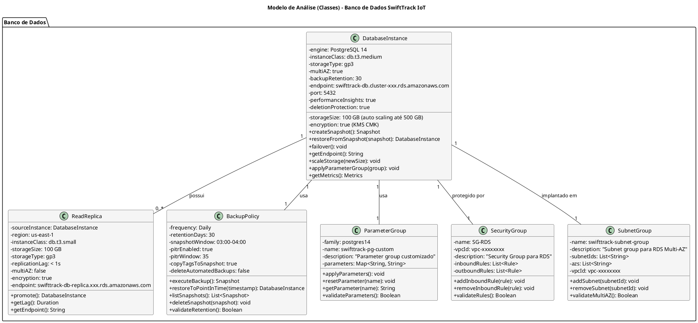
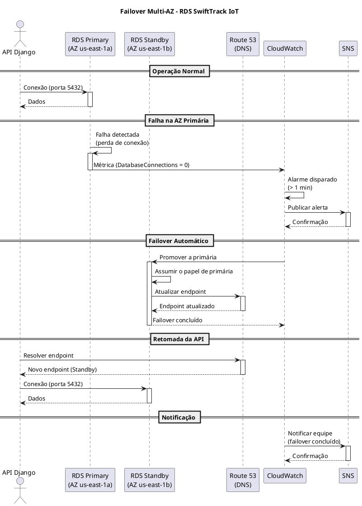
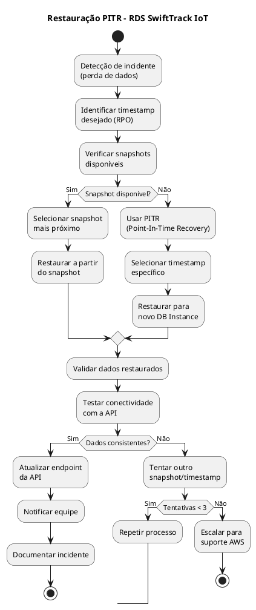

# Modelo de Análise (Classes de Análise)

## Dimensionamento de Banco de Dados (RDS)

## SwiftTrack IOT - Plataforma de Telemetria e Gestão Logística

---

| **Informação do Documento** | |
| :--- | :--- |
| **Projeto** | SwiftTrack IoT - Plataforma de Telemetria e Gestão Logística |
| **Documento** | Modelo de Análise (Classes de Análise) - Dimensionamento de Banco de Dados (RDS) |
| **Versão** | 1.0 |
| **Data** | [DD/MM/AAAA] |
| **Status** | Em Desenvolvimento |
| **Responsável** | [Nome do Grupo] |
| **Disciplina** | Projeto de Cloud - Semana 5 |
| **Fase RUP/UP** | Elaboration |

---

## 1. Introdução

### 1.1. Propósito

Este documento apresenta o **Modelo de Análise (Classes de Análise)** para o dimensionamento do banco de dados relacional **Amazon RDS (PostgreSQL)** da plataforma **SwiftTrack IoT** na AWS. O modelo descreve as classes de análise responsáveis pela persistência de dados transacionais (faturas, clientes, rotas, motoristas), suas responsabilidades, atributos e relacionamentos, além das decisões de dimensionamento baseadas nos requisitos não-funcionais.

O modelo é derivado diretamente dos seguintes artefatos:

- **Documento de Visão** (Semana 1) - Seção "Recursos do Produto (Arquitetura AWS)"
- **Documento de Requisitos Suplementares** (Semana 2) - Seções "Desempenho" e "Confiabilidade"
- **Modelo de Casos de Uso Arquiteturais** (Semana 3) - UC-ARQ-004 (Conectividade entre Camadas)
- **Modelo de Análise (Pacotes/Subsistemas)** (Semana 4) - Pacotes "Data Protection" e "Secrets Management"

### 1.2. Escopo

O modelo abrange o dimensionamento do banco de dados relacional RDS PostgreSQL, incluindo:

- **Instância primária** (`DatabaseInstance`) com Multi-AZ
- **Réplica de leitura** (`ReadReplica`) para dashboards e relatórios
- **Política de backup** (`BackupPolicy`) com PITR e retenção de 30 dias
- **Grupo de parâmetros** (`ParameterGroup`) customizado
- **Grupo de segurança** (`SecurityGroup`) restritivo
- **Grupo de sub-redes** (`SubnetGroup`) Multi-AZ
- **Cálculos de dimensionamento** (vCPU, memória, IOPS, storage)
- **Estimativa de custo** e comparação com alternativas

**Fora do escopo:** Bancos de dados NoSQL (DynamoDB), que serão tratados em documento separado.

### 1.3. Definições e Siglas

| **Sigla** | **Definição** |
| :--- | :--- |
| **RDS** | Relational Database Service |
| **PITR** | Point-In-Time Recovery |
| **RPO** | Recovery Point Objective |
| **RTO** | Recovery Time Objective |
| **IOPS** | Input/Output Operations Per Second |
| **TPS** | Transactions Per Second |
| **Multi-AZ** | Múltiplas Zonas de Disponibilidade |
| **CMK** | Customer Managed Key |
| **KMS** | Key Management Service |
| **LGPD** | Lei Geral de Proteção de Dados |
| **SG** | Security Group |

### 1.4. Referências

- Documento de Visão - SwiftTrack IoT (v1.0)
- Documento de Requisitos Suplementares - SwiftTrack IoT (v1.0)
- Modelo de Casos de Uso Arquiteturais - SwiftTrack IoT (v1.0)
- Modelo de Análise (Pacotes/Subsistemas) - SwiftTrack IoT (v1.0)
- AWS RDS Documentation
- AWS Well-Architected Framework - Performance Efficiency Pillar
- AWS RDS Pricing

---

## 2. Visão Geral do Dimensionamento

### 2.1. Requisitos que Impactam o Dimensionamento

| **Requisito** | **Valor** | **Fonte** |
| :--- | :--- | :--- |
| **Usuários ativos** | 10.000 motoristas | Documento de Visão |
| **Pedidos por dia** | 50.000 pedidos | Requisitos Suplementares |
| **TPS (pico)** | 1.000 transações/segundo | Requisitos Suplementares |
| **Latência máxima (API)** | 200ms | Requisitos Suplementares |
| **Volume de dados (inicial)** | 100 GB | Estimativa |
| **Crescimento mensal** | 10 GB/mês | Estimativa |
| **Conexões simultâneas** | 500 | Estimativa |
| **SLA de disponibilidade** | 99,95% | Requisitos Suplementares |
| **RPO** | 15 minutos | Requisitos Suplementares |
| **RTO** | 1 hora | Requisitos Suplementares |
| **Orçamento total do projeto** | US$ 1.500/mês | Documento de Visão |
| **Orçamento alocado para RDS** | US$ 250/mês | Estimativa (16% do total) |

### 2.2. Arquitetura de Banco de Dados

```text
+------------------------------------------------------------------+
|                    ARQUITETURA RDS SWIFTTRACK                     |
+------------------------------------------------------------------+
|                                                                  |
|  +---------------------------+   +-----------------------------+  |
|  | AZ us-east-1a            |   | AZ us-east-1b              |  |
|  | +---------------------+  |   | +---------------------+    |  |
|  | | Subnet-Private-A    |  |   | | Subnet-Private-B    |    |  |
|  | | 10.0.3.0/24         |  |   | | 10.0.4.0/24         |    |  |
|  | |                     |  |   | |                     |    |  |
|  | | [RDS Primary]       |  |   | | [RDS Standby]       |    |  |
|  | | db.t3.medium        |  |   | | db.t3.medium        |    |  |
|  | | 100 GB gp3          |  |   | | 100 GB gp3          |    |  |
|  | | Multi-AZ: Sim       |  |   | | Multi-AZ: Sim       |    |  |
|  | |                     |  |   | |                     |    |  |
|  | | Replicação          |  |   | |                     |    |  |
|  | | Síncrona            |  |   | |                     |    |  |
|  | +----------+----------+  |   | +---------------------+    |  |
|  |            |               |   |                           |  |
|  | +----------v----------+   |   | +---------------------+    |  |
|  | | [Read Replica]      |   |   | | [Backup]            |    |  |
|  | | db.t3.small         |   |   | | Snapshot diário     |    |  |
|  | | 100 GB gp3          |   |   | | Retenção: 30 dias   |    |  |
|  | | Replicação assínc.  |   |   | | PITR: 15 min        |    |  |
|  | +---------------------+   |   | +---------------------+    |  |
|  +---------------------------+   +-----------------------------+  |
|                                                                  |
|  +------------------------------------------------------------+  |
|  | Configurações Adicionais                                    |  |
|  | - Engine: PostgreSQL 14                                     |  |
|  | - Backup Retention: 30 dias                                 |  |
|  | - PITR: Habilitado (RPO 15 min)                             |  |
|  | - Encryption: AES-256 (KMS CMK)                              |  |
|  | - Parameter Group: customizado (max_connections=500)        |  |
|  | - Security Group: SG-RDS (porta 5432, origem SG-EC2-API)    |  |
|  | - Subnet Group: sub-redes privadas (Multi-AZ)               |  |
|  +------------------------------------------------------------+  |
+------------------------------------------------------------------+
```

### 2.3. Matriz de Rastreamento

| **Requisito (Doc. Suplementar)** | **Pacote (Semana 4)** | **Classe de Análise** | **Serviço AWS** | **Configuração** |
| :--- | :--- | :--- | :--- | :--- |
| Disponibilidade 99,95% | Data Protection | `DatabaseInstance` | RDS Multi-AZ | Multi-AZ habilitado |
| RPO 15 minutos | Data Protection | `BackupPolicy` | RDS PITR | PITR habilitado |
| RTO 1 hora | Data Protection | `DatabaseInstance` | RDS Multi-AZ | Failover automático |
| Latência < 200ms | Network Security | `DatabaseInstance` | RDS | Instância dimensionada |
| Criptografia em repouso | Data Protection | `DatabaseInstance` | KMS | AES-256 |
| Isolamento de credenciais | Secrets Management | `DatabaseInstance` | Secrets Manager | Rotação 90 dias |
| Conformidade LGPD | Audit & Compliance | `BackupPolicy` | CloudTrail | Logs de auditoria |

---

## 3. Especificação das Classes de Análise

---

### 3.1. Classe: DATABASEINSTANCE

#### 3.1.1. Responsabilidade

Representar a instância primária do banco de dados RDS PostgreSQL, gerenciando sua configuração, disponibilidade, performance e segurança.

#### 3.1.2. Atributos

| **Atributo** | **Tipo** | **Valor (SwiftTrack)** | **Justificativa** |
| :--- | :--- | :--- | :--- |
| `engine` | String | PostgreSQL 14 | Compatível com Django REST Framework, open-source. |
| `instanceClass` | String | `db.t3.medium` | 2 vCPU, 4 GB RAM, suporta 500 conexões. |
| `storageSize` | Integer | 100 GB (auto scaling até 500 GB) | Volume inicial + crescimento de 10 GB/mês. |
| `storageType` | String | `gp3` | Melhor custo-benefício (SSD, 3.000 IOPS baseline). |
| `multiAZ` | Boolean | `true` | SLA 99,95%, failover automático, RPO 0. |
| `backupRetention` | Integer | 30 dias | Conformidade LGPD. |
| `encryption` | Boolean | `true` (KMS CMK) | LGPD: dados sensíveis de motoristas e clientes. |
| `endpoint` | String | `swifttrack-db.cluster-xxx.us-east-1.rds.amazonaws.com` | Acesso à API Django. |
| `port` | Integer | 5432 | Porta padrão do PostgreSQL. |
| `parameterGroup` | ParameterGroup | `swifttrack-pg-custom` | Configurações customizadas. |
| `securityGroup` | SecurityGroup | `SG-RDS` | Isolamento de rede. |
| `subnetGroup` | SubnetGroup | `swifttrack-subnet-group` | Multi-AZ. |
| `readReplicas` | List<ReadReplica> | 1 réplica | Distribuição de carga de leitura. |
| `backupPolicy` | BackupPolicy | `swifttrack-backup-policy` | Política de backup. |
| `performanceInsights` | Boolean | `true` | Monitoramento de performance. |
| `autoMinorVersionUpgrade` | Boolean | `true` | Atualizações automáticas de segurança. |
| `deletionProtection` | Boolean | `true` | Evitar exclusão acidental. |

#### 3.1.3. Responsabilidades (Métodos)

| **Responsabilidade** | **Descrição** | **Retorno** |
| :--- | :--- | :--- |
| `createSnapshot()` | Cria snapshot manual do banco. | `Snapshot` |
| `restoreFromSnapshot(snapshot)` | Restaura banco a partir de snapshot. | `DatabaseInstance` |
| `failover()` | Executa failover para AZ secundária. | `void` |
| `getEndpoint()` | Retorna o endpoint de conexão. | `String` |
| `scaleStorage(newSize)` | Aumenta o storage (auto scaling). | `void` |
| `applyParameterGroup(group)` | Aplica um parameter group. | `void` |
| `getMetrics()` | Retorna métricas de performance. | `Metrics` |

#### 3.1.4. Relacionamentos

| **Relacionamento** | **Multiplicidade** | **Descrição** |
| :--- | :--- | :--- |
| `DatabaseInstance` → `ReadReplica` | 1 : 0..* | Uma instância pode ter zero ou mais réplicas. |
| `DatabaseInstance` → `BackupPolicy` | 1 : 1 | Cada instância tem exatamente uma política de backup. |
| `DatabaseInstance` → `ParameterGroup` | 1 : 1 | Cada instância usa exatamente um parameter group. |
| `DatabaseInstance` → `SecurityGroup` | 1 : 1 | Cada instância é protegida por exatamente um SG. |
| `DatabaseInstance` → `SubnetGroup` | 1 : 1 | Cada instância é implantada em exatamente um subnet group. |

#### 3.1.5. Justificativa do Dimensionamento

| **Componente** | **Cálculo** | **Resultado** |
| :--- | :--- | :--- |
| **Conexões simultâneas** | 500 conexões | 500 |
| **Memória por conexão** | ~5 MB (PostgreSQL) | 2,5 GB |
| **Memória para cache** | 25% da RAM | 1 GB |
| **Memória total** | 2,5 GB + 1 GB + SO | ~4 GB |
| **vCPU** | 1.000 TPS / 500 TPS por vCPU | ~2 vCPU |
| **Instância escolhida** | 2 vCPU, 4 GB RAM | `db.t3.medium` |
| **IOPS necessários** | 1.000 TPS × 10ms | 10.000 IOPS (pico) |
| **IOPS baseline (gp3)** | 3.000 IOPS | 3.000 |
| **IOPS burst (gp3)** | Até 16.000 IOPS | 16.000 |
| **Storage inicial** | 100 GB | 100 GB |
| **Crescimento (12 meses)** | 10 GB/mês × 12 | 120 GB |
| **Storage total (12 meses)** | 100 GB + 120 GB | 220 GB |

#### 3.1.6. Estimativa de Custo

| **Componente** | **Configuração** | **Custo Mensal (us-east-1)** |
| :--- | :--- | :--- |
| **RDS Primary (db.t3.medium)** | Multi-AZ | $124,00 |
| **Storage (100 GB gp3)** | Multi-AZ | $16,00 |
| **Backup (100 GB)** | 30 dias | $0,00 (incluído) |
| **Performance Insights** | 7 dias de retenção | $0,00 (incluído) |
| **Subtotal Primary** | | **$140,00** |

---

### 3.2. Classe: READREPLICA

#### 3.2.1. Responsabilidade

Representar uma réplica de leitura do banco de dados, utilizada para distribuir a carga de consultas (dashboards, relatórios) e melhorar a performance da instância primária.

#### 3.2.2. Atributos

| **Atributo** | **Tipo** | **Valor (SwiftTrack)** | **Justificativa** |
| :--- | :--- | :--- | :--- |
| `sourceInstance` | DatabaseInstance | `swifttrack-db-primary` | Instância primária de origem. |
| `region` | String | `us-east-1` | Mesma região para baixa latência. |
| `instanceClass` | String | `db.t3.small` | 2 vCPU, 2 GB RAM, suficiente para leitura. |
| `storageSize` | Integer | 100 GB | Mesmo tamanho da primária. |
| `storageType` | String | `gp3` | Mesmo tipo da primária. |
| `replicationLag` | Duration | < 1 segundo | Replicação assíncrona. |
| `multiAZ` | Boolean | `false` | Réplica não precisa de Multi-AZ. |
| `encryption` | Boolean | `true` (KMS CMK) | Mesma criptografia da primária. |
| `endpoint` | String | `swifttrack-db-replica.xxx.us-east-1.rds.amazonaws.com` | Acesso para leitura. |

#### 3.2.3. Responsabilidades (Métodos)

| **Responsabilidade** | **Descrição** | **Retorno** |
| :--- | :--- | :--- |
| `promote()` | Promove réplica a primária (em caso de falha). | `DatabaseInstance` |
| `getLag()` | Retorna o lag de replicação. | `Duration` |
| `getEndpoint()` | Retorna o endpoint de conexão. | `String` |

#### 3.2.4. Relacionamentos

| **Relacionamento** | **Multiplicidade** | **Descrição** |
| :--- | :--- | :--- |
| `ReadReplica` → `DatabaseInstance` | 0..* : 1 | Cada réplica tem exatamente uma instância primária. |

#### 3.2.5. Justificativa do Dimensionamento

| **Componente** | **Cálculo** | **Resultado** |
| :--- | :--- | :--- |
| **Carga de leitura** | 60% das consultas | Dashboards e relatórios |
| **Instância escolhida** | 2 vCPU, 2 GB RAM | `db.t3.small` |
| **Replicação** | Assíncrona | Lag < 1 segundo |
| **Failover** | Manual (promote) | Em caso de falha da primária |

#### 3.2.6. Estimativa de Custo

| **Componente** | **Configuração** | **Custo Mensal (us-east-1)** |
| :--- | :--- | :--- |
| **Read Replica (db.t3.small)** | Single-AZ | $25,00 |
| **Storage (100 GB gp3)** | Single-AZ | $8,00 |
| **Subtotal Read Replica** | | **$33,00** |

---

### 3.3. Classe: BACKUPPOLICY

#### 3.3.1. Responsabilidade

Gerenciar as políticas de backup automático e recuperação do banco de dados, garantindo conformidade com RPO/RTO e LGPD.

#### 3.3.2. Atributos

| **Atributo** | **Tipo** | **Valor (SwiftTrack)** | **Justificativa** |
| :--- | :--- | :--- | :--- |
| `frequency` | String | `Daily` | Backup diário automático. |
| `retentionDays` | Integer | 30 dias | Conformidade LGPD. |
| `snapshotWindow` | String | `03:00-04:00` | Fora do horário comercial. |
| `pitrEnabled` | Boolean | `true` | RPO de 15 minutos. |
| `pitrWindow` | Integer | 35 dias | Período de recuperação. |
| `copyTagsToSnapshot` | Boolean | `true` | Rastreabilidade. |
| `deleteAutomatedBackups` | Boolean | `false` | Manter backups após exclusão. |
| `backupTarget` | String | `S3 (gerenciado pela AWS)` | Armazenamento de backups. |

#### 3.3.3. Responsabilidades (Métodos)

| **Responsabilidade** | **Descrição** | **Retorno** |
| :--- | :--- | :--- |
| `executeBackup()` | Executa backup diário. | `Snapshot` |
| `restoreToPointInTime(timestamp)` | Restaura banco para ponto específico. | `DatabaseInstance` |
| `listSnapshots()` | Lista snapshots disponíveis. | `List<Snapshot>` |
| `deleteSnapshot(snapshot)` | Remove snapshot antigo. | `void` |
| `validateRetention()` | Valida política de retenção. | `Boolean` |

#### 3.3.4. Relacionamentos

| **Relacionamento** | **Multiplicidade** | **Descrição** |
| :--- | :--- | :--- |
| `BackupPolicy` → `DatabaseInstance` | 1 : 1 | Cada política está associada a uma instância. |

#### 3.3.5. Justificativa do Dimensionamento

| **Componente** | **Cálculo** | **Resultado** |
| :--- | :--- | :--- |
| **RPO** | 15 minutos | PITR habilitado |
| **RTO** | 1 hora | Failover automático (Multi-AZ) |
| **Retenção** | 30 dias | LGPD Art. 46 |
| **Janela de backup** | 03:00-04:00 | Fora do horário comercial |
| **Custo de backup** | 100 GB | Incluído (até 100% do storage) |

#### 3.3.6. Estimativa de Custo

| **Componente** | **Configuração** | **Custo Mensal (us-east-1)** |
| :--- | :--- | :--- |
| **Backup automático** | 100 GB | $0,00 (incluído) |
| **Backup manual** | 100 GB | $0,095/GB (~$9,50) |
| **PITR** | 35 dias | $0,00 (incluído) |
| **Subtotal Backup** | | **$0,00 a $9,50** |

---

### 3.4. Classe: PARAMETERGROUP

#### 3.4.1. Responsabilidade

Gerenciar as configurações específicas do engine PostgreSQL, otimizando performance, segurança e conexões.

#### 3.4.2. Atributos

| **Atributo** | **Tipo** | **Valor (SwiftTrack)** | **Justificativa** |
| :--- | :--- | :--- | :--- |
| `family` | String | `postgres14` | Versão do PostgreSQL. |
| `name` | String | `swifttrack-pg-custom` | Nome do parameter group. |
| `description` | String | "Parameter group customizado para SwiftTrack" | Descrição. |
| `parameters` | Map<String, String> | Ver tabela abaixo | Configurações. |

#### 3.4.3. Parâmetros Configurados

| **Parâmetro** | **Valor** | **Padrão** | **Justificativa** |
| :--- | :--- | :--- | :--- |
| `max_connections` | 500 | 100 | Suportar 500 conexões simultâneas. |
| `shared_buffers` | 1 GB | 128 MB | 25% da RAM (4 GB). |
| `work_mem` | 4 MB | 4 MB | Evitar swap em ordenações. |
| `maintenance_work_mem` | 256 MB | 64 MB | Operações de manutenção. |
| `effective_cache_size` | 3 GB | 4 GB | 75% da RAM. |
| `random_page_cost` | 1.1 | 4.0 | SSD (gp3) tem acesso aleatório rápido. |
| `log_statement` | `ddl` | `none` | Auditoria de mudanças de schema. |
| `log_min_duration_statement` | 1000 | -1 | Logar queries > 1 segundo. |
| `timezone` | `America/Sao_Paulo` | `UTC` | Fuso horário local. |

#### 3.4.4. Responsabilidades (Métodos)

| **Responsabilidade** | **Descrição** | **Retorno** |
| :--- | :--- | :--- |
| `applyParameters()` | Aplica os parâmetros ao banco. | `void` |
| `resetParameter(name)` | Restaura parâmetro para o padrão. | `void` |
| `getParameter(name)` | Retorna o valor de um parâmetro. | `String` |
| `validateParameters()` | Valida se os parâmetros são compatíveis. | `Boolean` |

#### 3.4.5. Relacionamentos

| **Relacionamento** | **Multiplicidade** | **Descrição** |
| :--- | :--- | :--- |
| `ParameterGroup` → `DatabaseInstance` | 1 : 1 | Cada parameter group é usado por uma instância. |

#### 3.4.6. Estimativa de Custo

| **Componente** | **Configuração** | **Custo Mensal** |
| :--- | :--- | :--- |
| **Parameter Group** | Customizado | $0,00 (gratuito) |
| **Subtotal Parameter Group** | | **$0,00** |

---

### 3.5. Classe: SECURITYGROUP

#### 3.5.1. Responsabilidade

Controlar o acesso de rede à instância RDS, permitindo apenas conexões da camada de aplicação (EC2) na porta correta.

#### 3.5.2. Atributos

| **Atributo** | **Tipo** | **Valor (SwiftTrack)** | **Justificativa** |
| :--- | :--- | :--- | :--- |
| `name` | String | `SG-RDS` | Nome do security group. |
| `vpcId` | String | `vpc-xxxxxxxx` | VPC da SwiftTrack. |
| `description` | String | "Security Group para RDS PostgreSQL" | Descrição. |
| `inboundRules` | List<Rule> | Ver tabela abaixo | Regras de entrada. |
| `outboundRules` | List<Rule> | Nenhuma | Sem saída necessária. |

#### 3.5.3. Regras de Entrada

| **Protocolo** | **Porta** | **Origem** | **Descrição** |
| :--- | :--- | :--- | :--- |
| TCP | 5432 | SG-EC2-API | Apenas a API acessa o banco. |
| TCP | 5432 | SG-Lambda | Lambda de manutenção (se aplicável). |

#### 3.5.4. Regras de Saída

| **Protocolo** | **Porta** | **Destino** | **Descrição** |
| :--- | :--- | :--- | :--- |
| - | - | - | Nenhuma saída necessária. |

#### 3.5.5. Responsabilidades (Métodos)

| **Responsabilidade** | **Descrição** | **Retorno** |
| :--- | :--- | :--- |
| `addInboundRule(rule)` | Adiciona regra de entrada. | `void` |
| `removeInboundRule(rule)` | Remove regra de entrada. | `void` |
| `validateRules()` | Valida se as regras estão corretas. | `Boolean` |

#### 3.5.6. Relacionamentos

| **Relacionamento** | **Multiplicidade** | **Descrição** |
| :--- | :--- | :--- |
| `SecurityGroup` → `DatabaseInstance` | 1 : 1 | Cada SG protege uma instância. |

#### 3.5.7. Estimativa de Custo

| **Componente** | **Configuração** | **Custo Mensal** |
| :--- | :--- | :--- |
| **Security Group** | SG-RDS | $0,00 (gratuito) |
| **Subtotal Security Group** | | **$0,00** |

---

### 3.6. Classe: SUBNETGROUP

#### 3.6.1. Responsabilidade

Definir as sub-redes privadas onde a instância RDS será implantada, garantindo isolamento e Multi-AZ.

#### 3.6.2. Atributos

| **Atributo** | **Tipo** | **Valor (SwiftTrack)** | **Justificativa** |
| :--- | :--- | :--- | :--- |
| `name` | String | `swifttrack-subnet-group` | Nome do subnet group. |
| `description` | String | "Subnet group para RDS Multi-AZ" | Descrição. |
| `subnetIds` | List<String> | `subnet-priv-a`, `subnet-priv-b` | Sub-redes privadas. |
| `azs` | List<String> | `us-east-1a`, `us-east-1b` | Multi-AZ. |
| `vpcId` | String | `vpc-xxxxxxxx` | VPC da SwiftTrack. |

#### 3.6.3. Responsabilidades (Métodos)

| **Responsabilidade** | **Descrição** | **Retorno** |
| :--- | :--- | :--- |
| `addSubnet(subnetId)` | Adiciona sub-rede ao grupo. | `void` |
| `removeSubnet(subnetId)` | Remove sub-rede do grupo. | `void` |
| `validateMultiAZ()` | Valida se há sub-redes em múltiplas AZs. | `Boolean` |

#### 3.6.4. Relacionamentos

| **Relacionamento** | **Multiplicidade** | **Descrição** |
| :--- | :--- | :--- |
| `SubnetGroup` → `DatabaseInstance` | 1 : 1 | Cada subnet group é usado por uma instância. |

#### 3.6.5. Estimativa de Custo

| **Componente** | **Configuração** | **Custo Mensal** |
| :--- | :--- | :--- |
| **Subnet Group** | Multi-AZ | $0,00 (gratuito) |
| **Subtotal Subnet Group** | | **$0,00** |

---

## 4. Diagrama de Classes (PlantUML)



---

## 5. Diagrama de Sequência - Failover Multi-AZ



---

## 6. Diagrama de Atividades - Restauração PITR



---

## 7. Memória de Cálculo

### 7.1. Cálculo de vCPU e Memória

| **Métrica** | **Fórmula** | **Cálculo** | **Resultado** |
| :--- | :--- | :--- | :--- |
| **Conexões simultâneas** | - | - | 500 |
| **Memória por conexão** | - | - | 5 MB |
| **Memória para conexões** | 500 × 5 MB | 2.500 MB | 2,5 GB |
| **Memória para cache** | 25% da RAM | 4 GB × 0,25 | 1 GB |
| **Memória para SO** | - | - | 0,5 GB |
| **Memória total** | 2,5 + 1 + 0,5 | - | 4 GB |
| **vCPU** | 1.000 TPS / 500 TPS | 2 | 2 vCPU |
| **Instância escolhida** | - | - | `db.t3.medium` |

### 7.2. Cálculo de Storage e IOPS

| **Métrica** | **Fórmula** | **Cálculo** | **Resultado** |
| :--- | :--- | :--- | :--- |
| **Volume inicial** | - | - | 100 GB |
| **Crescimento mensal** | - | - | 10 GB |
| **Crescimento anual** | 10 GB × 12 | 120 GB | 120 GB |
| **Volume total (12 meses)** | 100 + 120 | 220 GB | 220 GB |
| **Storage escolhido** | Auto scaling | 100 GB → 500 GB | - |
| **IOPS baseline (gp3)** | - | - | 3.000 IOPS |
| **IOPS burst (gp3)** | - | - | 16.000 IOPS |
| **IOPS necessários** | 1.000 TPS × 10ms | 10.000 IOPS | 10.000 IOPS |
| **Throughput (gp3)** | - | - | 125 MB/s |

### 7.3. Cálculo de Disponibilidade

| **Métrica** | **Fórmula** | **Cálculo** | **Resultado** |
| :--- | :--- | :--- | :--- |
| **SLA desejado** | - | - | 99,95% |
| **Downtime mensal** | (1 - 0,9995) × 30 dias | 0,0005 × 43.200 min | 21,6 min |
| **Downtime anual** | (1 - 0,9995) × 365 dias | 0,0005 × 525.600 min | 262,8 min (4,38h) |
| **Multi-AZ** | - | - | Reduz downtime para ~0 |
| **RPO** | - | - | 15 min (PITR) |
| **RTO** | - | - | 1 hora (failover) |

### 7.4. Estimativa de Custo Total

| **Componente** | **Configuração** | **Custo Mensal** |
| :--- | :--- | :--- |
| **RDS Primary (db.t3.medium)** | Multi-AZ | $124,00 |
| **Storage Primary (100 GB gp3)** | Multi-AZ | $16,00 |
| **Read Replica (db.t3.small)** | Single-AZ | $25,00 |
| **Storage Replica (100 GB gp3)** | Single-AZ | $8,00 |
| **Backup (100 GB)** | 30 dias | $0,00 |
| **Performance Insights** | 7 dias | $0,00 |
| **Parameter Group** | Customizado | $0,00 |
| **Security Group** | SG-RDS | $0,00 |
| **Subnet Group** | Multi-AZ | $0,00 |
| **TOTAL** | | **$173,00/mês** |

**Percentual do Orçamento Total:** $173 / $1.500 = **11,5%**

---

## 8. Trade-Offs Documentados

| **Decisão** | **Alternativa** | **Prós** | **Contras** | **Custo Impacto** |
| :--- | :--- | :--- | :--- | :--- |
| **`db.t3.medium`** | `db.r5.large` | t3: mais barato; r5: mais memória. | t3: burst, r5: mais caro. | t3: $124; r5: $290 |
| **Multi-AZ** | Single-AZ | Alta disponibilidade, failover automático. | Dobra o custo. | +$62/mês |
| **Read Replica** | Sem réplica | Distribui carga de leitura. | Custo adicional. | +$33/mês |
| **gp3** | io1 | gp3: mais barato; io1: mais IOPS. | io1: mais caro. | gp3: $16; io1: $50 |
| **PITR** | Sem PITR | RPO 15 min. | Custo de armazenamento. | Incluído |
| **30 dias de retenção** | 7 dias | Conformidade LGPD. | Maior custo de storage. | +$0 (até 100%) |

---

## 9. Riscos e Mitigações

| **Risco** | **Probabilidade** | **Impacto** | **Mitigação** |
| :--- | :--- | :--- | :--- |
| **Esgotamento de conexões** | Média | Alto | `max_connections=500` + PgBouncer. |
| **Storage insuficiente** | Baixa | Alto | Auto scaling até 500 GB. |
| **Falha na AZ primária** | Baixa | Alto | Multi-AZ com failover automático. |
| **Perda de dados** | Baixa | Crítico | PITR + backup diário. |
| **Custo acima do orçamento** | Média | Médio | Monitoramento via CloudWatch + Budgets. |
| **Acesso não autorizado** | Baixa | Crítico | SG restritivo + Secrets Manager. |
| **Performance degradada** | Média | Médio | Performance Insights + alarmes. |

---

## 10. Cconsiderações Finais

### 10.1. Lições Aprendidas

- O dimensionamento do RDS deve ser baseado em **requisitos mensuráveis** (TPS, conexões, latência).
- **Multi-AZ é obrigatório** para SLAs acima de 99,9%.
- **Read Replicas** são essenciais para distribuir carga de leitura em dashboards.
- **PITR** é fundamental para atender RPO baixo (15 min).
- O **custo do RDS** (~$173/mês) representa 11,5% do orçamento total, o que é aceitável.

### 10.2. Próximos Passos

- **Semana 6:** Dimensionamento de Computação (EC2) - `ComputeInstance`, `AutoScalingGroup`, `LoadBalancer`.
- **Semana 7:** Dimensionamento de Armazenamento (S3) - `StorageBucket`, `LifecyclePolicy`, `ReplicationRule`.
- **Semana 8:** Consolidação da Arquitetura - Diagramas de Sequência e Design.

---

## 11. Aprovações

| **Função** | **Nome** | **Data** | **Assinatura** |
| :--- | :--- | :--- | :--- |
| Arquiteto de Soluções | | | |
| Arquiteto de Banco de Dados | | | |
| Professor Responsável | | | |
| Coordenador do Curso | | | |

---

## 12. Histórico de Versões


| **Versão** | **Data** | **Autor** | **Descrição das Alterações** |
| :--- | :--- | :--- | :--- |
| 0.1 | [DD/MM/AAAA] | [Nome do Grupo] | Criação inicial do documento. |
| 1.0 | [DD/MM/AAAA] | [Nome do Grupo] | Versão completa com todas as classes e cálculos. |


## Instruções de Preenchimento

### Como Utilizar Este Modelo

1. **Substitua os placeholders** `[NOME DO PROJETO]`, `[DD/MM/AAAA]`, `[Nome do Grupo]` pelas informações do seu projeto.

2. **Adapte os atributos** de cada classe conforme as necessidades específicas do seu projeto.

3. **Preencha a memória de cálculo** com os números reais do seu caso.

4. **Utilize os diagramas PlantUML** como base, adaptando as classes e relacionamentos.

5. **Documente os trade-offs** e justificativas técnicas para cada decisão.

6. **Valide os requisitos** (SLA, RPO, RTO, latência) com as escolhas feitas.

### Critérios de Avaliação

| **Critério** | **Peso** | **Descrição** |
| :--- | :--- | :--- |
| **Completude das Classes** | 25% | Todas as classes necessárias estão descritas? |
| **Diagramas PlantUML** | 20% | Os diagramas estão corretos e completos? |
| **Memória de Cálculo** | 20% | Os cálculos estão documentados e corretos? |
| **Justificativas Técnicas** | 20% | As decisões são bem fundamentadas? |
| **Riscos e Mitigações** | 15% | Os riscos estão identificados e mitigados? |