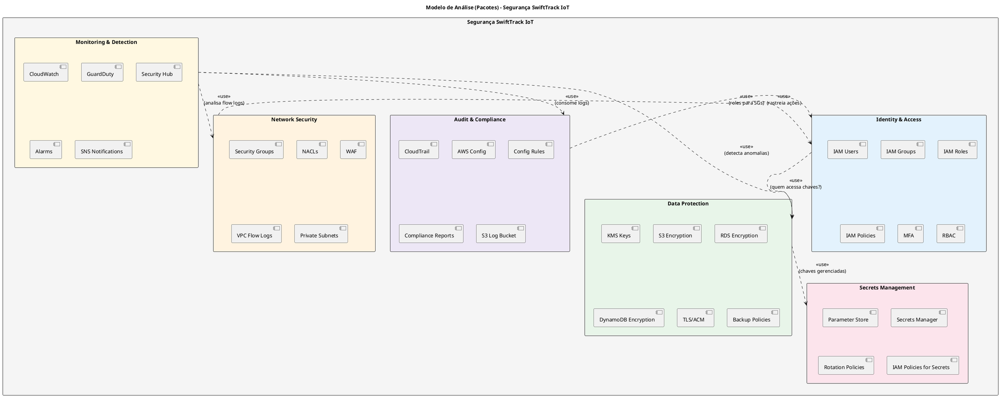
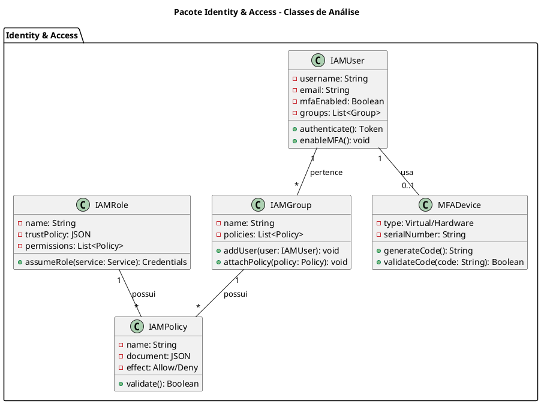
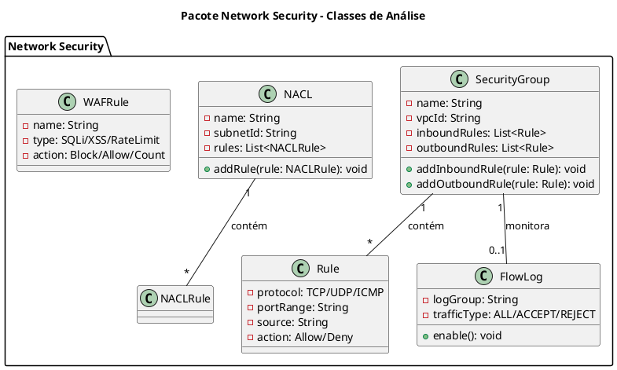
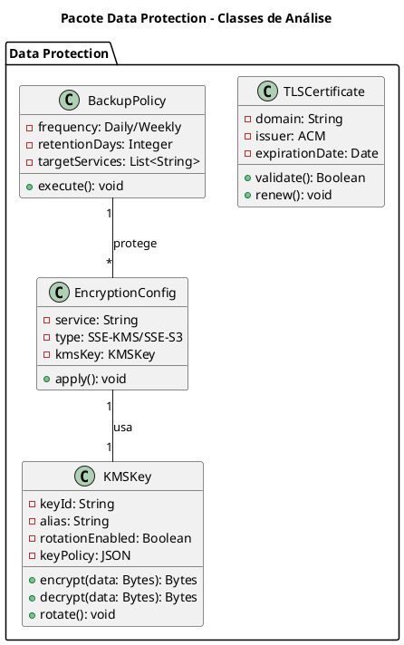
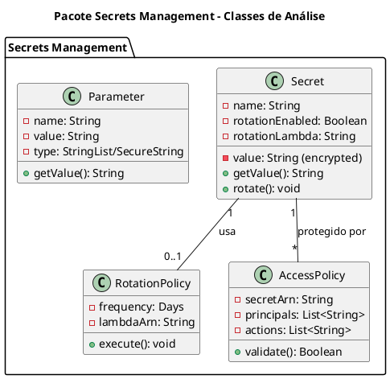
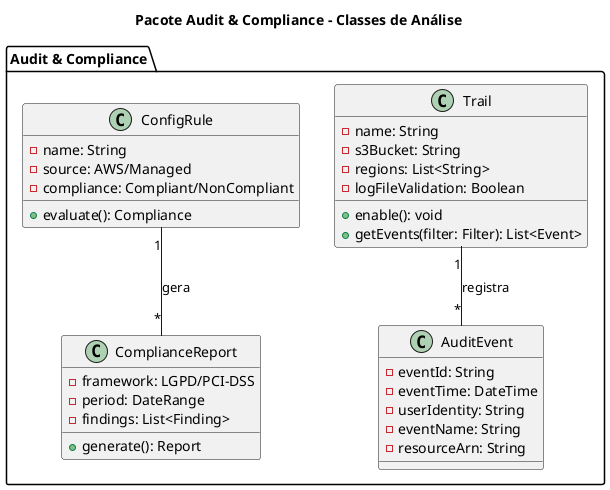
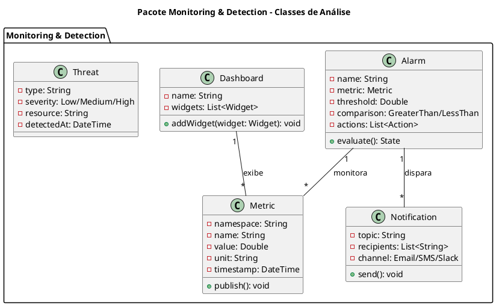
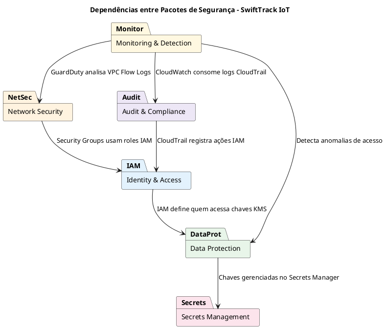

# Modelo de Análise (Pacotes/Subsistemas)

## SWIFTTRACK IOT - ARQUITETURA DE SEGURANÇA EM NUVEM AWS

| **Informação do Documento** | |
| :--- | :--- |
| **Projeto** | SwiftTrack IoT - Plataforma de Telemetria e Gestão Logística |
| **Documento** | Modelo de Análise (Pacotes/Subsistemas) - Segurança |
| **Versão** | 1.0 |
| **Data** | [DD/MM/AAAA] |
| **Status** | Em Desenvolvimento |
| **Responsável** | [Nome do Grupo] |
| **Disciplina** | Projeto de Cloud |
| **Fase RUP/UP** | Elaboration |

---

## 1. INTRODUÇÃO

### 1.1. Propósito

Este documento apresenta o **Modelo de Análise (Pacotes/Subsistemas)** para a arquitetura de segurança da plataforma **SwiftTrack IoT** na AWS. O modelo organiza os componentes de segurança em pacotes coesos, facilitando a compreensão, manutenção e evolução da arquitetura, além de permitir a rastreabilidade entre requisitos de segurança e elementos técnicos.

O modelo é derivado diretamente dos seguintes artefatos:
- **Documento de Visão** (Semana 1) - Seção "Segurança e Privacidade"
- **Documento de Requisitos Suplementares** (Semana 2) - Seção "Requisitos de Segurança"
- **Modelo de Casos de Uso Arquiteturais** (Semana 3) - UC-ARQ-002 e UC-ARQ-007

### 1.2. Escopo

O modelo abrange os subsistemas de segurança necessários para proteger:
- **Dados de motoristas e clientes** (LGPD)
- **Credenciais de banco de dados**
- **Telemetria de veículos** (coordenadas GPS)
- **Faturas e notas fiscais**
- **Logs de auditoria**

### 1.3. Definições e Siglas

| **Sigla** | **Definição** |
| :--- | :--- |
| **IAM** | Identity and Access Management |
| **KMS** | Key Management Service |
| **CMK** | Customer Managed Key |
| **SG** | Security Group |
| **NACL** | Network Access Control List |
| **WAF** | Web Application Firewall |
| **RBAC** | Role-Based Access Control |
| **MFA** | Multi-Factor Authentication |
| **LGPD** | Lei Geral de Proteção de Dados |
| **TLS** | Transport Layer Security |
| **SSE** | Server-Side Encryption |
| **PITR** | Point-In-Time Recovery |

### 1.4. Referências

- Documento de Visão - SwiftTrack IoT (v1.0)
- Documento de Requisitos Suplementares - SwiftTrack IoT (v1.0)
- Modelo de Casos de Uso Arquiteturais - SwiftTrack IoT (v1.0)
- AWS Well-Architected Framework - Security Pillar
- AWS IAM Best Practices
- Lei Geral de Proteção de Dados (LGPD)

## 2. VISÃO GERAL DOS PACOTES DE SEGURANÇA

### 2.1. Diagrama de Pacotes (PlantUML)



### 2.2. Descrição dos Pacotes

| **Pacote** | **Responsabilidade** | **Serviços AWS** | **Requisitos Atendidos** |
| :--- | :--- | :--- | :--- |
| **Identity & Access** | Gerenciar identidades, autenticação e autorização. | IAM, MFA, RBAC | Segurança (LGPD), Manutenibilidade |
| **Network Security** | Controlar tráfego de rede (firewall). | Security Groups, NACLs, WAF | Segurança (LGPD), Disponibilidade |
| **Data Protection** | Criptografar dados em repouso e em trânsito. | KMS, ACM, S3/RDS/DynamoDB Encryption | Segurança (LGPD), Compliance |
| **Secrets Management** | Proteger credenciais e chaves. | Secrets Manager, Parameter Store | Segurança (LGPD), Manutenibilidade |
| **Audit & Compliance** | Rastrear ações e garantir conformidade. | CloudTrail, AWS Config | Segurança (LGPD), Compliance |
| **Monitoring & Detection** | Detectar anomalias e ameaças. | CloudWatch, GuardDuty, Security Hub | Manutenibilidade, Disponibilidade |

### 2.3. Matriz de Rastreamento

| **Requisito (Doc. Suplementar)** | **Pacote Responsável** | **Serviço AWS** | **Controle** |
| :--- | :--- | :--- | :--- |
| Criptografia em repouso (AES-256) | Data Protection | KMS, RDS, S3, DynamoDB | SSE-KMS, RDS Encryption |
| Criptografia em trânsito (TLS 1.3) | Data Protection | ACM, ALB, API Gateway | Certificados SSL |
| Autenticação MFA para admins | Identity & Access | IAM | MFA obrigatório |
| Autorização RBAC | Identity & Access | IAM Groups, Policies | Roles granulares |
| Isolamento de credenciais | Secrets Management | Secrets Manager | Rotação automática |
| Auditoria de acessos | Audit & Compliance | CloudTrail | Logs imutáveis |
| Detecção de anomalias | Monitoring & Detection | GuardDuty, CloudWatch | Alarmes, ML |
| Conformidade LGPD | Audit & Compliance | AWS Config | Config Rules |

## 3. ESPECIFICAÇÃO DOS PACOTES

### 3.1. PACOTE: IDENTITY & ACCESS

#### 3.1.1. Responsabilidade

Gerenciar identidades (humanos e serviços), autenticação, autorização e permissões de acesso a todos os recursos da SwiftTrack na AWS.

#### 3.1.2. Elementos do Pacote

| **Elemento** | **Descrição** | **Serviço AWS** |
| :--- | :--- | :--- |
| **IAM Users** | Usuários humanos (admins, operadores, auditores). | IAM |
| **IAM Groups** | Agrupamento de usuários por função (RBAC). | IAM Groups |
| **IAM Roles** | Identidades para serviços (EC2, Lambda, RDS). | IAM Roles |
| **IAM Policies** | Permissões granulares (JSON). | IAM Policies |
| **MFA** | Autenticação multifator. | IAM MFA |
| **RBAC** | Controle baseado em papéis. | IAM Groups + Policies |

#### 3.1.3. Diagrama de Classes de Análise



#### 3.1.4. Roles e Permissões (SwiftTrack)

| **Role** | **Tipo** | **Serviços Acessados** | **Permissões** | **Justificativa** |
| :--- | :--- | :--- | :--- | :--- |
| **Admin-Role** | Humano | Todos | `*:*` (com MFA) | Emergências e gestão. |
| **DevOps-Role** | Humano | EC2, RDS, S3, CodePipeline | Deploy, operação | CI/CD e operações. |
| **Auditor-Role** | Humano | CloudTrail, Config | Somente leitura | Auditoria e compliance. |
| **EC2-API-Role** | Serviço | S3, Secrets, DynamoDB | Get/Put específicos | API acessa serviços. |
| **Lambda-Role** | Serviço | DynamoDB, S3, Logs | Put/Write | Ingestão de telemetria. |
| **RDS-Role** | Serviço | KMS | Encrypt/Decrypt | Criptografia de dados. |

#### 3.1.5. Política IAM (Exemplo - EC2-API-Role)

```json
{
  "Version": "2012-10-17",
  "Statement": [
    {
      "Sid": "S3Access",
      "Effect": "Allow",
      "Action": [
        "s3:GetObject",
        "s3:PutObject"
      ],
      "Resource": "arn:aws:s3:::swifttrack-static/*"
    },
    {
      "Sid": "SecretsAccess",
      "Effect": "Allow",
      "Action": [
        "secretsmanager:GetSecretValue"
      ],
      "Resource": "arn:aws:secretsmanager:us-east-1:123456789012:secret:rds-credentials-*"
    },
    {
      "Sid": "DynamoDBAccess",
      "Effect": "Allow",
      "Action": [
        "dynamodb:PutItem",
        "dynamodb:GetItem",
        "dynamodb:Query"
      ],
      "Resource": "arn:aws:dynamodb:us-east-1:123456789012:table/telemetry"
    }
  ]
}
```

#### 3.1.6. Riscos e Mitigações

| **Risco** | **Mitigação** |
| :--- | :--- |
| Credenciais hardcoded | Usar IAM Roles para serviços. |
| Permissões excessivas | Aplicar princípio de menor privilégio. |
| Acesso não autorizado | MFA obrigatório para admins. |
| Rotação de credenciais | Rotação automática via Secrets Manager. |

### 3.2. PACOTE: NETWORK SECURITY

#### 3.2.1. Responsabilidade

Controlar e filtrar o tráfego de rede entre as camadas da aplicação, garantindo isolamento e proteção contra acessos não autorizados.

#### 3.2.2. Elementos do Pacote

| **Elemento** | **Descrição** | **Serviço AWS** |
| :--- | :--- | :--- |
| **Security Groups** | Firewall de instâncias (stateful). | VPC |
| **NACLs** | Firewall de sub-redes (stateless). | VPC |
| **WAF** | Firewall de aplicação (L7). | WAF |
| **VPC Flow Logs** | Logs de tráfego de rede. | VPC |
| **Private Subnets** | Sub-redes sem acesso à Internet. | VPC |

#### 3.2.3. Diagrama de Classes de Análise



#### 3.2.4. Matriz de Security Groups (SwiftTrack)

| **Security Group** | **Regra de Entrada** | **Origem** | **Regra de Saída** | **Destino** | **Justificativa** |
| :--- | :--- | :--- | :--- | :--- | :--- |
| **SG-ALB** | 80, 443 | 0.0.0.0/0 | 8000 | SG-EC2-API | Exposição pública via HTTPS. |
| **SG-EC2-API** | 8000 | SG-ALB | 5432 | SG-RDS | API acessada apenas pelo ALB. |
| | | | 443 | VPC Endpoints | Acesso a DynamoDB, S3, Secrets. |
| **SG-RDS** | 5432 | SG-EC2-API | - | - | Banco acessível apenas pela API. |
| **SG-Lambda** | - | - | 443 | VPC Endpoints | Lambda acessa serviços via endpoints. |

#### 3.2.5. Matriz de NACLs (SwiftTrack)

| **NACL** | **Regra** | **Protocolo** | **Porta** | **Origem/Destino** | **Ação** |
| :--- | :--- | :--- | :--- | :--- | :--- |
| **NACL-Public** | 100 | TCP | 80, 443 | 0.0.0.0/0 | Allow |
| | 200 | TCP | 1024-65535 | 0.0.0.0/0 | Allow (efêmeras) |
| | * | All | All | 0.0.0.0/0 | Deny |
| **NACL-Private** | 100 | TCP | 5432 | 10.0.1.0/24 | Allow |
| | 200 | TCP | 8000 | 10.0.1.0/24 | Allow |
| | * | All | All | 0.0.0.0/0 | Deny |

#### 3.2.6. WAF Rules (SwiftTrack)

| **Regra** | **Tipo** | **Ação** | **Justificativa** |
| :--- | :--- | :--- | :--- |
| **SQLi Protection** | SQL Injection | Block | Proteger API de ataques. |
| **XSS Protection** | Cross-Site Scripting | Block | Proteger dashboards. |
| **Rate Limiting** | Rate-based | Block (1000 req/5min) | Evitar DDoS. |
| **Geo-blocking** | Geolocation | Allow (Brasil) | Conformidade LGPD. |

#### 3.2.7. Riscos e Mitigações

| **Risco** | **Mitigação** |
| :--- | :--- |
| Security Groups permissivos | Revisão periódica das regras. |
| Portas expostas | Usar apenas portas necessárias. |
| Ataques DDoS | WAF + Shield Standard. |
| Tráfego não monitorado | VPC Flow Logs habilitados. |

---

### 3.3. PACOTE: DATA PROTECTION

#### 3.3.1. Responsabilidade

Garantir a criptografia de dados em repouso e em trânsito, além de políticas de backup e recuperação, assegurando conformidade com a LGPD.

#### 3.3.2. Elementos do Pacote

| **Elemento** | **Descrição** | **Serviço AWS** |
| :--- | :--- | :--- |
| **KMS Keys** | Chaves de criptografia gerenciadas. | KMS |
| **S3 Encryption** | Criptografia de objetos. | S3 + KMS |
| **RDS Encryption** | Criptografia de banco relacional. | RDS + KMS |
| **DynamoDB Encryption** | Criptografia de tabelas NoSQL. | DynamoDB + KMS |
| **TLS/ACM** | Certificados SSL/TLS. | ACM |
| **Backup Policies** | Políticas de backup e retenção. | AWS Backup |

#### 3.3.3. Diagrama de Classes de Análise



#### 3.3.4. Matriz de Criptografia (SwiftTrack)

| **Serviço** | **Criptografia em Repouso** | **Criptografia em Trânsito** | **Chave** | **Justificativa** |
| :--- | :--- | :--- | :--- | :--- |
| **RDS** | AES-256 | TLS 1.3 | KMS CMK | LGPD: dados de motoristas. |
| **S3** | SSE-KMS | TLS 1.3 | KMS CMK | LGPD: comprovantes. |
| **DynamoDB** | AES-256 | TLS 1.3 | AWS Managed | Telemetria. |
| **Secrets Manager** | AES-256 | TLS 1.3 | AWS Managed | Credenciais. |
| **ALB** | - | TLS 1.3 | ACM Certificate | API pública. |
| **EBS (EC2)** | AES-256 | - | KMS CMK | Disco da API. |

#### 3.3.5. Políticas de Backup (SwiftTrack)

| **Serviço** | **Frequência** | **Retenção** | **RPO** | **RTO** |
| :--- | :--- | :--- | :--- | :--- |
| **RDS** | Diário (snapshot) | 30 dias | 15 min (PITR) | 1 hora |
| **DynamoDB** | Contínuo (PITR) | 35 dias | 5 min | 30 min |
| **S3** | Versionamento | 90 dias | 0 | 0 |
| **EBS** | Diário (snapshot) | 7 dias | 24 horas | 2 horas |

#### 3.3.6. Riscos e Mitigações

| **Risco** | **Mitigação** |
| :--- | :--- |
| Chaves comprometidas | Rotação automática (90 dias). |
| Dados não criptografados | Criptografia obrigatória em todos os serviços. |
| Backup não testado | Testes de recuperação trimestrais. |
| Perda de dados | PITR + Multi-AZ. |

### 3.4. PACOTE: SECRETS MANAGEMENT

#### 3.4.1. Responsabilidade

Proteger credenciais, chaves de API, tokens e outros segredos, garantindo que não sejam expostos em código ou configurações.

#### 3.4.2. Elementos do Pacote

| **Elemento** | **Descrição** | **Serviço AWS** |
| :--- | :--- | :--- |
| **Secrets Manager** | Armazenamento de segredos com rotação. | Secrets Manager |
| **Parameter Store** | Armazenamento de configurações. | Systems Manager |
| **Rotation Policies** | Políticas de rotação automática. | Lambda + Secrets Manager |
| **IAM Policies for Secrets** | Controle de acesso aos segredos. | IAM |

#### 3.4.3. Diagrama de Classes de Análise



#### 3.4.4. Segredos Gerenciados (SwiftTrack)

| **Segredo** | **Serviço** | **Rotação** | **Acesso** | **Justificativa** |
| :--- | :--- | :--- | :--- | :--- |
| **rds-credentials** | RDS PostgreSQL | 90 dias | EC2-API-Role | Evitar hardcoded. |
| **api-keys** | API Gateway | 180 dias | Lambda-Role | Autenticação de dispositivos. |
| **jwt-secret** | Django | 90 dias | EC2-API-Role | Tokens de sessão. |
| **s3-access** | S3 | 90 dias | EC2-API-Role | Acesso a buckets. |

#### 3.4.5. Riscos e Mitigações

| **Risco** | **Mitigação** |
| :--- | :--- |
| Segredos em código | Usar Secrets Manager. |
| Rotação manual | Rotação automática via Lambda. |
| Acesso não autorizado | IAM Policies restritivas. |
| Vazamento de segredos | Auditoria via CloudTrail. |

### 3.5. PACOTE: AUDIT & COMPLIANCE

#### 3.5.1. Responsabilidade

Rastrear todas as ações realizadas na conta AWS, garantir conformidade com regulamentações (LGPD) e fornecer evidências para auditorias.

#### 3.5.2. Elementos do Pacote

| **Elemento** | **Descrição** | **Serviço AWS** |
| :--- | :--- | :--- |
| **CloudTrail** | Registro de todas as ações na conta. | CloudTrail |
| **AWS Config** | Avaliação de conformidade. | AWS Config |
| **Config Rules** | Regras de conformidade. | AWS Config |
| **Compliance Reports** | Relatórios de conformidade. | AWS Artifact |
| **S3 Log Bucket** | Armazenamento de logs. | S3 |

#### 3.5.3. Diagrama de Classes de Análise



#### 3.5.4. Config Rules (SwiftTrack)

| **Regra** | **Descrição** | **Serviço Alvo** | **Conformidade** |
| :--- | :--- | :--- | :--- |
| **encrypted-volumes** | Volumes EBS criptografados. | EC2 | LGPD |
| **rds-storage-encrypted** | RDS criptografado. | RDS | LGPD |
| **s3-bucket-ssl-requests-only** | S3 exige HTTPS. | S3 | LGPD |
| **iam-password-policy** | Política de senhas forte. | IAM | Segurança |
| **mfa-enabled-for-iam-console-access** | MFA para admins. | IAM | Segurança |
| **cloudtrail-enabled** | CloudTrail ativo. | CloudTrail | Auditoria |

#### 3.5.5. Riscos e Mitigações

| **Risco** | **Mitigação** |
| :--- | :--- |
| Logs não imutáveis | S3 com Object Lock. |
| Auditoria incompleta | CloudTrail em todas as regiões. |
| Conformidade não verificada | AWS Config Rules. |
| Perda de logs | Replicação para outra região. |

### 3.6. PACOTE: MONITORING & DETECTION

#### 3.6.1. Responsabilidade

Monitorar a saúde dos recursos, detectar anomalias e ameaças, e emitir alertas para a equipe de operações.

#### 3.6.2. Elementos do Pacote

| **Elemento** | **Descrição** | **Serviço AWS** |
| :--- | :--- | :--- |
| **CloudWatch** | Métricas, logs e alarmes. | CloudWatch |
| **GuardDuty** | Detecção de ameaças com ML. | GuardDuty |
| **Security Hub** | Visão centralizada de segurança. | Security Hub |
| **Alarms** | Alarmes baseados em métricas. | CloudWatch |
| **SNS Notifications** | Notificações de incidentes. | SNS |

#### 3.6.3. Diagrama de Classes de Análise



#### 3.6.4. Alarmes Configurados (SwiftTrack)

| **Alarme** | **Métrica** | **Threshold** | **Ação** | **Justificativa** |
| :--- | :--- | :--- | :--- | :--- |
| **CPU-High** | CPUUtilization | > 80% (5 min) | Auto Scaling + SNS | Escalar API. |
| **Latency-High** | TargetResponseTime | > 80ms (5 min) | SNS | SLA de latência. |
| **RDS-Storage-Low** | FreeStorageSpace | < 10 GB | SNS | Evitar falha. |
| **Lambda-Errors** | Errors | > 10 (5 min) | SNS | Ingestão com falha. |
| **Unauthorized-API-Calls** | CloudTrail | > 5 (5 min) | SNS + GuardDuty | Detecção de ataque. |
| **Root-Account-Usage** | CloudTrail | > 0 | SNS | Alerta crítico. |

#### 3.6.5. Riscos e Mitigações

| **Risco** | **Mitigação** |
| :--- | :--- |
| Alarmes não configurados | Cobertura de 100% dos recursos. |
| Notificações ignoradas | Escalonamento para múltiplos canais. |
| Detecção tardia | GuardDuty + Security Hub. |
| Falsos positivos | Ajuste fino de thresholds. |

## 4. DIAGRAMA DE DEPENDÊNCIAS ENTRE PACOTES



| **De** | **Para** | **Motivo** |
| :--- | :--- | :--- |
| Identity & Access | Data Protection | IAM define quem pode acessar chaves KMS. |
| Network Security | Identity & Access | Security Groups usam roles IAM. |
| Data Protection | Secrets Management | Chaves de criptografia são gerenciadas no Secrets Manager. |
| Audit & Compliance | Identity & Access | CloudTrail registra ações de usuários IAM. |
| Monitoring & Detection | Audit & Compliance | CloudWatch consome logs do CloudTrail. |
| Monitoring & Detection | Network Security | GuardDuty analisa VPC Flow Logs. |
| Monitoring & Detection | Data Protection | Detecta anomalias de acesso a dados. |

## 5. MATRIZ DE RASTREAMENTO COMPLETA

| **Requisito (Doc. Suplementar)** | **Caso de Uso (Semana 3)** | **Pacote** | **Serviço AWS** | **Controle** |
| :--- | :--- | :--- | :--- | :--- |
| Criptografia em repouso | UC-ARQ-007 | Data Protection | KMS, RDS, S3, DynamoDB | SSE-KMS |
| Criptografia em trânsito | UC-ARQ-004 | Data Protection | ACM, ALB | TLS 1.3 |
| MFA para admins | UC-ARQ-002 | Identity & Access | IAM | MFA |
| RBAC | UC-ARQ-002 | Identity & Access | IAM Groups | Roles |
| Isolamento de credenciais | UC-AR