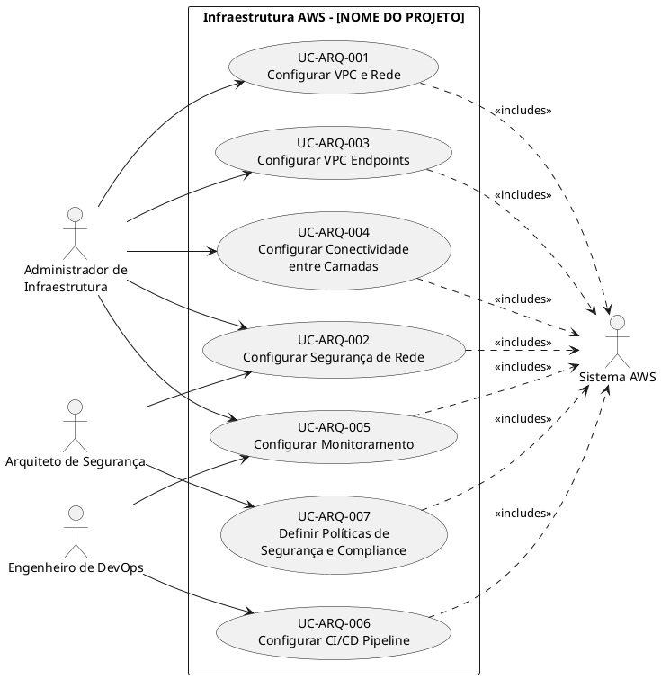
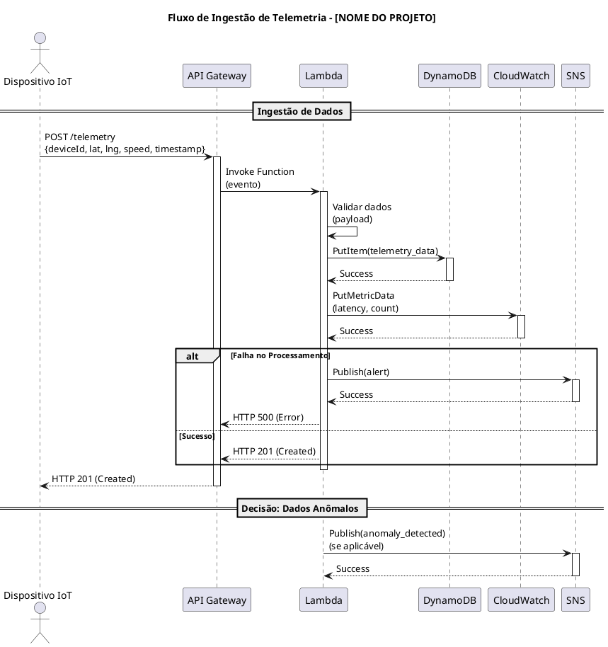
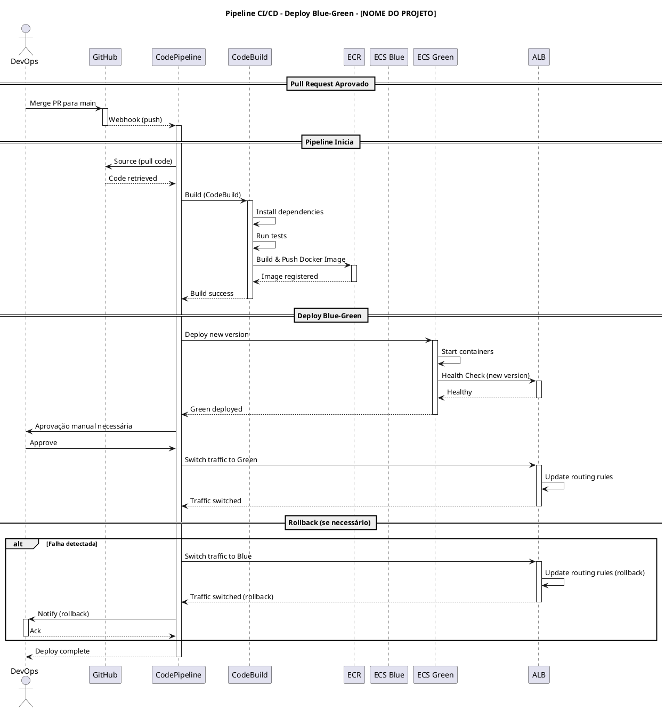
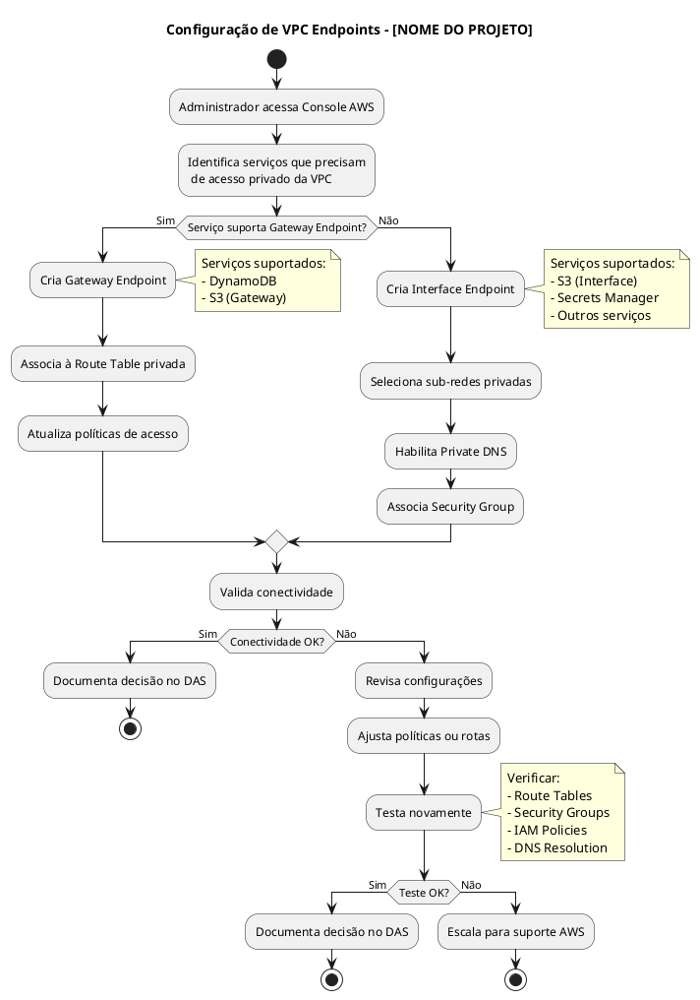
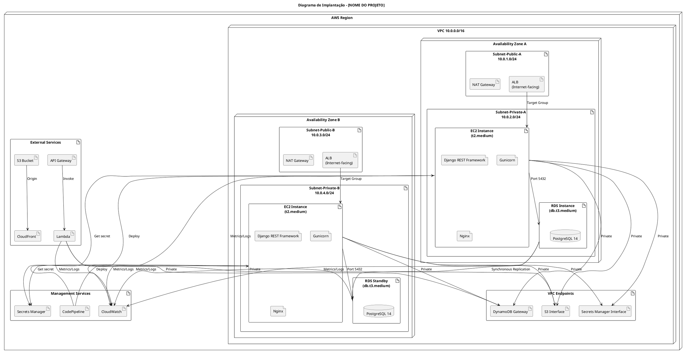

## Modelo de Documento de Casos de Uso Arquiteturais

**Disciplina:** Projeto de Cloud
**Projeto:** [Nome do Projeto]  
**Data:** xx/xx/2026  
**Status:** xxxx  xxxxx xxxxxx

---

| **Informação do Documento** | |
|---|---|
| **Documento** | Modelo de Casos de Uso Arquiteturais |
| **Versão** | 1.0 |
| **Responsável** | [Nome do Grupo] |
| **Disciplina** | Projeto de Cloud  |

---

## 1. INTRODUÇÃO

### 1.1. Propósito

Este documento descreve os Casos de Uso Arquiteturais para a infraestrutura em nuvem AWS da plataforma **[NOME DO PROJETO]**. Os casos de uso arquiteturais focam em requisitos de infraestrutura, segurança, operações e governança, diferentemente dos casos de uso funcionais que descrevem interações de usuários finais com o sistema.

Os casos de uso arquiteturais são derivados diretamente dos requisitos estabelecidos no:
- **Documento de Visão** 
- **Documento de Requisitos Suplementares** 

### 1.2. Escopo

Os casos de uso arquiteturais abrangem a configuração, operação e manutenção da infraestrutura AWS, incluindo:

- Rede (VPC, sub-redes, rotas, endpoints)
- Segurança (Security Groups, NACLs, IAM)

**Em segundo momento**

- Conectividade entre camadas (ALB, EC2, RDS, Lambda)
- Integração com serviços gerenciados (DynamoDB, S3, Secrets Manager)
- Automação e deploy (CI/CD)
- Monitoramento e observabilidade

### 1.3. Definições e Siglas

| **Sigla** | **Definição** |
| :--- | :--- |
| **VPC** | Virtual Private Cloud - Rede virtual privada na AWS |
| **IGW** | Internet Gateway - Gateway para comunicação com a Internet |
| **NAT** | Network Address Translation - Tradução de endereços de rede |
| **ALB** | Application Load Balancer - Balanceador de carga para aplicações |
| **SG** | Security Group - Firewall a nível de instância |
| **NACL** | Network Access Control List - Firewall a nível de sub-rede |
| **RDS** | Relational Database Service - Banco de dados relacional gerenciado |
| **IAM** | Identity and Access Management - Gerenciamento de identidade e acesso |
| **CI/CD** | Continuous Integration / Continuous Deployment |
| **RPO** | Recovery Point Objective - Objetivo de ponto de recuperação |
| **RTO** | Recovery Time Objective - Objetivo de tempo de recuperação |
| **LGPD** | Lei Geral de Proteção de Dados |

### 1.4. Referências

- Documento de Visão - [NOME DO PROJETO] (v1.0)
- Documento de Requisitos Suplementares - [NOME DO PROJETO] (v1.0)
- AWS Well-Architected Framework
- Amazon VPC Documentation
- Lei Geral de Proteção de Dados (LGPD)

---

## 2. VISÃO GERAL DOS CASOS DE USO

### 2.1. Atores

| **Ator** | **Descrição** | **Responsabilidades** |
| :--- | :--- | :--- |
| **Administrador de Infraestrutura** | Profissional responsável por configurar e gerenciar a infraestrutura AWS. | Criar VPC, sub-redes, security groups, endpoints, NAT Gateways. |
| **Engenheiro de DevOps** | Profissional responsável por automação, CI/CD e operações. | Configurar pipelines, deploys, rollbacks, monitoramento. |
| **Arquiteto de Segurança** | Profissional responsável por políticas de segurança e compliance. | Definir políticas IAM, criptografia, auditoria, conformidade. |
| **Sistema AWS** | Serviços gerenciados da AWS (DynamoDB, S3, Secrets Manager, etc.). | Prover serviços, endpoints, logs, métricas. |

### 2.2. Diagrama de Casos de Uso



### 2.3. Matriz de Rastreamento

| **Caso de Uso** | **Requisitos Suplementares** | **Documento de Visão** | **Serviços AWS** |
| :--- | :--- | :--- | :--- |
| UC-ARQ-001 | Confiabilidade (Multi-AZ), Custo | Visão Geral da Solução | VPC, Sub-redes, IGW, NAT, Route Tables |
| UC-ARQ-002 | Segurança (LGPD), Manutenibilidade | Segurança e Privacidade | Security Groups, NACLs, IAM |
| UC-ARQ-003 | Segurança (LGPD), Custo | Arquitetura Híbrida | VPC Endpoints (DynamoDB, S3, Secrets Manager) |
| UC-ARQ-004 | Desempenho (Latência), Disponibilidade | API + Ingestão | ALB, EC2, RDS, Lambda |
| UC-ARQ-005 | Manutenibilidade, Disponibilidade | Monitoramento | CloudWatch, Logs, Alarms |
| UC-ARQ-006 | Manutenibilidade (Deploy/Rollback) | Automação | CodePipeline, CodeBuild, CodeDeploy |
| UC-ARQ-007 | Segurança (LGPD), Compliance | Segurança e Privacidade | IAM, KMS, Secrets Manager, CloudTrail |

---

## 3. DIAGRAMAS DE ARQUITETURA

### 3.1. Diagrama de Componentes - Visão Geral da Arquitetura

```plantuml
@startuml
!define AWSPuml https://raw.githubusercontent.com/awslabs/aws-icons-for-plantuml/v16.0/dist
!include AWSPuml/AWSCommon.puml
!include AWSPuml/NetworkingContentDelivery/AmazonVPC.puml
!include AWSPuml/NetworkingContentDelivery/AmazonRoute53.puml
!include AWSPuml/NetworkingContentDelivery/ElasticLoadBalancing.puml
!include AWSPuml/Compute/AmazonEC2.puml
!include AWSPuml/Database/AmazonRDS.puml
!include AWSPuml/Database/AmazonDynamoDB.puml
!include AWSPuml/Storage/AmazonS3.puml
!include AWSPuml/ApplicationIntegration/AmazonAPIGateway.puml
!include AWSPuml/Compute/AWSLambda.puml
!include AWSPuml/ManagementGovernance/AWSCloudWatch.puml
!include AWSPuml/DeveloperTools/AWSCodePipeline.puml

title Arquitetura de Componentes - [NOME DO PROJETO]

package "AWS Cloud" {
  package "VPC 10.0.0.0/16" {
    package "Availability Zone A" {
      package "Subnet-Public-A\n10.0.1.0/24" {
        AmazonALB(albA, "Application Load Balancer", "ALB - A")
        NATGateway(natA, "NAT Gateway", "NAT-A")
      }
      package "Subnet-Private-A\n10.0.2.0/24" {
        AmazonEC2(ec2A, "API Instance", "EC2 - A")
        AmazonRDS(rdsA, "RDS Primary", "PostgreSQL")
      }
    }
    package "Availability Zone B" {
      package "Subnet-Public-B\n10.0.3.0/24" {
        AmazonALB(albB, "Application Load Balancer", "ALB - B")
        NATGateway(natB, "NAT Gateway", "NAT-B")
      }
      package "Subnet-Private-B\n10.0.4.0/24" {
        AmazonEC2(ec2B, "API Instance", "EC2 - B")
        AmazonRDS(rdsB, "RDS Standby", "PostgreSQL")
      }
    }
    
    package "VPC Endpoints" {
      AmazonDynamoDB(dynamoDB, "DynamoDB", "GPS Data")
      AmazonS3(s3, "S3", "Static Files")
      AWSSecretsManager(secrets, "Secrets Manager", "Credentials")
    }
    
    AmazonAPIGateway(apiGw, "API Gateway", "Ingestão")
    AWSLambda(lambda, "Lambda", "Processamento")
  }
  
  AmazonS3(s3cdn, "S3 + CloudFront", "CDN")
  AWSCloudWatch(cloudwatch, "CloudWatch", "Monitoramento")
  AWSCodePipeline(pipeline, "CodePipeline", "CI/CD")
  
  Cloudflare(client, "Clientes/Operadores")
}

' Conexões
client --> albA
client --> albB

albA --> ec2A
albB --> ec2B

ec2A --> rdsA
ec2B --> rdsB

ec2A --> dynamoDB
ec2B --> dynamoDB

ec2A --> s3
ec2B --> s3

ec2A --> secrets
ec2B --> secrets

lambda --> dynamoDB
lambda --> s3

apiGw --> lambda

s3cdn <-- s3

pipeline --> ec2A
pipeline --> ec2B

ec2A --> cloudwatch
ec2B --> cloudwatch
lambda --> cloudwatch
rdsA --> cloudwatch
rdsB --> cloudwatch

@enduml
```

### 3.2. Diagrama de Sequência - Ingestão de Telemetria



### 3.3. Diagrama de Sequência - Deploy Automatizado (Blue-Green)



### 3.4. Diagrama de Atividades - Configuração de VPC Endpoints



### 3.5. Diagrama de Implantação - Visão Física



---

## 4. ESPECIFICAÇÃO DOS CASOS DE USO

---

### UC-ARQ-001: CONFIGURAR VPC E REDE

| **Elemento** | **Especificação** |
| :--- | :--- |
| **Identificador** | UC-ARQ-001 |
| **Nome** | Configurar VPC e Rede [NOME DO PROJETO] |
| **Versão** | 1.0 |
| **Data** | [DD/MM/AAAA] |
| **Status** | Em Desenvolvimento |

| **Ator Principal** | Administrador de Infraestrutura |
| **Ator Secundário** | Sistema AWS |

| **Pré-condição** | 1. Conta AWS ativa.<br>2. Permissões IAM para criar VPC, sub-redes, IGW, NAT Gateway, Route Tables.<br>3. Documento de Visão e Requisitos Suplementares definidos. |
| **Pós-condição** | 1. VPC criada com CIDR definido.<br>2. Sub-redes públicas e privadas criadas em múltiplas AZs.<br>3. Internet Gateway anexado.<br>4. NAT Gateways configurados.<br>5. Route Tables configuradas. |

| **Fluxo Principal** | **Passos** |
| :--- | :--- |
| 1. | Administrador acessa o Console AWS. |
| 2. | Navega até o serviço VPC. |
| 3. | Cria VPC com CIDR definido no DAS e habilita DNS hostnames. |
| 4. | Cria sub-redes públicas (uma por AZ) com CIDRs definidos. |
| 5. | Cria sub-redes privadas (uma por AZ) com CIDRs definidos. |
| 6. | Cria e anexa Internet Gateway à VPC. |
| 7. | Cria NAT Gateways (um por AZ) nas sub-redes públicas. |
| 8. | Configura Route Table pública: CIDR_VPC → local, 0.0.0.0/0 → IGW. |
| 9. | Configura Route Table privada: CIDR_VPC → local, 0.0.0.0/0 → NAT Gateway. |
| 10. | Associa sub-redes públicas à Route Table pública. |
| 11. | Associa sub-redes privadas à Route Table privada. |
| 12. | Valida conectividade: instância pública → Internet, instância privada → NAT. |

| **Fluxos Alternativos** | **Descrição** |
| :--- | :--- |
| Alt 1 | CIDR da VPC conflita com outra VPC → alterar CIDR. |
| Alt 2 | Limite de VPCs por região atingido → solicitar aumento de quota. |
| Alt 3 | Permissões IAM insuficientes → atualizar IAM policies. |
| Alt 4 | NAT Gateway falha → verificar Elastic IP e configuração. |

| **Requisitos Não-Funcionais** | **Métrica** |
| :--- | :--- |
| **Desempenho** | VPC criada e configurada em < 15 min. |
| **Disponibilidade** | Multi-AZ com 2 AZs (redundância). |
| **Segurança** | Sub-redes privadas sem rota direta para Internet. |
| **Custo** | NAT Gateway: conforme estimativa no DAS. |

| **Riscos** | **Mitigação** |
| :--- | :--- |
| Endereçamento conflitante | Planejar CIDR com folga (mínimo /16). |
| Custo elevado do NAT Gateway | Avaliar NAT Instance se orçamento restrito. |
| Erro de roteamento | Testar conectividade com `ping` ou `traceroute`. |

---

### UC-ARQ-002: CONFIGURAR SEGURANÇA DE REDE

| **Elemento** | **Especificação** |
| :--- | :--- |
| **Identificador** | UC-ARQ-002 |
| **Nome** | Configurar Segurança de Rede [NOME DO PROJETO] |
| **Versão** | 1.0 |
| **Data** | [DD/MM/AAAA] |
| **Status** | Em Desenvolvimento |

| **Ator Principal** | Administrador de Infraestrutura |
| **Ator Secundário** | Arquiteto de Segurança, Sistema AWS |

| **Pré-condição** | 1. VPC e sub-redes criadas (UC-ARQ-001).<br>2. IAM configurado.<br>3. Requisitos de segurança definidos. |
| **Pós-condição** | 1. Security Groups configurados para cada camada.<br>2. NACLs configuradas.<br>3. IAM roles definidas para serviços. |

| **Fluxo Principal** | **Passos** |
| :--- | :--- |
| 1. | Administrador acessa o Console AWS. |
| 2. | Navega até Security Groups. |
| 3. | Cria SG-ALB com regras de entrada: Portas 80, 443 (0.0.0.0/0). |
| 4. | Cria SG-EC2-API com regras de entrada: Porta 8000 (origem: SG-ALB). |
| 5. | Cria SG-RDS com regras de entrada: Porta 5432 (origem: SG-EC2-API). |
| 6. | Cria SG-Lambda com regras de saída: DynamoDB, S3, Secrets Manager. |
| 7. | Cria NACLs para sub-redes públicas e privadas. |
| 8. | Define IAM roles para EC2, Lambda e RDS (princípio menor privilégio). |
| 9. | Documenta todas as regras no DAS. |

| **Fluxos Alternativos** | **Descrição** |
| :--- | :--- |
| Alt 1 | Porta exposta acidentalmente → revisão das regras. |
| Alt 2 | IAM role com permissões excessivas → revisar e ajustar. |
| Alt 3 | NACL bloqueando tráfego legítimo → ajustar regras numeradas. |

| **Requisitos Não-Funcionais** | **Métrica** |
| :--- | :--- |
| **Segurança** | Princípio de menor privilégio implementado. |
| **Segurança** | Criptografia em trânsito (TLS 1.3). |
| **Compliance** | Conformidade com LGPD e demais regulamentações. |

| **Riscos** | **Mitigação** |
| :--- | :--- |
| Security Groups permissivos | Revisão periódica das regras. |
| Acesso não autorizado | MFA obrigatório para admins. |

---

### UC-ARQ-003: CONFIGURAR VPC ENDPOINTS

| **Elemento** | **Especificação** |
| :--- | :--- |
| **Identificador** | UC-ARQ-003 |
| **Nome** | Configurar VPC Endpoints [NOME DO PROJETO] |
| **Versão** | 1.0 |
| **Data** | [DD/MM/AAAA] |
| **Status** | Em Desenvolvimento |

| **Ator Principal** | Administrador de Infraestrutura |
| **Ator Secundário** | Sistema AWS |

| **Pré-condição** | 1. VPC e sub-redes privadas criadas (UC-ARQ-001).<br>2. IAM configurado.<br>3. Serviços AWS identificados (DynamoDB, S3, Secrets Manager). |
| **Pós-condição** | 1. Endpoints configurados para serviços necessários.<br>2. Políticas de endpoint restritivas aplicadas.<br>3. Conectividade validada. |

| **Fluxo Principal** | **Passos** |
| :--- | :--- |
| 1. | Administrador acessa o Console AWS. |
| 2. | Navega até VPC Endpoints. |
| 3. | Para serviços compatíveis (DynamoDB, S3), cria Gateway Endpoint. |
| 4. | Associa às sub-redes privadas e Route Tables. |
| 5. | Para serviços não compatíveis (Secrets Manager), cria Interface Endpoint. |
| 6. | Seleciona sub-redes privadas e habilita Private DNS. |
| 7. | Aplica políticas de endpoint para restringir acesso. |
| 8. | Valida conectividade de cada serviço. |

| **Fluxos Alternativos** | **Descrição** |
| :--- | :--- |
| Alt 1 | Serviço não suporta Gateway Endpoint → usar Interface Endpoint. |
| Alt 2 | Política de endpoint bloqueia acesso → revisar e ajustar. |
| Alt 3 | Endpoint não aparece na VPC → verificar região e disponibilidade. |

| **Requisitos Não-Funcionais** | **Métrica** |
| :--- | :--- |
| **Segurança** | Tráfego não sai da VPC. |
| **Custo** | Conforme estimativa no DAS. |
| **Desempenho** | Latência reduzida vs acesso via Internet. |

| **Riscos** | **Mitigação** |
| :--- | :--- |
| Custo elevado | Usar Gateway Endpoint para serviços suportados. |
| Políticas restritivas | Testar com usuários específicos antes de aplicar. |

---

### UC-ARQ-004: CONFIGURAR CONECTIVIDADE ENTRE CAMADAS

| **Elemento** | **Especificação** |
| :--- | :--- |
| **Identificador** | UC-ARQ-004 |
| **Nome** | Configurar Conectividade entre Camadas [NOME DO PROJETO] |
| **Versão** | 1.0 |
| **Data** | [DD/MM/AAAA] |
| **Status** | Em Desenvolvimento |

| **Ator Principal** | Administrador de Infraestrutura |
| **Ator Secundário** | Engenheiro de DevOps |

| **Pré-condição** | 1. VPC e sub-redes criadas (UC-ARQ-001).<br>2. Security Groups configurados (UC-ARQ-002).<br>3. VPC Endpoints configurados (UC-ARQ-003). |
| **Pós-condição** | 1. Application Load Balancer (ALB) configurado.<br>2. EC2 (API) configurada e comunicando com ALB.<br>3. RDS acessível apenas pela EC2.<br>4. Lambda acessando serviços via endpoints. |

| **Fluxo Principal** | **Passos** |
| :--- | :--- |
| 1. | Administrador acessa o Console AWS. |
| 2. | Configura Application Load Balancer (ALB) na sub-rede pública. |
| 3. | Configura listener: porta 443 (HTTPS) → porta 8000 (EC2). |
| 4. | Configura Target Group com EC2-API. |
| 5. | Cria Launch Template para EC2-API com User Data. |
| 6. | Configura Auto Scaling Group com mínimo 2 instâncias (Multi-AZ). |
| 7. | Configura RDS em Multi-AZ com Security Group restrito. |
| 8. | Configura Lambda com VPC e VPC Endpoints. |
| 9. | Testa fluxo completo: ALB → EC2 → RDS. |

| **Requisitos Não-Funcionais** | **Métrica** |
| :--- | :--- |
| **Disponibilidade** | Conforme SLO definido (ex: 99,95%). |
| **Desempenho** | Latência conforme SLO definido. |
| **Segurança** | Comunicação entre camadas via rede privada. |

| **Riscos** | **Mitigação** |
| :--- | :--- |
| ALB como ponto único de falha | ALB é gerenciado e altamente disponível. |
| Auto Scaling mal configurado | Definir CloudWatch alarms para escalonamento. |

---

### UC-ARQ-005: CONFIGURAR MONITORAMENTO

| **Elemento** | **Especificação** |
| :--- | :--- |
| **Identificador** | UC-ARQ-005 |
| **Nome** | Configurar Monitoramento [NOME DO PROJETO] |
| **Versão** | 1.0 |
| **Data** | [DD/MM/AAAA] |
| **Status** | Em Desenvolvimento |

| **Ator Principal** | Administrador de Infraestrutura |
| **Ator Secundário** | Engenheiro de DevOps |

| **Pré-condição** | 1. VPC e recursos configurados.<br>2. Requisitos de monitoramento definidos. |
| **Pós-condição** | 1. CloudWatch dashboards configurados.<br>2. Alarmes definidos.<br>3. Logs centralizados. |

| **Fluxo Principal** | **Passos** |
| :--- | :--- |
| 1. | Administrador acessa o Console AWS. |
| 2. | Navega até CloudWatch. |
| 3. | Cria Dashboard com métricas principais. |
| 4. | Configura alarmes conforme SLOs definidos. |
| 5. | Configura CloudWatch Logs para todos os serviços. |
| 6. | Define métricas customizadas para o negócio. |
| 7. | Configura notificações (email, Slack, SMS). |

| **Requisitos Não-Funcionais** | **Métrica** |
| :--- | :--- |
| **Observabilidade** | 100% de cobertura de logs. |
| **Resposta a incidentes** | Conforme MTTR definido. |

---

### UC-ARQ-006: CONFIGURAR CI/CD PIPELINE

| **Elemento** | **Especificação** |
| :--- | :--- |
| **Identificador** | UC-ARQ-006 |
| **Nome** | Configurar CI/CD Pipeline [NOME DO PROJETO] |
| **Versão** | 1.0 |
| **Data** | [DD/MM/AAAA] |
| **Status** | Em Desenvolvimento |

| **Ator Principal** | Engenheiro de DevOps |
| **Ator Secundário** | Sistema AWS |

| **Pré-condição** | 1. Código da API no repositório.<br>2. EC2 e RDS configurados. |
| **Pós-condição** | 1. Pipeline automatizado funcionando.<br>2. Deploy conforme SLO definido.<br>3. Rollback automatizado. |

| **Fluxo Principal** | **Passos** |
| :--- | :--- |
| 1. | Engenheiro acessa o Console AWS. |
| 2. | Configura CodePipeline com Source, Build, Deploy. |
| 3. | Config