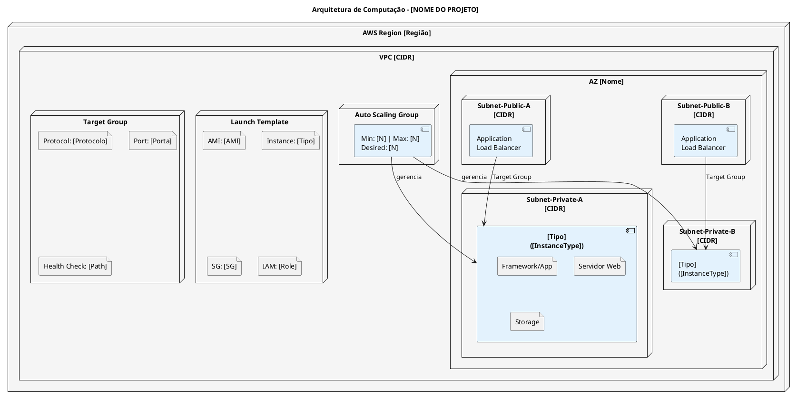
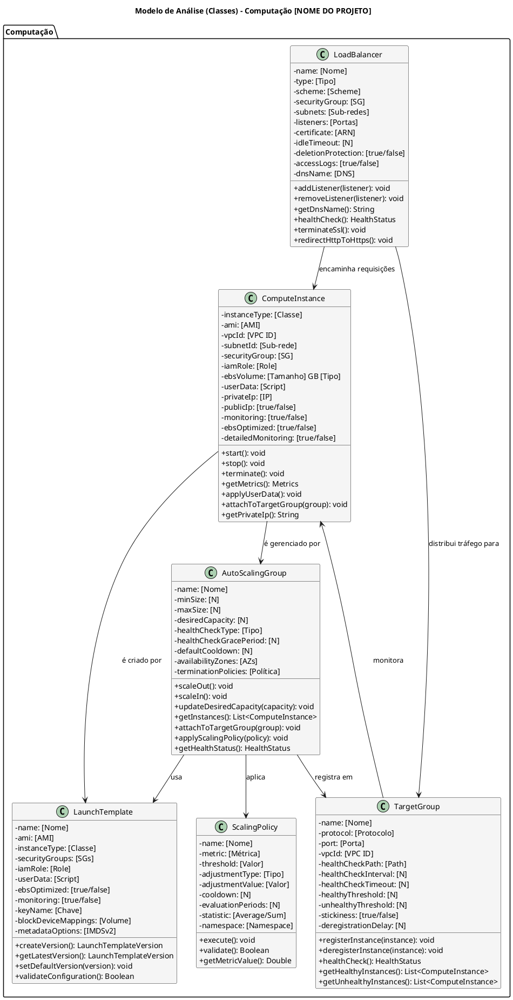

# MODELO DE ANÁLISE (CLASSES DE ANÁLISE)

## DIMENSIONAMENTO DE COMPUTAÇÃO (EC2)

## [NOME DO PROJETO] - [DESCRIÇÃO CURTA DO PROJETO]

---

| **Informação do Documento** | |
| :--- | :--- |
| **Projeto** | [Nome do Projeto] |
| **Documento** | Modelo de Análise (Classes de Análise) - Dimensionamento de Computação (EC2) |
| **Versão** | 1.0 |
| **Data** | [DD/MM/AAAA] |
| **Status** | Em Desenvolvimento |
| **Responsável** | [Nome do Grupo] |
| **Disciplina** | Projeto de Cloud - Semana 6 |
| **Fase RUP/UP** | Elaboration |

---

## 1. INTRODUÇÃO

### 1.1. Propósito

Este documento apresenta o **Modelo de Análise (Classes de Análise)** para o dimensionamento da camada de computação **[Amazon EC2 / Amazon ECS / AWS Fargate]** da plataforma **[NOME DO PROJETO]** na AWS. O modelo descreve as classes de análise responsáveis pelo processamento da API, suas responsabilidades, atributos e relacionamentos, além das decisões de dimensionamento baseadas nos requisitos não-funcionais.

O modelo é derivado diretamente dos seguintes artefatos:
- **Documento de Visão** (Semana 1) - Seção "Recursos do Produto (Arquitetura AWS)"
- **Documento de Requisitos Suplementares** (Semana 2) - Seções "Desempenho" e "Disponibilidade"
- **Modelo de Casos de Uso Arquiteturais** (Semana 3) - UC-ARQ-XXX (Conectividade entre Camadas)
- **Modelo de Análise (Pacotes/Subsistemas)** (Semana 4) - Pacote "[Network Security]"
- **Modelo de Análise (Classes) - RDS** (Semana 5) - Integração com banco de dados

### 1.2. Escopo

O modelo abrange o dimensionamento da camada de computação, incluindo:
- **Instância de computação** (`ComputeInstance`) para a API
- **Auto Scaling Group** (`AutoScalingGroup`) para escalabilidade automática
- **Load Balancer** (`LoadBalancer`) para distribuição de carga
- **Target Group** (`TargetGroup`) para registro de instâncias
- **Launch Template** (`LaunchTemplate`) para padronização de instâncias
- **Políticas de Escalonamento** (`ScalingPolicy`) para escala horizontal
- **Cálculos de dimensionamento** (vCPU, memória, número de instâncias)
- **Estimativa de custo** e comparação com alternativas

**Fora do escopo:** Instâncias EC2 para o NAT Gateway (tratadas na Semana 3), Lambda (serverless, tratado em documento separado), RDS (tratado na Semana 5) e S3 (tratado na Semana 7).

### 1.3. Definições e Siglas

| **Sigla** | **Definição** |
| :--- | :--- |
| **EC2** | Elastic Compute Cloud |
| **ALB** | Application Load Balancer |
| **NLB** | Network Load Balancer |
| **ASG** | Auto Scaling Group |
| **AMI** | Amazon Machine Image |
| **EBS** | Elastic Block Store |
| **TPS** | Transactions Per Second |
| **Multi-AZ** | Múltiplas Zonas de Disponibilidade |
| **SLA** | Service Level Agreement |
| **RPO** | Recovery Point Objective |
| **RTO** | Recovery Time Objective |
| **LGPD** | Lei Geral de Proteção de Dados |
| **SG** | Security Group |

### 1.4. Referências

- Documento de Visão - [NOME DO PROJETO] (v1.0)
- Documento de Requisitos Suplementares - [NOME DO PROJETO] (v1.0)
- Modelo de Casos de Uso Arquiteturais - [NOME DO PROJETO] (v1.0)
- Modelo de Análise (Pacotes/Subsistemas) - [NOME DO PROJETO] (v1.0)
- Modelo de Análise (Classes) - RDS - [NOME DO PROJETO] (v1.0)
- AWS EC2 Documentation
- AWS Auto Scaling Documentation
- AWS Well-Architected Framework - Performance Efficiency Pillar
- AWS EC2 Pricing

---

## 2. VISÃO GERAL DO DIMENSIONAMENTO

### 2.1. Requisitos que Impactam o Dimensionamento

| **Requisito** | **Valor** | **Fonte** |
| :--- | :--- | :--- |
| **Usuários ativos** | [Valor] | Documento de Visão |
| **Requisições por segundo (pico)** | [Valor] | Requisitos Suplementares |
| **Latência máxima (API)** | [Valor] | Requisitos Suplementares |
| **CPU por requisição** | [Valor] | Estimativa |
| **Memória por requisição** | [Valor] | Estimativa |
| **Conexões simultâneas** | [Valor] | Estimativa |
| **SLA de disponibilidade** | [Valor] | Requisitos Suplementares |
| **Picos de demanda** | [Valor] | Requisitos Suplementares |
| **RPO** | [Valor] | Requisitos Suplementares |
| **RTO** | [Valor] | Requisitos Suplementares |
| **Orçamento total do projeto** | [Valor] | Documento de Visão |
| **Orçamento alocado para EC2** | [Valor] | Estimativa |

### 2.2. Arquitetura de Computação

### 2.3. Matriz de Rastreamento

| **Requisito (Doc. Suplementar)** | **Pacote (Semana 4)** | **Classe de Análise** | **Serviço AWS** | **Configuração** |
| :--- | :--- | :--- | :--- | :--- |
| [Requisito 1] | [Pacote] | [Classe] | [Serviço] | [Configuração] |
| [Requisito 2] | [Pacote] | [Classe] | [Serviço] | [Configuração] |
| [Requisito 3] | [Pacote] | [Classe] | [Serviço] | [Configuração] |
| [Requisito 4] | [Pacote] | [Classe] | [Serviço] | [Configuração] |
| [Requisito 5] | [Pacote] | [Classe] | [Serviço] | [Configuração] |
| ... | ... | ... | ... | ... |

---

## 3. ESPECIFICAÇÃO DAS CLASSES DE ANÁLISE

---

### 3.1. CLASSE: COMPUTEINSTANCE

#### 3.1.1. Responsabilidade

[Descrever a responsabilidade da classe no contexto do projeto]

**Exemplo:** Representar a instância EC2 que executa a API administrativa [Framework] da [NOME DO PROJETO], gerenciando sua configuração, disponibilidade, performance e segurança.

#### 3.1.2. Atributos

| **Atributo** | **Tipo** | **Valor** | **Justificativa** |
| :--- | :--- | :--- | :--- |
| `instanceType` | String | [Classe] | [Justificativa] |
| `ami` | String | [AMI] | [Justificativa] |
| `vpcId` | String | [VPC ID] | [Justificativa] |
| `subnetId` | String | [Sub-rede] | [Justificativa] |
| `securityGroup` | SecurityGroup | [SG] | [Justificativa] |
| `iamRole` | String | [Role] | [Justificativa] |
| `ebsVolume` | String | [Tamanho] GB [Tipo] | [Justificativa] |
| `userData` | String | [Script] | [Justificativa] |
| `privateIp` | String | [IP] | [Justificativa] |
| `publicIp` | Boolean | [true/false] | [Justificativa] |
| `monitoring` | Boolean | [true/false] | [Justificativa] |
| `ebsOptimized` | Boolean | [true/false] | [Justificativa] |
| `detailedMonitoring` | Boolean | [true/false] | [Justificativa] |

#### 3.1.3. Responsabilidades (Métodos)

| **Responsabilidade** | **Descrição** | **Retorno** |
| :--- | :--- | :--- |
| `start()` | Inicia a instância EC2. | `void` |
| `stop()` | Para a instância EC2. | `void` |
| `terminate()` | Termina a instância EC2. | `void` |
| `getMetrics()` | Retorna métricas de performance. | `Metrics` |
| `applyUserData()` | Executa o script de inicialização. | `void` |
| `attachToTargetGroup(group)` | Registra a instância em um target group. | `void` |
| `getPrivateIp()` | Retorna o IP privado da instância. | `String` |

#### 3.1.4. Relacionamentos

| **Relacionamento** | **Multiplicidade** | **Descrição** |
| :--- | :--- | :--- |
| `ComputeInstance` → `AutoScalingGroup` | 1..* : 1 | [Descrição] |
| `ComputeInstance` → `LaunchTemplate` | 1 : 1 | [Descrição] |
| `ComputeInstance` → `SecurityGroup` | 1 : 1 | [Descrição] |
| `ComputeInstance` → `TargetGroup` | 1..* : 1 | [Descrição] |

#### 3.1.5. Justificativa do Dimensionamento

| **Componente** | **Cálculo** | **Resultado** |
| :--- | :--- | :--- |
| **TPS (pico)** | [Cálculo] | [Resultado] |
| **CPU por requisição** | [Cálculo] | [Resultado] |
| **CPU total** | [Cálculo] | [Resultado] |
| **vCPU com margem** | [Cálculo] | [Resultado] |
| **Memória por requisição** | [Cálculo] | [Resultado] |
| **Conexões simultâneas** | [Cálculo] | [Resultado] |
| **Memória total** | [Cálculo] | [Resultado] |
| **Instância escolhida** | [Cálculo] | [Resultado] |
| **TPS por instância** | [Cálculo] | [Resultado] |
| **Número de instâncias (base)** | [Cálculo] | [Resultado] |
| **Número de instâncias (pico)** | [Cálculo] | [Resultado] |

#### 3.1.6. Estimativa de Custo

| **Componente** | **Configuração** | **Custo Mensal** |
| :--- | :--- | :--- |
| **EC2 ([N] × [instanceType])** | [On-Demand/Reserved], [Multi-AZ] | [Custo] |
| **EBS ([N] × [Tamanho] GB [Tipo])** | [Tamanho] GB por instância | [Custo] |
| **Data Transfer** | [Volume]/mês | [Custo] |
| **Subtotal ComputeInstance** | | **[Custo]** |

---

### 3.2. CLASSE: AUTOSCALINGGROUP

#### 3.2.1. Responsabilidade

[Descrever a responsabilidade da classe no contexto do projeto]

**Exemplo:** Gerenciar automaticamente o número de instâncias EC2 com base na demanda, garantindo disponibilidade, performance e otimização de custos.

#### 3.2.2. Atributos

| **Atributo** | **Tipo** | **Valor** | **Justificativa** |
| :--- | :--- | :--- | :--- |
| `name` | String | [Nome] | [Justificativa] |
| `minSize` | Integer | [N] | [Justificativa] |
| `maxSize` | Integer | [N] | [Justificativa] |
| `desiredCapacity` | Integer | [N] | [Justificativa] |
| `healthCheckType` | String | [ELB/EC2] | [Justificativa] |
| `healthCheckGracePeriod` | Integer | [N]s | [Justificativa] |
| `defaultCooldown` | Integer | [N]s | [Justificativa] |
| `availabilityZones` | List<String> | [AZs] | [Justificativa] |
| `launchTemplate` | LaunchTemplate | [Nome] | [Justificativa] |
| `targetGroupArns` | List<String> | [ARNs] | [Justificativa] |
| `scalingPolicies` | List<ScalingPolicy> | [N] políticas | [Justificativa] |
| `terminationPolicies` | List<String> | [Política] | [Justificativa] |

#### 3.2.3. Responsabilidades (Métodos)

| **Responsabilidade** | **Descrição** | **Retorno** |
| :--- | :--- | :--- |
| `scaleOut()` | Adiciona instâncias (até maxSize). | `void` |
| `scaleIn()` | Remove instâncias (até minSize). | `void` |
| `updateDesiredCapacity(capacity)` | Atualiza a capacidade desejada. | `void` |
| `getInstances()` | Retorna a lista de instâncias ativas. | `List<ComputeInstance>` |
| `attachToTargetGroup(group)` | Registra o ASG no target group. | `void` |
| `applyScalingPolicy(policy)` | Aplica uma política de escalonamento. | `void` |
| `getHealthStatus()` | Retorna o status de saúde do ASG. | `HealthStatus` |

#### 3.2.4. Relacionamentos

| **Relacionamento** | **Multiplicidade** | **Descrição** |
| :--- | :--- | :--- |
| `AutoScalingGroup` → `ComputeInstance` | 1 : 1..* | [Descrição] |
| `AutoScalingGroup` → `LaunchTemplate` | 1 : 1 | [Descrição] |
| `AutoScalingGroup` → `ScalingPolicy` | 1 : 1..* | [Descrição] |
| `AutoScalingGroup` → `TargetGroup` | 1 : 1 | [Descrição] |

#### 3.2.5. Justificativa do Dimensionamento

| **Componente** | **Cálculo** | **Resultado** |
| :--- | :--- | :--- |
| **Capacidade base** | [Cálculo] | [Resultado] |
| **Capacidade de pico** | [Cálculo] | [Resultado] |
| **TPS por instância** | [Cálculo] | [Resultado] |
| **TPS total (base)** | [Cálculo] | [Resultado] |
| **TPS total (pico)** | [Cálculo] | [Resultado] |
| **Tempo de scale out** | [Cálculo] | [Resultado] |
| **Tempo de scale in** | [Cálculo] | [Resultado] |

#### 3.2.6. Estimativa de Custo

| **Componente** | **Configuração** | **Custo Mensal** |
| :--- | :--- | :--- |
| **Auto Scaling Group** | [N] instâncias base | [Custo] |
| **Picos (média)** | +[N] instâncias ([%] do tempo) | [Custo] |
| **Subtotal AutoScalingGroup** | | **[Custo]** |

---

### 3.3. CLASSE: LOADBALANCER

#### 3.3.1. Responsabilidade

[Descrever a responsabilidade da classe no contexto do projeto]

**Exemplo:** Distribuir o tráfego de entrada entre as instâncias EC2 da API, garantindo alta disponibilidade, balanceamento de carga e terminação SSL.

#### 3.3.2. Atributos

| **Atributo** | **Tipo** | **Valor** | **Justificativa** |
| :--- | :--- | :--- | :--- |
| `name` | String | [Nome] | [Justificativa] |
| `type` | String | [Application/Network] | [Justificativa] |
| `scheme` | String | [internet-facing/internal] | [Justificativa] |
| `securityGroup` | SecurityGroup | [SG] | [Justificativa] |
| `subnets` | List<String> | [Sub-redes] | [Justificativa] |
| `listeners` | List<Listener> | [Portas] | [Justificativa] |
| `certificate` | String | [ARN] | [Justificativa] |
| `idleTimeout` | Integer | [N]s | [Justificativa] |
| `deletionProtection` | Boolean | [true/false] | [Justificativa] |
| `accessLogs` | Boolean | [true/false] | [Justificativa] |
| `dnsName` | String | [DNS] | [Justificativa] |

#### 3.3.3. Responsabilidades (Métodos)

| **Responsabilidade** | **Descrição** | **Retorno** |
| :--- | :--- | :--- |
| `addListener(listener)` | Adiciona um listener (porta/protocolo). | `void` |
| `removeListener(listener)` | Remove um listener. | `void` |
| `getDnsName()` | Retorna o DNS name do ALB. | `String` |
| `healthCheck()` | Verifica a saúde das instâncias. | `HealthStatus` |
| `terminateSsl()` | Termina conexões SSL/TLS. | `void` |
| `redirectHttpToHttps()` | Redireciona HTTP para HTTPS. | `void` |

#### 3.3.4. Relacionamentos

| **Relacionamento** | **Multiplicidade** | **Descrição** |
| :--- | :--- | :--- |
| `LoadBalancer` → `TargetGroup` | 1 : 1..* | [Descrição] |
| `LoadBalancer` → `SecurityGroup` | 1 : 1 | [Descrição] |

#### 3.3.5. Justificativa do Dimensionamento

| **Componente** | **Cálculo** | **Resultado** |
| :--- | :--- | :--- |
| **Tráfego de entrada** | [Cálculo] | [Resultado] |
| **Capacidade do ALB** | [Cálculo] | [Resultado] |
| **Latência adicional** | [Cálculo] | [Resultado] |
| **Custo do ALB** | [Cálculo] | [Resultado] |
| **Certificado SSL** | [Cálculo] | [Resultado] |

#### 3.3.6. Estimativa de Custo

| **Componente** | **Configuração** | **Custo Mensal** |
| :--- | :--- | :--- |
| **[ALB/NLB]** | 1 LB, Multi-AZ | [Custo] |
| **LCU (Load Balancer Capacity Units)** | [Volume]/mês | [Custo] |
| **Certificado SSL (ACM)** | Gratuito | $0,00 |
| **Subtotal LoadBalancer** | | **[Custo]** |

---

### 3.4. CLASSE: TARGETGROUP

#### 3.4.1. Responsabilidade

[Descrever a responsabilidade da classe no contexto do projeto]

**Exemplo:** Agrupar instâncias EC2 para o Load Balancer, gerenciando o registro, desregistro e health check das instâncias.

#### 3.4.2. Atributos

| **Atributo** | **Tipo** | **Valor** | **Justificativa** |
| :--- | :--- | :--- | :--- |
| `name` | String | [Nome] | [Justificativa] |
| `protocol` | String | [HTTP/HTTPS/TCP] | [Justificativa] |
| `port` | Integer | [Porta] | [Justificativa] |
| `vpcId` | String | [VPC ID] | [Justificativa] |
| `healthCheckPath` | String | [Path] | [Justificativa] |
| `healthCheckInterval` | Integer | [N]s | [Justificativa] |
| `healthCheckTimeout` | Integer | [N]s | [Justificativa] |
| `healthyThreshold` | Integer | [N] | [Justificativa] |
| `unhealthyThreshold` | Integer | [N] | [Justificativa] |
| `stickiness` | Boolean | [true/false] | [Justificativa] |
| `deregistrationDelay` | Integer | [N]s | [Justificativa] |

#### 3.4.3. Responsabilidades (Métodos)

| **Responsabilidade** | **Descrição** | **Retorno** |
| :--- | :--- | :--- |
| `registerInstance(instance)` | Registra uma instância EC2. | `void` |
| `deregisterInstance(instance)` | Remove uma instância EC2. | `void` |
| `healthCheck()` | Verifica a saúde das instâncias. | `HealthStatus` |
| `getHealthyInstances()` | Retorna instâncias saudáveis. | `List<ComputeInstance>` |
| `getUnhealthyInstances()` | Retorna instâncias não saudáveis. | `List<ComputeInstance>` |

#### 3.4.4. Relacionamentos

| **Relacionamento** | **Multiplicidade** | **Descrição** |
| :--- | :--- | :--- |
| `TargetGroup` → `ComputeInstance` | 1 : 1..* | [Descrição] |
| `TargetGroup` → `LoadBalancer` | 1 : 1 | [Descrição] |

#### 3.4.5. Justificativa do Dimensionamento

| **Componente** | **Cálculo** | **Resultado** |
| :--- | :--- | :--- |
| **Health Check** | [Cálculo] | [Resultado] |
| **Timeout** | [Cálculo] | [Resultado] |
| **Healthy Threshold** | [Cálculo] | [Resultado] |
| **Unhealthy Threshold** | [Cálculo] | [Resultado] |
| **Deregistration Delay** | [Cálculo] | [Resultado] |

#### 3.4.6. Estimativa de Custo

| **Componente** | **Configuração** | **Custo Mensal** |
| :--- | :--- | :--- |
| **Target Group** | [Protocolo]/[Porta] | $0,00 (gratuito) |
| **Subtotal TargetGroup** | | **$0,00** |

---

### 3.5. CLASSE: LAUNCHTEMPLATE

#### 3.5.1. Responsabilidade

[Descrever a responsabilidade da classe no contexto do projeto]

**Exemplo:** Definir a configuração padronizada para o lançamento de instâncias EC2, incluindo AMI, tipo de instância, security groups, IAM role e user data.

#### 3.5.2. Atributos

| **Atributo** | **Tipo** | **Valor** | **Justificativa** |
| :--- | :--- | :--- | :--- |
| `name` | String | [Nome] | [Justificativa] |
| `ami` | String | [AMI] | [Justificativa] |
| `instanceType` | String | [Classe] | [Justificativa] |
| `securityGroups` | List<String> | [SGs] | [Justificativa] |
| `iamRole` | String | [Role] | [Justificativa] |
| `userData` | String | [Script] | [Justificativa] |
| `ebsOptimized` | Boolean | [true/false] | [Justificativa] |
| `monitoring` | Boolean | [true/false] | [Justificativa] |
| `keyName` | String | [Chave] | [Justificativa] |
| `blockDeviceMappings` | List<Mapping> | [Volume] | [Justificativa] |
| `metadataOptions` | String | [IMDSv2] | [Justificativa] |

#### 3.5.3. Responsabilidades (Métodos)

| **Responsabilidade** | **Descrição** | **Retorno** |
| :--- | :--- | :--- |
| `createVersion()` | Cria uma nova versão do template. | `LaunchTemplateVersion` |
| `getLatestVersion()` | Retorna a versão mais recente. | `LaunchTemplateVersion` |
| `setDefaultVersion(version)` | Define a versão padrão. | `void` |
| `validateConfiguration()` | Valida a configuração do template. | `Boolean` |

#### 3.5.4. Relacionamentos

| **Relacionamento** | **Multiplicidade** | **Descrição** |
| :--- | :--- | :--- |
| `LaunchTemplate` → `AutoScalingGroup` | 1 : 1..* | [Descrição] |
| `LaunchTemplate` → `ComputeInstance` | 1 : 1..* | [Descrição] |

#### 3.5.5. Justificativa do Dimensionamento

| **Componente** | **Configuração** | **Justificativa** |
| :--- | :--- | :--- |
| **AMI** | [AMI] | [Justificativa] |
| **Instance Type** | [Classe] | [Justificativa] |
| **Security Group** | [SG] | [Justificativa] |
| **IAM Role** | [Role] | [Justificativa] |
| **User Data** | [Script] | [Justificativa] |
| **EBS** | [Volume] | [Justificativa] |

#### 3.5.6. Estimativa de Custo

| **Componente** | **Configuração** | **Custo Mensal** |
| :--- | :--- | :--- |
| **Launch Template** | Configuração | $0,00 (gratuito) |
| **Subtotal LaunchTemplate** | | **$0,00** |

---

### 3.6. CLASSE: SCALINGPOLICY

#### 3.6.1. Responsabilidade

[Descrever a responsabilidade da classe no contexto do projeto]

**Exemplo:** Definir as regras de escalonamento automático do Auto Scaling Group, com base em métricas de performance (CPU, memória, rede).

#### 3.6.2. Atributos

| **Atributo** | **Tipo** | **Valor** | **Justificativa** |
| :--- | :--- | :--- | :--- |
| `name` | String | [Nome] | [Justificativa] |
| `metric` | String | [Métrica] | [Justificativa] |
| `threshold` | Double | [Valor] | [Justificativa] |
| `adjustmentType` | String | [Tipo] | [Justificativa] |
| `adjustmentValue` | Integer | [Valor] | [Justificativa] |
| `cooldown` | Integer | [N]s | [Justificativa] |
| `evaluationPeriods` | Integer | [N] | [Justificativa] |
| `statistic` | String | [Average/Sum] | [Justificativa] |
| `namespace` | String | [Namespace] | [Justificativa] |

#### 3.6.3. Responsabilidades (Métodos)

| **Responsabilidade** | **Descrição** | **Retorno** |
| :--- | :--- | :--- |
| `execute()` | Executa a política de escalonamento. | `void` |
| `validate()` | Valida a configuração da política. | `Boolean` |
| `getMetricValue()` | Retorna o valor atual da métrica. | `Double` |

#### 3.6.4. Relacionamentos

| **Relacionamento** | **Multiplicidade** | **Descrição** |
| :--- | :--- | :--- |
| `ScalingPolicy` → `AutoScalingGroup` | 1..* : 1 | [Descrição] |

#### 3.6.5. Justificativa do Dimensionamento

| **Componente** | **Cálculo** | **Resultado** |
| :--- | :--- | :--- |
| **Métrica** | [Cálculo] | [Resultado] |
| **Período de avaliação** | [Cálculo] | [Resultado] |
| **Cooldown** | [Cálculo] | [Resultado] |
| **Ajuste** | [Cálculo] | [Resultado] |
| **TPS por instância** | [Cálculo] | [Resultado] |
| **Capacidade de pico** | [Cálculo] | [Resultado] |

#### 3.6.6. Estimativa de Custo

| **Componente** | **Configuração** | **Custo Mensal** |
| :--- | :--- | :--- |
| **Scaling Policy** | [N] políticas | $0,00 (gratuito) |
| **Subtotal ScalingPolicy** | | **$0,00** |

---

## 4. DIAGRAMA DE CLASSES (PLANTUML)

---

### 5. CONSIDERAÇÕES FINAIS

- A arquitetura de computação deve garantir alta disponibilidade, escalabilidade horizontal e desempenho consistente para a API.
- O dimensionamento deve ser validado com base em métricas reais de carga, latência e uso de CPU/memória.
- O Auto Scaling Group deve ajustar a capacidade conforme a demanda, mantendo o SLA e reduzindo custos operacionais.
- A combinação de ALB + ASG + Target Group + Launch Template proporciona uma solução estável, segura e escalável na AWS.

---

### 6. APÊNDICE

- [Adicionar referências, cálculos detalhados, custos e justificativas específicas do projeto.]
