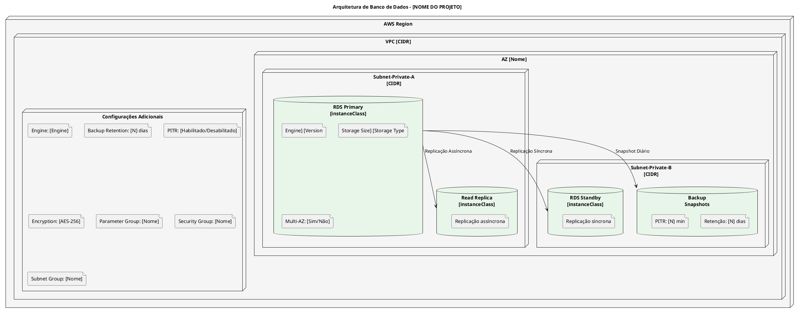
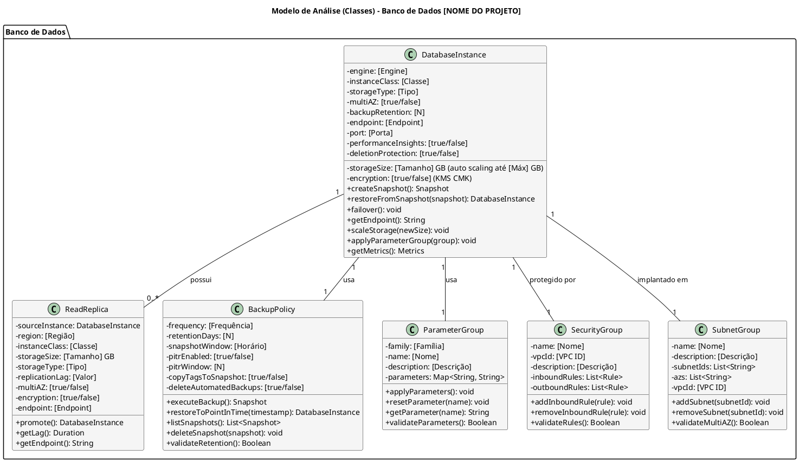
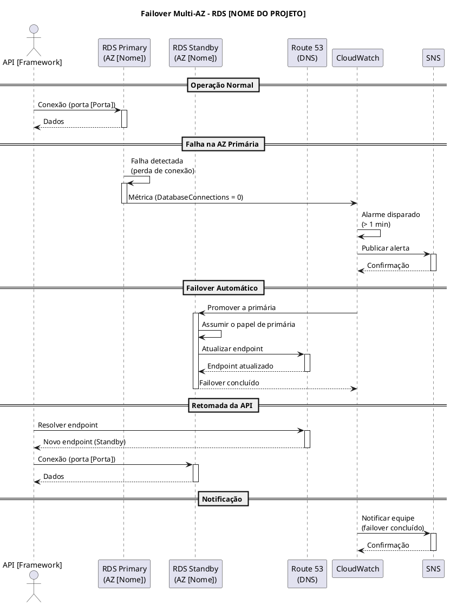
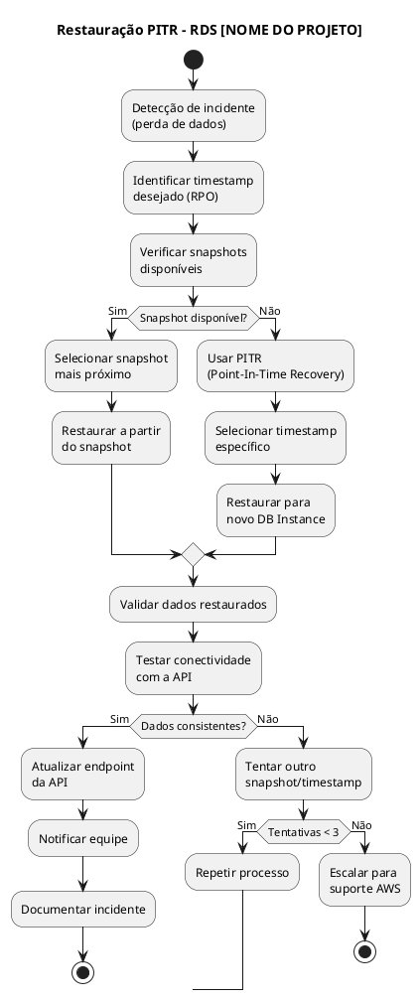

# Modelo de Análise (Classes de Análise)

## Dimensionamento de Banco de Dados (RDS)

## [NOME DO PROJETO] - [DESCRIÇÃO CURTA DO PROJETO]

---

| **Informação do Documento** | |
| :--- | :--- |
| **Projeto** | [Nome do Projeto] |
| **Documento** | Modelo de Análise (Classes de Análise) - Dimensionamento de Banco de Dados (RDS) |
| **Versão** | 1.0 |
| **Data** | [DD/MM/AAAA] |
| **Status** | Em Desenvolvimento |
| **Responsável** | [Nome do Grupo] |
| **Disciplina** | Projeto de Cloud - Semana 5 |
| **Fase RUP/UP** | Elaboration |

---

## 1. INTRODUÇÃO

### 1.1. Propósito

Este documento apresenta o **Modelo de Análise (Classes de Análise)** para o dimensionamento do banco de dados relacional **[Amazon RDS / Amazon Aurora]** da plataforma **[NOME DO PROJETO]** na AWS. O modelo descreve as classes de análise responsáveis pela persistência de dados transacionais, suas responsabilidades, atributos e relacionamentos, além das decisões de dimensionamento baseadas nos requisitos não-funcionais.

O modelo é derivado diretamente dos seguintes artefatos:
- **Documento de Visão** (Semana 1) - Seção "Recursos do Produto (Arquitetura AWS)"
- **Documento de Requisitos Suplementares** (Semana 2) - Seções "Desempenho" e "Confiabilidade"
- **Modelo de Casos de Uso Arquiteturais** (Semana 3) - UC-ARQ-XXX (Conectividade entre Camadas)
- **Modelo de Análise (Pacotes/Subsistemas)** (Semana 4) - Pacotes "[Data Protection]" e "[Secrets Management]"

### 1.2. Escopo

O modelo abrange o dimensionamento do banco de dados relacional, incluindo:
- **Instância primária** (`DatabaseInstance`)
- **Réplica de leitura** (`ReadReplica`) - *se aplicável*
- **Política de backup** (`BackupPolicy`)
- **Grupo de parâmetros** (`ParameterGroup`)
- **Grupo de segurança** (`SecurityGroup`)
- **Grupo de sub-redes** (`SubnetGroup`)
- **Cálculos de dimensionamento** (vCPU, memória, IOPS, storage)
- **Estimativa de custo** e comparação com alternativas

**Fora do escopo:** Bancos de dados NoSQL (DynamoDB), que devem ser tratados em documento separado, caso existam no projeto.

### 1.3. Definições e Siglas

| **Sigla** | **Definição** |
| :--- | :--- |
| **RDS** | Relational Database Service |
| **PITR** | Point-In-Time Recovery |
| **RPO** | Recovery Point Objective |
| **RTO** | Recovery Time Objective |
| **IOPS** | Input/Output Operations Per Second |
| **TPS** | Transactions Per Second |
| **Multi-AZ** | Múltiplas Zonas de Disponibilidade |
| **CMK** | Customer Managed Key |
| **KMS** | Key Management Service |
| **LGPD** | Lei Geral de Proteção de Dados |
| **SG** | Security Group |

### 1.4. Referências

- Documento de Visão - [NOME DO PROJETO] (v1.0)
- Documento de Requisitos Suplementares - [NOME DO PROJETO] (v1.0)
- Modelo de Casos de Uso Arquiteturais - [NOME DO PROJETO] (v1.0)
- Modelo de Análise (Pacotes/Subsistemas) - [NOME DO PROJETO] (v1.0)
- AWS RDS Documentation
- AWS Well-Architected Framework - Performance Efficiency Pillar
- AWS RDS Pricing

---

## 2. VISÃO GERAL DO DIMENSIONAMENTO

### 2.1. Requisitos que Impactam o Dimensionamento

| **Requisito** | **Valor** | **Fonte** |
| :--- | :--- | :--- |
| **Usuários ativos** | [Valor] | Documento de Visão |
| **Transações por dia** | [Valor] | Requisitos Suplementares |
| **TPS (pico)** | [Valor] | Requisitos Suplementares |
| **Latência máxima (API)** | [Valor] | Requisitos Suplementares |
| **Volume de dados (inicial)** | [Valor] | Estimativa |
| **Crescimento mensal** | [Valor] | Estimativa |
| **Conexões simultâneas** | [Valor] | Estimativa |
| **SLA de disponibilidade** | [Valor] | Requisitos Suplementares |
| **RPO** | [Valor] | Requisitos Suplementares |
| **RTO** | [Valor] | Requisitos Suplementares |
| **Orçamento total do projeto** | [Valor] | Documento de Visão |
| **Orçamento alocado para RDS** | [Valor] | Estimativa |

### 2.2. Arquitetura de Banco de Dados

### 2.3. Matriz de Rastreamento

| **Requisito (Doc. Suplementar)** | **Pacote (Semana 4)** | **Classe de Análise** | **Serviço AWS** | **Configuração** |
| :--- | :--- | :--- | :--- | :--- |
| [Requisito 1] | [Pacote] | [Classe] | [Serviço] | [Configuração] |
| [Requisito 2] | [Pacote] | [Classe] | [Serviço] | [Configuração] |
| [Requisito 3] | [Pacote] | [Classe] | [Serviço] | [Configuração] |
| [Requisito 4] | [Pacote] | [Classe] | [Serviço] | [Configuração] |
| ... | ... | ... | ... | ... |

---

## 3. ESPECIFICAÇÃO DAS CLASSES DE ANÁLISE

---

### 3.1. CLASSE: DATABASEINSTANCE

#### 3.1.1. Responsabilidade

[Descrever a responsabilidade da classe no contexto do projeto]

**Exemplo:** Representar a instância primária do banco de dados RDS [Engine], gerenciando sua configuração, disponibilidade, performance e segurança.

#### 3.1.2. Atributos

| **Atributo** | **Tipo** | **Valor** | **Justificativa** |
| :--- | :--- | :--- | :--- |
| `engine` | String | [Engine + Version] | [Justificativa] |
| `instanceClass` | String | [Classe] | [Justificativa] |
| `storageSize` | Integer | [Tamanho] GB (auto scaling até [Máx] GB) | [Justificativa] |
| `storageType` | String | [Tipo] | [Justificativa] |
| `multiAZ` | Boolean | [true/false] | [Justificativa] |
| `backupRetention` | Integer | [N] dias | [Justificativa] |
| `encryption` | Boolean | [true/false] | [Justificativa] |
| `endpoint` | String | [Endpoint] | [Justificativa] |
| `port` | Integer | [Porta] | [Justificativa] |
| `parameterGroup` | ParameterGroup | [Nome] | [Justificativa] |
| `securityGroup` | SecurityGroup | [Nome] | [Justificativa] |
| `subnetGroup` | SubnetGroup | [Nome] | [Justificativa] |
| `readReplicas` | List<ReadReplica> | [N] réplicas | [Justificativa] |
| `backupPolicy` | BackupPolicy | [Nome] | [Justificativa] |
| `performanceInsights` | Boolean | [true/false] | [Justificativa] |
| `autoMinorVersionUpgrade` | Boolean | [true/false] | [Justificativa] |
| `deletionProtection` | Boolean | [true/false] | [Justificativa] |

#### 3.1.3. Responsabilidades (Métodos)

| **Responsabilidade** | **Descrição** | **Retorno** |
| :--- | :--- | :--- |
| `createSnapshot()` | Cria snapshot manual do banco. | `Snapshot` |
| `restoreFromSnapshot(snapshot)` | Restaura banco a partir de snapshot. | `DatabaseInstance` |
| `failover()` | Executa failover para AZ secundária. | `void` |
| `getEndpoint()` | Retorna o endpoint de conexão. | `String` |
| `scaleStorage(newSize)` | Aumenta o storage (auto scaling). | `void` |
| `applyParameterGroup(group)` | Aplica um parameter group. | `void` |
| `getMetrics()` | Retorna métricas de performance. | `Metrics` |

#### 3.1.4. Relacionamentos

| **Relacionamento** | **Multiplicidade** | **Descrição** |
| :--- | :--- | :--- |
| `DatabaseInstance` → `ReadReplica` | 1 : 0..* | [Descrição] |
| `DatabaseInstance` → `BackupPolicy` | 1 : 1 | [Descrição] |
| `DatabaseInstance` → `ParameterGroup` | 1 : 1 | [Descrição] |
| `DatabaseInstance` → `SecurityGroup` | 1 : 1 | [Descrição] |
| `DatabaseInstance` → `SubnetGroup` | 1 : 1 | [Descrição] |

#### 3.1.5. Justificativa do Dimensionamento

| **Componente** | **Cálculo** | **Resultado** |
| :--- | :--- | :--- |
| **Conexões simultâneas** | [Cálculo] | [Resultado] |
| **Memória por conexão** | [Cálculo] | [Resultado] |
| **Memória para cache** | [Cálculo] | [Resultado] |
| **Memória total** | [Cálculo] | [Resultado] |
| **vCPU** | [Cálculo] | [Resultado] |
| **Instância escolhida** | [Cálculo] | [Resultado] |
| **IOPS necessários** | [Cálculo] | [Resultado] |
| **IOPS baseline** | [Cálculo] | [Resultado] |
| **IOPS burst** | [Cálculo] | [Resultado] |
| **Storage inicial** | [Cálculo] | [Resultado] |
| **Crescimento (12 meses)** | [Cálculo] | [Resultado] |
| **Storage total (12 meses)** | [Cálculo] | [Resultado] |

#### 3.1.6. Estimativa de Custo

| **Componente** | **Configuração** | **Custo Mensal** |
| :--- | :--- | :--- |
| **RDS Primary ([instanceClass])** | [Multi-AZ/Single-AZ] | [Custo] |
| **Storage ([N] GB [type])** | [Multi-AZ/Single-AZ] | [Custo] |
| **Backup ([N] GB)** | [N] dias | [Custo] |
| **Performance Insights** | [N] dias | [Custo] |
| **Subtotal Primary** | | **[Custo]** |

---

### 3.2. CLASSE: READREPLICA

> **Nota:** Preencha esta seção apenas se o projeto utilizar Read Replicas. Caso contrário, indique "Não aplicável" e justifique.

#### 3.2.1. Responsabilidade

[Descrever a responsabilidade da classe no contexto do projeto]

**Exemplo:** Representar uma réplica de leitura do banco de dados, utilizada para distribuir a carga de consultas (dashboards, relatórios) e melhorar a performance da instância primária.

#### 3.2.2. Atributos

| **Atributo** | **Tipo** | **Valor** | **Justificativa** |
| :--- | :--- | :--- | :--- |
| `sourceInstance` | DatabaseInstance | [Instância primária] | [Justificativa] |
| `region` | String | [Região] | [Justificativa] |
| `instanceClass` | String | [Classe] | [Justificativa] |
| `storageSize` | Integer | [Tamanho] GB | [Justificativa] |
| `storageType` | String | [Tipo] | [Justificativa] |
| `replicationLag` | Duration | [Valor] | [Justificativa] |
| `multiAZ` | Boolean | [true/false] | [Justificativa] |
| `encryption` | Boolean | [true/false] | [Justificativa] |
| `endpoint` | String | [Endpoint] | [Justificativa] |

#### 3.2.3. Responsabilidades (Métodos)

| **Responsabilidade** | **Descrição** | **Retorno** |
| :--- | :--- | :--- |
| `promote()` | Promove réplica a primária. | `DatabaseInstance` |
| `getLag()` | Retorna o lag de replicação. | `Duration` |
| `getEndpoint()` | Retorna o endpoint de conexão. | `String` |

#### 3.2.4. Relacionamentos

| **Relacionamento** | **Multiplicidade** | **Descrição** |
| :--- | :--- | :--- |
| `ReadReplica` → `DatabaseInstance` | 0..* : 1 | [Descrição] |

#### 3.2.5. Justificativa do Dimensionamento

| **Componente** | **Cálculo** | **Resultado** |
| :--- | :--- | :--- |
| **Carga de leitura** | [Cálculo] | [Resultado] |
| **Instância escolhida** | [Cálculo] | [Resultado] |
| **Replicação** | [Cálculo] | [Resultado] |
| **Failover** | [Cálculo] | [Resultado] |

#### 3.2.6. Estimativa de Custo

| **Componente** | **Configuração** | **Custo Mensal** |
| :--- | :--- | :--- |
| **Read Replica ([instanceClass])** | [Multi-AZ/Single-AZ] | [Custo] |
| **Storage ([N] GB [type])** | [Multi-AZ/Single-AZ] | [Custo] |
| **Subtotal Read Replica** | | **[Custo]** |

---

### 3.3. CLASSE: BACKUPPOLICY

#### 3.3.1. Responsabilidade

[Descrever a responsabilidade da classe no contexto do projeto]

**Exemplo:** Gerenciar as políticas de backup automático e recuperação do banco de dados, garantindo conformidade com RPO/RTO e LGPD.

#### 3.3.2. Atributos

| **Atributo** | **Tipo** | **Valor** | **Justificativa** |
| :--- | :--- | :--- | :--- |
| `frequency` | String | [Frequência] | [Justificativa] |
| `retentionDays` | Integer | [N] dias | [Justificativa] |
| `snapshotWindow` | String | [Horário] | [Justificativa] |
| `pitrEnabled` | Boolean | [true/false] | [Justificativa] |
| `pitrWindow` | Integer | [N] dias | [Justificativa] |
| `copyTagsToSnapshot` | Boolean | [true/false] | [Justificativa] |
| `deleteAutomatedBackups` | Boolean | [true/false] | [Justificativa] |
| `backupTarget` | String | [Destino] | [Justificativa] |

#### 3.3.3. Responsabilidades (Métodos)

| **Responsabilidade** | **Descrição** | **Retorno** |
| :--- | :--- | :--- |
| `executeBackup()` | Executa backup diário. | `Snapshot` |
| `restoreToPointInTime(timestamp)` | Restaura banco para ponto específico. | `DatabaseInstance` |
| `listSnapshots()` | Lista snapshots disponíveis. | `List<Snapshot>` |
| `deleteSnapshot(snapshot)` | Remove snapshot antigo. | `void` |
| `validateRetention()` | Valida política de retenção. | `Boolean` |

#### 3.3.4. Relacionamentos

| **Relacionamento** | **Multiplicidade** | **Descrição** |
| :--- | :--- | :--- |
| `BackupPolicy` → `DatabaseInstance` | 1 : 1 | [Descrição] |

#### 3.3.5. Justificativa do Dimensionamento

| **Componente** | **Cálculo** | **Resultado** |
| :--- | :--- | :--- |
| **RPO** | [Cálculo] | [Resultado] |
| **RTO** | [Cálculo] | [Resultado] |
| **Retenção** | [Cálculo] | [Resultado] |
| **Janela de backup** | [Cálculo] | [Resultado] |
| **Custo de backup** | [Cálculo] | [Resultado] |

#### 3.3.6. Estimativa de Custo

| **Componente** | **Configuração** | **Custo Mensal** |
| :--- | :--- | :--- |
| **Backup automático** | [N] GB | [Custo] |
| **Backup manual** | [N] GB | [Custo] |
| **PITR** | [N] dias | [Custo] |
| **Subtotal Backup** | | **[Custo]** |

---

### 3.4. CLASSE: PARAMETERGROUP

#### 3.4.1. Responsabilidade

[Descrever a responsabilidade da classe no contexto do projeto]

**Exemplo:** Gerenciar as configurações específicas do engine [Engine], otimizando performance, segurança e conexões.

#### 3.4.2. Atributos

| **Atributo** | **Tipo** | **Valor** | **Justificativa** |
| :--- | :--- | :--- | :--- |
| `family` | String | [Família] | [Justificativa] |
| `name` | String | [Nome] | [Justificativa] |
| `description` | String | [Descrição] | [Justificativa] |
| `parameters` | Map<String, String> | Ver tabela abaixo | [Justificativa] |

#### 3.4.3. Parâmetros Configurados

| **Parâmetro** | **Valor** | **Padrão** | **Justificativa** |
| :--- | :--- | :--- | :--- |
| `max_connections` | [Valor] | [Padrão] | [Justificativa] |
| `shared_buffers` | [Valor] | [Padrão] | [Justificativa] |
| `work_mem` | [Valor] | [Padrão] | [Justificativa] |
| `maintenance_work_mem` | [Valor] | [Padrão] | [Justificativa] |
| `effective_cache_size` | [Valor] | [Padrão] | [Justificativa] |
| `random_page_cost` | [Valor] | [Padrão] | [Justificativa] |
| `log_statement` | [Valor] | [Padrão] | [Justificativa] |
| `log_min_duration_statement` | [Valor] | [Padrão] | [Justificativa] |
| `timezone` | [Valor] | [Padrão] | [Justificativa] |

#### 3.4.4. Responsabilidades (Métodos)

| **Responsabilidade** | **Descrição** | **Retorno** |
| :--- | :--- | :--- |
| `applyParameters()` | Aplica os parâmetros ao banco. | `void` |
| `resetParameter(name)` | Restaura parâmetro para o padrão. | `void` |
| `getParameter(name)` | Retorna o valor de um parâmetro. | `String` |
| `validateParameters()` | Valida se os parâmetros são compatíveis. | `Boolean` |

#### 3.4.5. Relacionamentos

| **Relacionamento** | **Multiplicidade** | **Descrição** |
| :--- | :--- | :--- |
| `ParameterGroup` → `DatabaseInstance` | 1 : 1 | [Descrição] |

#### 3.4.6. Estimativa de Custo

| **Componente** | **Configuração** | **Custo Mensal** |
| :--- | :--- | :--- |
| **Parameter Group** | Customizado | $0,00 (gratuito) |
| **Subtotal Parameter Group** | | **$0,00** |

---

### 3.5. CLASSE: SECURITYGROUP

#### 3.5.1. Responsabilidade

[Descrever a responsabilidade da classe no contexto do projeto]

**Exemplo:** Controlar o acesso de rede à instância RDS, permitindo apenas conexões da camada de aplicação na porta correta.

#### 3.5.2. Atributos

| **Atributo** | **Tipo** | **Valor** | **Justificativa** |
| :--- | :--- | :--- | :--- |
| `name` | String | [Nome] | [Justificativa] |
| `vpcId` | String | [VPC ID] | [Justificativa] |
| `description` | String | [Descrição] | [Justificativa] |
| `inboundRules` | List<Rule> | Ver tabela abaixo | [Justificativa] |
| `outboundRules` | List<Rule> | Ver tabela abaixo | [Justificativa] |

#### 3.5.3. Regras de Entrada

| **Protocolo** | **Porta** | **Origem** | **Descrição** |
| :--- | :--- | :--- | :--- |
| [Protocolo] | [Porta] | [Origem] | [Descrição] |
| [Protocolo] | [Porta] | [Origem] | [Descrição] |

#### 3.5.4. Regras de Saída

| **Protocolo** | **Porta** | **Destino** | **Descrição** |
| :--- | :--- | :--- | :--- |
| [Protocolo] | [Porta] | [Destino] | [Descrição] |

#### 3.5.5. Responsabilidades (Métodos)

| **Responsabilidade** | **Descrição** | **Retorno** |
| :--- | :--- | :--- |
| `addInboundRule(rule)` | Adiciona regra de entrada. | `void` |
| `removeInboundRule(rule)` | Remove regra de entrada. | `void` |
| `validateRules()` | Valida se as regras estão corretas. | `Boolean` |

#### 3.5.6. Relacionamentos

| **Relacionamento** | **Multiplicidade** | **Descrição** |
| :--- | :--- | :--- |
| `SecurityGroup` → `DatabaseInstance` | 1 : 1 | [Descrição] |

#### 3.5.7. Estimativa de Custo

| **Componente** | **Configuração** | **Custo Mensal** |
| :--- | :--- | :--- |
| **Security Group** | [Nome] | $0,00 (gratuito) |
| **Subtotal Security Group** | | **$0,00** |

---

### 3.6. CLASSE: SUBNETGROUP

#### 3.6.1. Responsabilidade

[Descrever a responsabilidade da classe no contexto do projeto]

**Exemplo:** Definir as sub-redes privadas onde a instância RDS será implantada, garantindo isolamento e Multi-AZ.

#### 3.6.2. Atributos

| **Atributo** | **Tipo** | **Valor** | **Justificativa** |
| :--- | :--- | :--- | :--- |
| `name` | String | [Nome] | [Justificativa] |
| `description` | String | [Descrição] | [Justificativa] |
| `subnetIds` | List<String> | [IDs das sub-redes] | [Justificativa] |
| `azs` | List<String> | [AZs] | [Justificativa] |
| `vpcId` | String | [VPC ID] | [Justificativa] |

#### 3.6.3. Responsabilidades (Métodos)

| **Responsabilidade** | **Descrição** | **Retorno** |
| :--- | :--- | :--- |
| `addSubnet(subnetId)` | Adiciona sub-rede ao grupo. | `void` |
| `removeSubnet(subnetId)` | Remove sub-rede do grupo. | `void` |
| `validateMultiAZ()` | Valida se há sub-redes em múltiplas AZs. | `Boolean` |

#### 3.6.4. Relacionamentos

| **Relacionamento** | **Multiplicidade** | **Descrição** |
| :--- | :--- | :--- |
| `SubnetGroup` → `DatabaseInstance` | 1 : 1 | [Descrição] |

#### 3.6.5. Estimativa de Custo

| **Componente** | **Configuração** | **Custo Mensal** |
| :--- | :--- | :--- |
| **Subnet Group** | Multi-AZ | $0,00 (gratuito) |
| **Subtotal Subnet Group** | | **$0,00** |

---

## 4. DIAGRAMA DE CLASSES (PLANTUML)

---

## 5. DIAGRAMA DE SEQUÊNCIA - FAILOVER MULTI-AZ

---

## 6. DIAGRAMA DE ATIVIDADES - RESTAURAÇÃO PITR

---

## 7. MEMÓRIA DE CÁLCULO

### 7.1. Cálculo de vCPU e Memória

| **Métrica** | **Fórmula** | **Cálculo** | **Resultado** |
| :--- | :--- | :--- | :--- |
| **Conexões simultâneas** | - | - | [Valor] |
| **Memória por conexão** | - | - | [Valor