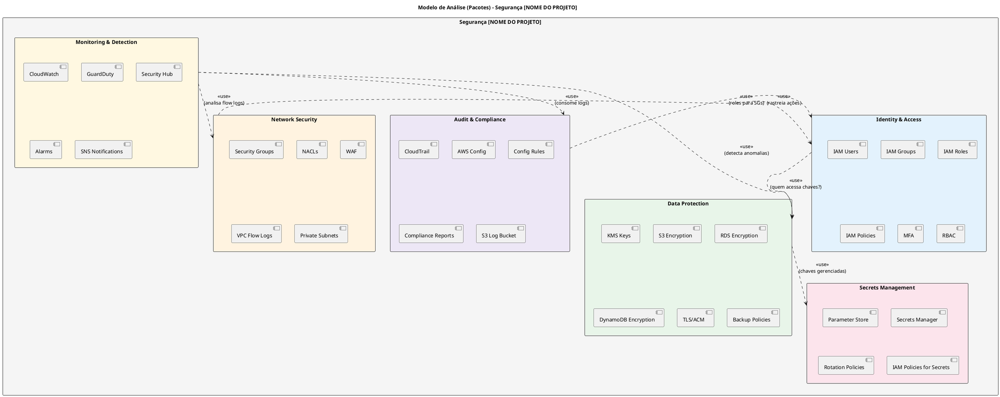
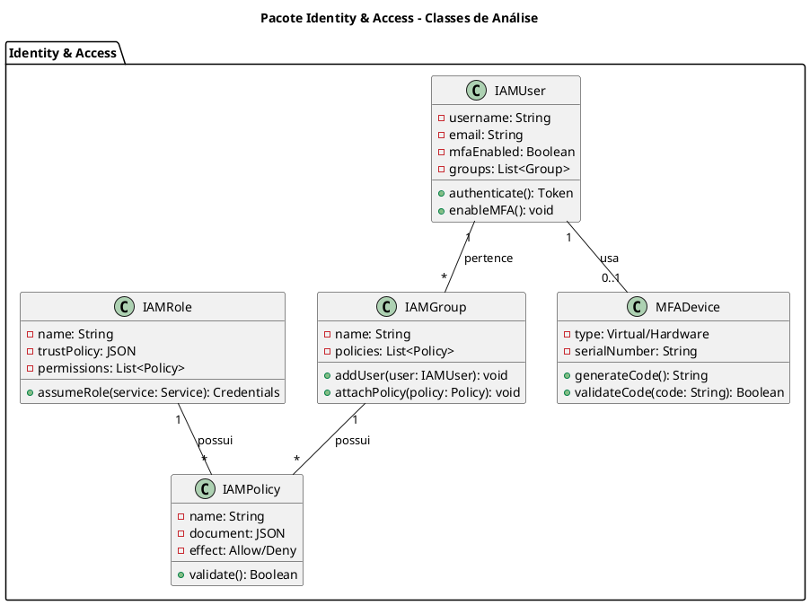
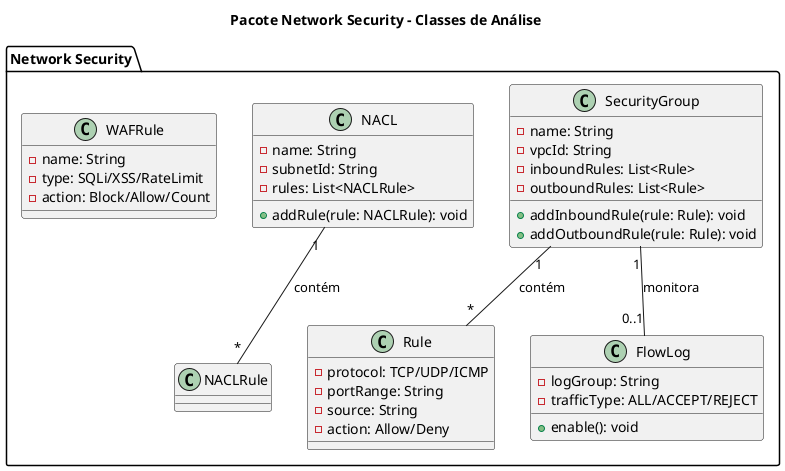
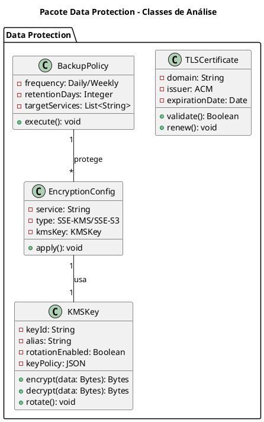
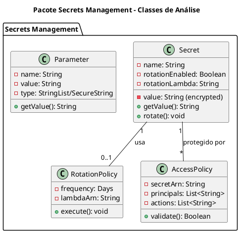
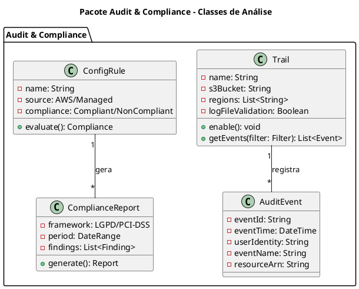
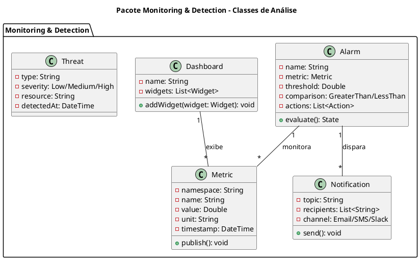
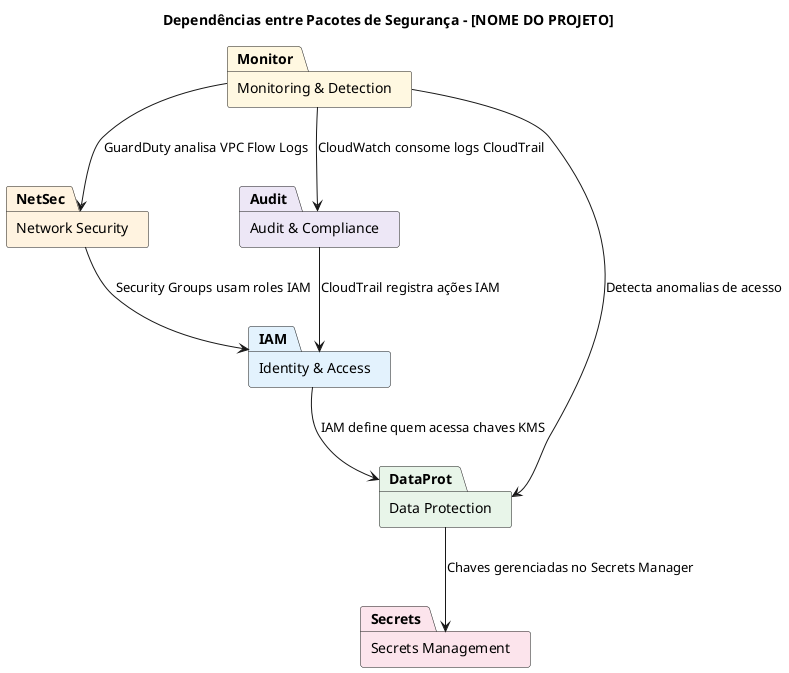

## **Modelo de Análise (Pacotes/Subsistemas)**

**Disciplina:** Projeto de Cloud
**Projeto:** [Nome do Projeto]  
**Data:** xx/xx/2026  
**Status:** xxxx  xxxxx xxxxxx

---

| **Informação do Documento** | |
| **Documento** | Modelo de Casos de Uso Arquiteturais |
| **Versão** | 1.0 |
| **Responsável** | [Nome do Grupo] |
| **Disciplina** | Projeto de Cloud  |

---

## 1. INTRODUÇÃO

### 1.1. Propósito

Este documento apresenta o **Modelo de Análise (Pacotes/Subsistemas)** para a arquitetura de segurança da plataforma **[NOME DO PROJETO]** na AWS. O modelo organiza os componentes de segurança em pacotes coesos, facilitando a compreensão, manutenção e evolução da arquitetura, além de permitir a rastreabilidade entre requisitos de segurança e elementos técnicos.

O modelo é derivado diretamente dos seguintes artefatos:

- **Documento de Visão** (Semana 1) - Seção "Segurança e Privacidade"
- **Documento de Requisitos Suplementares** (Semana 2) - Seção "Requisitos de Segurança"
- **Modelo de Casos de Uso Arquiteturais** (Semana 3) - UC-ARQ-002 e UC-ARQ-007

### 1.2. Escopo

O modelo abrange os subsistemas de segurança necessários para proteger os ativos de informação do projeto, incluindo:

- **Dados sensíveis** (conformidade com LGPD)
- **Credenciais e segredos**
- **Dados transacionais e de telemetria**
- **Arquivos e mídias**
- **Logs de auditoria**

### 1.3. Definições e Siglas

| **Sigla** | **Definição** |
| :--- | :--- |
| **IAM** | Identity and Access Management |
| **KMS** | Key Management Service |
| **CMK** | Customer Managed Key |
| **SG** | Security Group |
| **NACL** | Network Access Control List |
| **WAF** | Web Application Firewall |
| **RBAC** | Role-Based Access Control |
| **MFA** | Multi-Factor Authentication |
| **LGPD** | Lei Geral de Proteção de Dados |
| **TLS** | Transport Layer Security |
| **SSE** | Server-Side Encryption |
| **PITR** | Point-In-Time Recovery |
| **RPO** | Recovery Point Objective |
| **RTO** | Recovery Time Objective |

### 1.4. Referências

- Documento de Visão - [NOME DO PROJETO] (v1.0)
- Documento de Requisitos Suplementares - [NOME DO PROJETO] (v1.0)
- Modelo de Casos de Uso Arquiteturais - [NOME DO PROJETO] (v1.0)
- AWS Well-Architected Framework - Security Pillar
- AWS IAM Best Practices
- Lei Geral de Proteção de Dados (LGPD)

## 2. Visão Geral dos Pacores de Segurança

### 2.1. Diagrama de Pacotes (PlantUML)



### 2.2. Descrição dos Pacotes

| **Pacote** | **Responsabilidade** | **Serviços AWS** | **Requisitos Atendidos** |
| :--- | :--- | :--- | :--- |
| **Identity & Access** | Gerenciar identidades, autenticação e autorização. | IAM, MFA, RBAC | [Listar requisitos] |
| **Network Security** | Controlar tráfego de rede (firewall). | Security Groups, NACLs, WAF | [Listar requisitos] |
| **Data Protection** | Criptografar dados em repouso e em trânsito. | KMS, ACM, S3/RDS/DynamoDB Encryption | [Listar requisitos] |
| **Secrets Management** | Proteger credenciais e chaves. | Secrets Manager, Parameter Store | [Listar requisitos] |
| **Audit & Compliance** | Rastrear ações e garantir conformidade. | CloudTrail, AWS Config | [Listar requisitos] |
| **Monitoring & Detection** | Detectar anomalias e ameaças. | CloudWatch, GuardDuty, Security Hub | [Listar requisitos] |

### 2.3. Matriz de Rastreamento

| **Requisito (Doc. Suplementar)** | **Caso de Uso (Semana 3)** | **Pacote Responsável** | **Serviço AWS** | **Controle** |
| :--- | :--- | :--- | :--- | :--- |
| [Requisito 1] | [UC-ARQ-XXX] | [Pacote] | [Serviço] | [Controle] |
| [Requisito 2] | [UC-ARQ-XXX] | [Pacote] | [Serviço] | [Controle] |
| [Requisito 3] | [UC-ARQ-XXX] | [Pacote] | [Serviço] | [Controle] |
| ... | ... | ... | ... | ... |

---

## 3. ESPECIFICAÇÃO DOS PACOTES

---

### 3.1. PACOTE: IDENTITY & ACCESS

#### 3.1.1. Responsabilidade

[Descrever a responsabilidade do pacote no contexto do projeto]

**Exemplo:** Gerenciar identidades (humanos e serviços), autenticação, autorização e permissões de acesso a todos os recursos do projeto na AWS.

#### 3.1.2. Elementos do Pacote

| **Elemento** | **Descrição** | **Serviço AWS** |
| :--- | :--- | :--- |
| **IAM Users** | [Descrição] | IAM |
| **IAM Groups** | [Descrição] | IAM Groups |
| **IAM Roles** | [Descrição] | IAM Roles |
| **IAM Policies** | [Descrição] | IAM Policies |
| **MFA** | [Descrição] | IAM MFA |
| **RBAC** | [Descrição] | IAM Groups + Policies |

#### 3.1.3. Diagrama de Classes de Análise



#### 3.1.4. Roles e Permissões

| **Role** | **Tipo** | **Serviços Acessados** | **Permissões** | **Justificativa** |
| :--- | :--- | :--- | :--- | :--- |
| [Role 1] | Humano/Serviço | [Serviços] | [Permissões] | [Justificativa] |
| [Role 2] | Humano/Serviço | [Serviços] | [Permissões] | [Justificativa] |
| [Role 3] | Humano/Serviço | [Serviços] | [Permissões] | [Justificativa] |
| ... | ... | ... | ... | ... |

#### 3.1.5. Política IAM (Exemplo)

```json
{
  "Version": "2012-10-17",
  "Statement": [
    {
      "Sid": "[Identificador da Política]",
      "Effect": "Allow",
      "Action": [
        "[Ação 1]",
        "[Ação 2]"
      ],
      "Resource": "[ARN do Recurso]"
    }
  ]
}
```

#### 3.1.6. Riscos e Mitigações

| **Risco** | **Mitigação** |
| :--- | :--- |
| [Risco 1] | [Mitigação 1] |
| [Risco 2] | [Mitigação 2] |
| [Risco 3] | [Mitigação 3] |

---

### 3.2. PACOTE: NETWORK SECURITY

#### 3.2.1. Responsabilidade

[Descrever a responsabilidade do pacote no contexto do projeto]

**Exemplo:** Controlar e filtrar o tráfego de rede entre as camadas da aplicação, garantindo isolamento e proteção contra acessos não autorizados.

#### 3.2.2. Elementos do Pacote

| **Elemento** | **Descrição** | **Serviço AWS** |
| :--- | :--- | :--- |
| **Security Groups** | [Descrição] | VPC |
| **NACLs** | [Descrição] | VPC |
| **WAF** | [Descrição] | WAF |
| **VPC Flow Logs** | [Descrição] | VPC |
| **Private Subnets** | [Descrição] | VPC |

#### 3.2.3. Diagrama de Classes de Análise



#### 3.2.4. Matriz de Security Groups

| **Security Group** | **Regra de Entrada** | **Origem** | **Regra de Saída** | **Destino** | **Justificativa** |
| :--- | :--- | :--- | :--- | :--- | :--- |
| [SG-1] | [Porta] | [Origem] | [Porta] | [Destino] | [Justificativa] |
| [SG-2] | [Porta] | [Origem] | [Porta] | [Destino] | [Justificativa] |
| [SG-3] | [Porta] | [Origem] | [Porta] | [Destino] | [Justificativa] |

#### 3.2.5. Matriz de NACLs

| **NACL** | **Regra** | **Protocolo** | **Porta** | **Origem/Destino** | **Ação** |
| :--- | :--- | :--- | :--- | :--- | :--- |
| [NACL-1] | 100 | TCP | [Porta] | [Origem] | Allow |
| | 200 | TCP | [Porta] | [Origem] | Allow |
| | * | All | All | 0.0.0.0/0 | Deny |
| [NACL-2] | 100 | TCP | [Porta] | [Origem] | Allow |
| | * | All | All | 0.0.0.0/0 | Deny |

#### 3.2.6. WAF Rules

| **Regra** | **Tipo** | **Ação** | **Justificativa** |
| :--- | :--- | :--- | :--- |
| [Regra 1] | [Tipo] | [Ação] | [Justificativa] |
| [Regra 2] | [Tipo] | [Ação] | [Justificativa] |
| [Regra 3] | [Tipo] | [Ação] | [Justificativa] |

#### 3.2.7. Riscos e Mitigações

| **Risco** | **Mitigação** |
| :--- | :--- |
| [Risco 1] | [Mitigação 1] |
| [Risco 2] | [Mitigação 2] |
| [Risco 3] | [Mitigação 3] |

---

### 3.3. PACOTE: DATA PROTECTION

#### 3.3.1. Responsabilidade

[Descrever a responsabilidade do pacote no contexto do projeto]

**Exemplo:** Garantir a criptografia de dados em repouso e em trânsito, além de políticas de backup e recuperação, assegurando conformidade com a LGPD.

#### 3.3.2. Elementos do Pacote

| **Elemento** | **Descrição** | **Serviço AWS** |
| :--- | :--- | :--- |
| **KMS Keys** | [Descrição] | KMS |
| **S3 Encryption** | [Descrição] | S3 + KMS |
| **RDS Encryption** | [Descrição] | RDS + KMS |
| **DynamoDB Encryption** | [Descrição] | DynamoDB + KMS |
| **TLS/ACM** | [Descrição] | ACM |
| **Backup Policies** | [Descrição] | AWS Backup |

#### 3.3.3. Diagrama de Classes de Análise



#### 3.3.4. Matriz de Criptografia

| **Serviço** | **Criptografia em Repouso** | **Criptografia em Trânsito** | **Chave** | **Justificativa** |
| :--- | :--- | :--- | :--- | :--- |
| [Serviço 1] | [Tipo] | [Protocolo] | [Chave] | [Justificativa] |
| [Serviço 2] | [Tipo] | [Protocolo] | [Chave] | [Justificativa] |
| [Serviço 3] | [Tipo] | [Protocolo] | [Chave] | [Justificativa] |

#### 3.3.5. Políticas de Backup

| **Serviço** | **Frequência** | **Retenção** | **RPO** | **RTO** |
| :--- | :--- | :--- | :--- | :--- |
| [Serviço 1] | [Frequência] | [Retenção] | [RPO] | [RTO] |
| [Serviço 2] | [Frequência] | [Retenção] | [RPO] | [RTO] |
| [Serviço 3] | [Frequência] | [Retenção] | [RPO] | [RTO] |

#### 3.3.6. Riscos e Mitigações

| **Risco** | **Mitigação** |
| :--- | :--- |
| [Risco 1] | [Mitigação 1] |
| [Risco 2] | [Mitigação 2] |
| [Risco 3] | [Mitigação 3] |

---

### 3.4. PACOTE: SECRETS MANAGEMENT

#### 3.4.1. Responsabilidade

[Descrever a responsabilidade do pacote no contexto do projeto]

**Exemplo:** Proteger credenciais, chaves de API, tokens e outros segredos, garantindo que não sejam expostos em código ou configurações.

#### 3.4.2. Elementos do Pacote

| **Elemento** | **Descrição** | **Serviço AWS** |
| :--- | :--- | :--- |
| **Secrets Manager** | [Descrição] | Secrets Manager |
| **Parameter Store** | [Descrição] | Systems Manager |
| **Rotation Policies** | [Descrição] | Lambda + Secrets Manager |
| **IAM Policies for Secrets** | [Descrição] | IAM |

#### 3.4.3. Diagrama de Classes de Análise



#### 3.4.4. Segredos Gerenciados

| **Segredo** | **Serviço** | **Rotação** | **Acesso** | **Justificativa** |
| :--- | :--- | :--- | :--- | :--- |
| [Segredo 1] | [Serviço] | [Frequência] | [Role] | [Justificativa] |
| [Segredo 2] | [Serviço] | [Frequência] | [Role] | [Justificativa] |
| [Segredo 3] | [Serviço] | [Frequência] | [Role] | [Justificativa] |

#### 3.4.5. Riscos e Mitigações

| **Risco** | **Mitigação** |
| :--- | :--- |
| [Risco 1] | [Mitigação 1] |
| [Risco 2] | [Mitigação 2] |
| [Risco 3] | [Mitigação 3] |

---

### 3.5. PACOTE: AUDIT & COMPLIANCE

#### 3.5.1. Responsabilidade

[Descrever a responsabilidade do pacote no contexto do projeto]

**Exemplo:** Rastrear todas as ações realizadas na conta AWS, garantir conformidade com regulamentações (LGPD) e fornecer evidências para auditorias.

#### 3.5.2. Elementos do Pacote

| **Elemento** | **Descrição** | **Serviço AWS** |
| :--- | :--- | :--- |
| **CloudTrail** | [Descrição] | CloudTrail |
| **AWS Config** | [Descrição] | AWS Config |
| **Config Rules** | [Descrição] | AWS Config |
| **Compliance Reports** | [Descrição] | AWS Artifact |
| **S3 Log Bucket** | [Descrição] | S3 |

#### 3.5.3. Diagrama de Classes de Análise



#### 3.5.4. Config Rules

| **Regra** | **Descrição** | **Serviço Alvo** | **Conformidade** |
| :--- | :--- | :--- | :--- |
| [Regra 1] | [Descrição] | [Serviço] | [Framework] |
| [Regra 2] | [Descrição] | [Serviço] | [Framework] |
| [Regra 3] | [Descrição] | [Serviço] | [Framework] |

#### 3.5.5. Riscos e Mitigações

| **Risco** | **Mitigação** |
| :--- | :--- |
| [Risco 1] | [Mitigação 1] |
| [Risco 2] | [Mitigação 2] |
| [Risco 3] | [Mitigação 3] |

---

### 3.6. PACOTE: MONITORING & DETECTION

#### 3.6.1. Responsabilidade

[Descrever a responsabilidade do pacote no contexto do projeto]

**Exemplo:** Monitorar a saúde dos recursos, detectar anomalias e ameaças, e emitir alertas para a equipe de operações.

#### 3.6.2. Elementos do Pacote

| **Elemento** | **Descrição** | **Serviço AWS** |
| :--- | :--- | :--- |
| **CloudWatch** | [Descrição] | CloudWatch |
| **GuardDuty** | [Descrição] | GuardDuty |
| **Security Hub** | [Descrição] | Security Hub |
| **Alarms** | [Descrição] | CloudWatch |
| **SNS Notifications** | [Descrição] | SNS |

#### 3.6.3. Diagrama de Classes de Análise



#### 3.6.4. Alarmes Configurados

| **Alarme** | **Métrica** | **Threshold** | **Ação** | **Justificativa** |
| :--- | :--- | :--- | :--- | :--- |
| [Alarme 1] | [Métrica] | [Threshold] | [Ação] | [Justificativa] |
| [Alarme 2] | [Métrica] | [Threshold] | [Ação] | [Justificativa] |
| [Alarme 3] | [Métrica] | [Threshold] | [Ação] | [Justificativa] |

#### 3.6.5. Riscos e Mitigações

| **Risco** | **Mitigação** |
| :--- | :--- |
| [Risco 1] | [Mitigação 1] |
| [Risco 2] | [Mitigação 2] |
| [Risco 3] | [Mitigação 3] |

---

## 4. DIAGRAMA DE DEPENDÊNCIAS ENTRE PACOTES



| **De** | **Para** | **Motivo** |
| :--- | :--- | :--- |
| [Pacote 1] | [Pacote 2] | [Motivo] |
| [Pacote 2] | [Pacote 3] | [Motivo] |
| [Pacote 3] | [Pacote 4] | [Motivo] |
| ... | ... | ... |

---

## 5. MATRIZ DE RASTREAMENTO COMPLETA

| **Requisito (Doc. Suplementar)** | **Caso de Uso (Semana 3)** | **Pacote** | **Serviço AWS** | **Controle** |
| :--- | :--- | :--- | :--- | :--- |
| [Requisito 1] | [UC-ARQ-XXX] | [Pacote] | [Serviço] | [Controle] |
| [Requisito 2] | [UC-ARQ-XXX] | [Pacote] | [Serviço] | [Controle] |
| [Requisito 3] | [UC-ARQ-XXX] | [Pacote] | [Serviço] | [Controle] |
| [Requisito 4] | [UC-ARQ-XXX] | [Pacote] | [Serviço] | [Controle] |
| [Requisito 5] | [UC-ARQ-XXX] | [Pacote] | [Serviço] | [Controle] |
| ... | ... | ... | ... | ... |

---

## 6. CONSIDERAÇÕES FINAIS

### 6.1. Trade-offs Documentados

| **Decisão** | **Prós** | **Contras** | **Custo Impacto** |
| :--- | :--- | :--- | :--- |
| [Decisão 1] | [Prós] | [Contras] | [Custo] |
| [Decisão 2] | [Prós] | [Contras] | [Custo] |
| [Decisão 3] | [Prós] | [Contras] | [Custo] |

### 6.2. Lições Aprendidas

- [Lição 1]
- [Lição 2]
- [Lição 3]

### 6.3. Próximos Passos

- [Passo 1]
- [Passo 2]
- [Passo 3]

---

## 7. APROVAÇÕES

| **Função** | **Nome** | **Data** | **Assinatura** |
| :--- | :--- | :--- | :--- |
| Arquiteto de Soluções | | | |
| Arquiteto de Segurança | | | |
| Professor Responsável | | | |
| Coordenador do Curso | | | |

---

## 8. HISTÓRICO DE VERSÕES

| **Versão** | **Data** | **Autor** | **Descrição das Alterações** |
| :--- | :--- | :--- | :--- |
| 0.1 | [DD/MM/AAAA] | [Nome do Grupo] | Criação inicial do documento. |
| 1.0 | [DD/MM/AAAA] | [Nome do Grupo] | Versão completa com todos os pacotes. |

---

**FIM DO DOCUMENTO**

---

## INSTRUÇÕES DE PREENCHIMENTO

### Como Utilizar Este Modelo

1. **Substitua os placeholders** `[NOME DO PROJETO]`, `[DD/MM/AAAA]`, `[Nome do Grupo]` pelas informações do seu projeto.

2. **Preencha a Matriz de Rastreamento** conectando cada requisito do Documento de Requisitos Suplementares aos Casos de Uso Arquiteturais e aos Pacotes de Segurança.

3. **Adapte os pacotes** conforme a necessidade do seu projeto. Nem todos os projetos terão os 6 pacotes propostos; alguns podem ter mais, outros menos.

4. **Preencha as tabelas** de cada pacote com as decisões específicas do seu projeto.

5. **Utilize os diagramas PlantUML** como base, adaptando as classes e relacionamentos conforme o contexto.

6. **Documente os trade-offs** e justificativas técnicas para cada decisão.

### Critérios de Avaliação

| **Critério** | **Peso** | **Descrição** |
| :--- | :--- | :--- |
| **Completude dos Pacotes** | 25% | Todos os pacotes necessários estão descritos? |
| **Diagramas PlantUML** | 20% | Os diagramas estão corretos e completos? |
| **Matriz de Rastreamento** | 20% | Há conexão clara entre requisitos, casos de uso e pacotes? |
| **Justificativas Técnicas** | 20% | As decisões são bem fundamentadas? |
| **Riscos e Mitigações** | 15% | Os riscos estão identificados e mitigados? |