# MODELO DE DESIGN (DIAGRAMAS DE SEQUÊNCIA/COMUNICAÇÃO)

## CONSOLIDAÇÃO DA ARQUITETURA

### [NOME DO PROJETO] - [DESCRIÇÃO CURTA DO PROJETO]

---

## Informações do Documento

| **Informação do Documento** | |
| :--- | :--- |
| **Projeto** | [Nome do Projeto] |
| **Documento** | Modelo de Design (Diagramas de Sequência/Comunicação) - Consolidação da Arquitetura |
| **Versão** | 1.0 |
| **Data** | [DD/MM/AAAA] |
| **Status** | Em Desenvolvimento |
| **Responsável** | [Nome do Grupo] |
| **Disciplina** | Projeto de Cloud - Semana 7 |
| **Fase RUP/UP** | Elaboration |

---

## 1. INTRODUÇÃO

### 1.1. Propósito

Este documento apresenta o **Modelo de Design (Diagramas de Sequência/Comunicação)** para a consolidação da arquitetura da plataforma **[NOME DO PROJETO]** na AWS. O modelo demonstra as **interações entre os componentes** em fluxos críticos do sistema, validando a coerência da arquitetura projetada nas semanas anteriores e servindo como base para a implementação.

O modelo é derivado diretamente dos seguintes artefatos:
- **Documento de Visão** (Semana 1) - Seção "Recursos do Produto (Arquitetura AWS)"
- **Documento de Requisitos Suplementares** (Semana 2) - Seções "Desempenho" e "Disponibilidade"
- **Modelo de Casos de Uso Arquiteturais** (Semana 3) - UC-ARQ-XXX
- **Modelo de Análise (Pacotes/Subsistemas)** (Semana 4) - Pacotes de Segurança
- **Modelo de Análise (Classes) - RDS** (Semana 5) - `DatabaseInstance`, `ReadReplica`, `BackupPolicy`
- **Modelo de Análise (Classes) - EC2** (Semana 6) - `ComputeInstance`, `AutoScalingGroup`, `LoadBalancer`

### 1.2. Escopo

O modelo abrange os **fluxos críticos** do projeto, demonstrando as interações entre os componentes. Os fluxos a serem modelados devem ser selecionados com base nos requisitos não-funcionais e nos casos de uso arquiteturais.

**Sugestão de fluxos a modelar (adapte conforme o projeto):**

| **#** | **Fluxo Sugerido** | **Descrição** | **Prioridade** |
| :--- | :--- | :--- | :--- |
| 1 | **Ingestão de Dados** | Entrada de dados (IoT, API, formulário). | Crítica |
| 2 | **Requisição Principal** | Usuário → LB → Compute → Database → Resposta. | Crítica |
| 3 | **Autenticação** | Login, validação de credenciais, geração de token. | Alta |
| 4 | **Deploy Automatizado** | CI/CD pipeline (GitHub → CodePipeline → Compute). | Média |
| 5 | **Failover do Banco** | Falha na AZ primária → Promoção do standby. | Alta |
| 6 | **Upload de Arquivos** | Armazenamento de mídia (S3 + CDN). | Média |

**Fora do escopo:** Fluxos de Big Data (EMR, Redshift), que serão tratados em disciplinas posteriores.

### 1.3. Definições e Siglas

| **Sigla** | **Definição** |
| :--- | :--- |
| **UML** | Unified Modeling Language |
| **ALB** | Application Load Balancer |
| **NLB** | Network Load Balancer |
| **ASG** | Auto Scaling Group |
| **EC2** | Elastic Compute Cloud |
| **RDS** | Relational Database Service |
| **S3** | Simple Storage Service |
| **CDN** | Content Delivery Network |
| **JWT** | JSON Web Token |
| **MFA** | Multi-Factor Authentication |
| **TPS** | Transactions Per Second |
| **RPO** | Recovery Point Objective |
| **RTO** | Recovery Time Objective |
| **SLA** | Service Level Agreement |
| **LGPD** | Lei Geral de Proteção de Dados |

### 1.4. Referências

- Documento de Visão - [NOME DO PROJETO] (v1.0)
- Documento de Requisitos Suplementares - [NOME DO PROJETO] (v1.0)
- Modelo de Casos de Uso Arquiteturais - [NOME DO PROJETO] (v1.0)
- Modelo de Análise (Pacotes/Subsistemas) - [NOME DO PROJETO] (v1.0)
- Modelo de Análise (Classes) - RDS - [NOME DO PROJETO] (v1.0)
- Modelo de Análise (Classes) - EC2 - [NOME DO PROJETO] (v1.0)
- UML Distilled (Martin Fowler)
- AWS Well-Architected Framework - Operational Excellence Pillar

---

## 2. VISÃO GERAL DOS FLUXOS CRÍTICOS

### 2.1. Mapa de Fluxos

| **Fluxo** | **Descrição** | **Ator** | **Componentes Principais** | **Prioridade** | **Requisitos** |
| :--- | :--- | :--- | :--- | :--- | :--- |
| Fluxo 1 | [Descrição] | [Ator] | [Componentes] | [Prioridade] | [Requisitos] |
| Fluxo 2 | [Descrição] | [Ator] | [Componentes] | [Prioridade] | [Requisitos] |
| Fluxo 3 | [Descrição] | [Ator] | [Componentes] | [Prioridade] | [Requisitos] |
| Fluxo 4 | [Descrição] | [Ator] | [Componentes] | [Prioridade] | [Requisitos] |
| Fluxo 5 | [Descrição] | [Ator] | [Componentes] | [Prioridade] | [Requisitos] |
| Fluxo 6 | [Descrição] | [Ator] | [Componentes] | [Prioridade] | [Requisitos] |

### 2.2. Diagrama de Contexto Geral

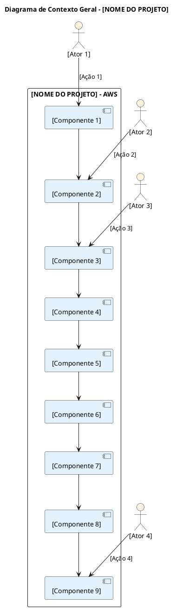

**Substitua os placeholders** com os componentes reais do seu projeto (ex: API Gateway, Lambda, ALB, EC2, RDS, DynamoDB, S3, Cognito, CodePipeline, CloudWatch).

---

## 3. ESPECIFICAÇÃO DOS FLUXOS

---

### 3.1. FLUXO 1: [NOME DO FLUXO 1]

#### 3.1.1. Descrição

[Descrever o fluxo em detalhes: quem inicia, qual o objetivo, quais componentes estão envolvidos.]

**Exemplo:** O [Ator] envia [dados/ação] para a plataforma [NOME DO PROJETO]. O processamento é feito de forma [serverless/IaaS], garantindo [requisitos].

#### 3.1.2. Requisitos Atendidos

| **Requisito** | **Valor** | **Fonte** |
| :--- | :--- | :--- |
| [Requisito 1] | [Valor] | Requisitos Suplementares |
| [Requisito 2] | [Valor] | Requisitos Suplementares |
| [Requisito 3] | [Valor] | Requisitos Suplementares |
| [Requisito 4] | [Valor] | Requisitos Suplementares |

#### 3.1.3. Diagrama de Sequência

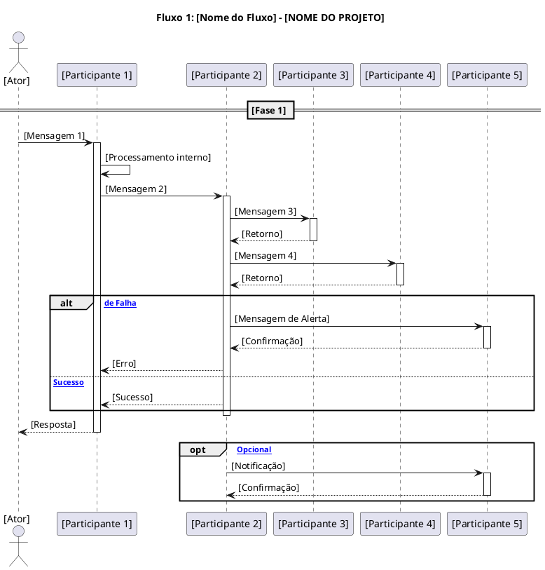

#### 3.1.4. Diagrama de Comunicação

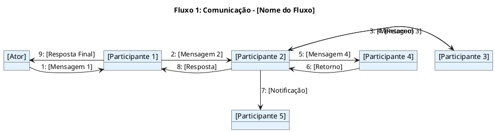

#### 3.1.5. Tabela de Mensagens

| **#** | **De** | **Para** | **Mensagem** | **Protocolo** | **Requisito** |
| :--- | :--- | :--- | :--- | :--- | :--- |
| 1 | [Ator] | [P1] | [Mensagem] | [Protocolo] | [Requisito] |
| 2 | [P1] | [P2] | [Mensagem] | [Protocolo] | [Requisito] |
| 3 | [P2] | [P3] | [Mensagem] | [Protocolo] | [Requisito] |
| 4 | [P3] | [P2] | [Retorno] | [Protocolo] | - |
| 5 | [P2] | [P4] | [Mensagem] | [Protocolo] | [Requisito] |
| 6 | [P4] | [P2] | [Retorno] | [Protocolo] | - |
| 7 | [P2] | [P5] | [Notificação] | [Protocolo] | - |
| 8 | [P2] | [P1] | [Resposta] | [Protocolo] | - |
| 9 | [P1] | [Ator] | [Resposta Final] | [Protocolo] | - |

#### 3.1.6. Riscos e Mitigações

| **Risco** | **Probabilidade** | **Impacto** | **Mitigação** |
| :--- | :--- | :--- | :--- |
| [Risco 1] | [Alta/Média/Baixa] | [Alto/Médio/Baixo] | [Mitigação] |
| [Risco 2] | [Alta/Média/Baixa] | [Alto/Médio/Baixo] | [Mitigação] |
| [Risco 3] | [Alta/Média/Baixa] | [Alto/Médio/Baixo] | [Mitigação] |

---

### 3.2. FLUXO 2: [NOME DO FLUXO 2]

#### 3.2.1. Descrição

[Descrever o fluxo em detalhes.]

#### 3.2.2. Requisitos Atendidos

| **Requisito** | **Valor** | **Fonte** |
| :--- | :--- | :--- |
| [Requisito 1] | [Valor] | Requisitos Suplementares |
| [Requisito 2] | [Valor] | Requisitos Suplementares |
| [Requisito 3] | [Valor] | Requisitos Suplementares |
| [Requisito 4] | [Valor] | Requisitos Suplementares |

#### 3.2.3. Diagrama de Sequência

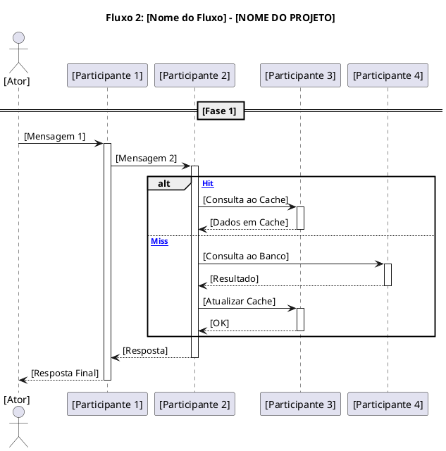

#### 3.2.4. Diagrama de Comunicação

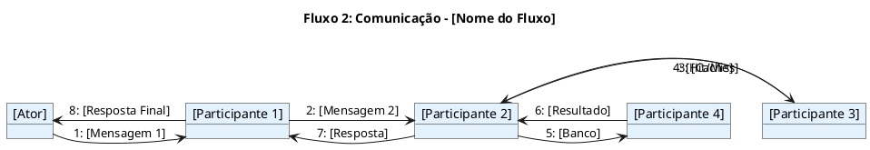

#### 3.2.5. Tabela de Mensagens

| **#** | **De** | **Para** | **Mensagem** | **Protocolo** | **Requisito** |
| :--- | :--- | :--- | :--- | :--- | :--- |
| 1 | [Ator] | [P1] | [Mensagem] | [Protocolo] | [Requisito] |
| 2 | [P1] | [P2] | [Mensagem] | [Protocolo] | [Requisito] |
| 3 | [P2] | [P3] | [Consulta Cache] | [Protocolo] | - |
| 4 | [P3] | [P2] | [Hit/Miss] | [Protocolo] | - |
| 5 | [P2] | [P4] | [Consulta Banco] | [Protocolo] | [Requisito] |
| 6 | [P4] | [P2] | [Resultado] | [Protocolo] | - |
| 7 | [P2] | [P1] | [Resposta] | [Protocolo] | - |
| 8 | [P1] | [Ator] | [Resposta Final] | [Protocolo] | - |

#### 3.2.6. Riscos e Mitigações

| **Risco** | **Probabilidade** | **Impacto** | **Mitigação** |
| :--- | :--- | :--- | :--- |
| [Risco 1] | [Alta/Média/Baixa] | [Alto/Médio/Baixo] | [Mitigação] |
| [Risco 2] | [Alta/Média/Baixa] | [Alto/Médio/Baixo] | [Mitigação] |
| [Risco 3] | [Alta/Média/Baixa] | [Alto/Médio/Baixo] | [Mitigação] |

---

### 3.3. FLUXO 3: [NOME DO FLUXO 3]

#### 3.3.1. Descrição

[Descrever o fluxo em detalhes.]

#### 3.3.2. Requisitos Atendidos

| **Requisito** | **Valor** | **Fonte** |
| :--- | :--- | :--- |
| [Requisito 1] | [Valor] | Requisitos Suplementares |
| [Requisito 2] | [Valor] | Requisitos Suplementares |
| [Requisito 3] | [Valor] | Requisitos Suplementares |

#### 3.3.3. Diagrama de Sequência

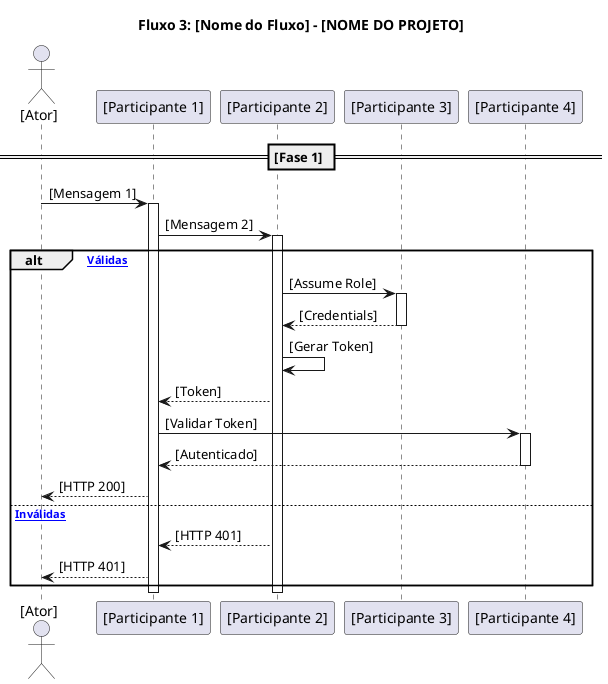

#### 3.3.4. Diagrama de Comunicação

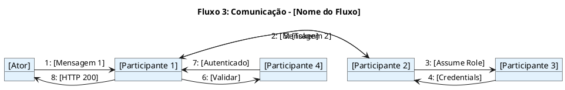

#### 3.3.5. Tabela de Mensagens

| **#** | **De** | **Para** | **Mensagem** | **Protocolo** | **Requisito** |
| :--- | :--- | :--- | :--- | :--- | :--- |
| 1 | [Ator] | [P1] | [Mensagem] | [Protocolo] | [Requisito] |
| 2 | [P1] | [P2] | [Mensagem] | [Protocolo] | [Requisito] |
| 3 | [P2] | [P3] | [Assume Role] | [Protocolo] | [Requisito] |
| 4 | [P3] | [P2] | [Credentials] | [Protocolo] | - |
| 5 | [P2] | [P1] | [Token] | [Protocolo] | [Requisito] |
| 6 | [P1] | [P4] | [Validar] | [Protocolo] | - |
| 7 | [P4] | [P1] | [Autenticado] | [Protocolo] | - |
| 8 | [P1] | [Ator] | [HTTP 200] | [Protocolo] | - |

#### 3.3.6. Riscos e Mitigações

| **Risco** | **Probabilidade** | **Impacto** | **Mitigação** |
| :--- | :--- | :--- | :--- |
| [Risco 1] | [Alta/Média/Baixa] | [Alto/Médio/Baixo] | [Mitigação] |
| [Risco 2] | [Alta/Média/Baixa] | [Alto/Médio/Baixo] | [Mitigação] |
| [Risco 3] | [Alta/Média/Baixa] | [Alto/Médio/Baixo] | [Mitigação] |

---

### 3.4. FLUXO 4: [NOME DO FLUXO 4]

#### 3.4.1. Descrição

[Descrever o fluxo em detalhes.]

#### 3.4.2. Requisitos Atendidos

| **Requisito** | **Valor** | **Fonte** |
| :--- | :--- | :--- |
| [Requisito 1] | [Valor] | Requisitos Suplementares |
| [Requisito 2] | [Valor] | Requisitos Suplementares |
| [Requisito 3] | [Valor] | Requisitos Suplementares |

#### 3.4.3. Diagrama de Sequência

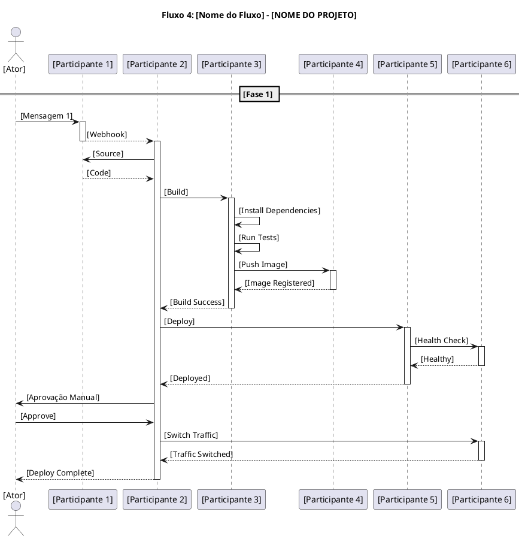

#### 3.4.4. Diagrama de Comunicação

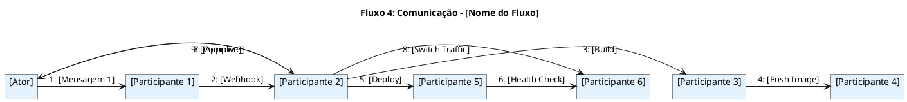

#### 3.4.5. Tabela de Mensagens

| **#** | **De** | **Para** | **Mensagem** | **Protocolo** | **Requisito** |
| :--- | :--- | :--- | :--- | :--- | :--- |
| 1 | [Ator] | [P1] | [Mensagem] | [Protocolo] | [Requisito] |
| 2 | [P1] | [P2] | [Webhook] | [Protocolo] | - |
| 3 | [P2] | [P3] | [Build] | [Protocolo] | [Requisito] |
| 4 | [P3] | [P4] | [Push Image] | [Protocolo] | - |
| 5 | [P2] | [P5] | [Deploy] | [Protocolo] | - |
| 6 | [P5] | [P6] | [Health Check] | [Protocolo] | - |
| 7 | [Ator] | [P2] | [Approve] | [Protocolo] | - |
| 8 | [P2] | [P6] | [Switch Traffic] | [Protocolo] | - |
| 9 | [P2] | [Ator] | [Complete] | [Protocolo] | - |

#### 3.4.6. Riscos e Mitigações

| **Risco** | **Probabilidade** | **Impacto** | **Mitigação** |
| :--- | :--- | :--- | :--- |
| [Risco 1] | [Alta/Média/Baixa] | [Alto/Médio/Baixo] | [Mitigação] |
| [Risco 2] | [Alta/Média/Baixa] | [Alto/Médio/Baixo] | [Mitigação] |
| [Risco 3] | [Alta/Média/Baixa] | [Alto/Médio/Baixo] | [Mitigação] |

---

### 3.5. FLUXO 5: [NOME DO FLUXO 5]

#### 3.5.1. Descrição

[Descrever o fluxo em detalhes.]

#### 3.5.2. Requisitos Atendidos

| **Requisito** | **Valor** | **Fonte** |
| :--- | :--- | :--- |
| [Requisito 1] | [Valor] | Requisitos Suplementares |
| [Requisito 2] | [Valor] | Requisitos Suplementares |
| [Requisito 3] | [Valor] | Requisitos Suplementares |

#### 3.5.3. Diagrama de Sequência

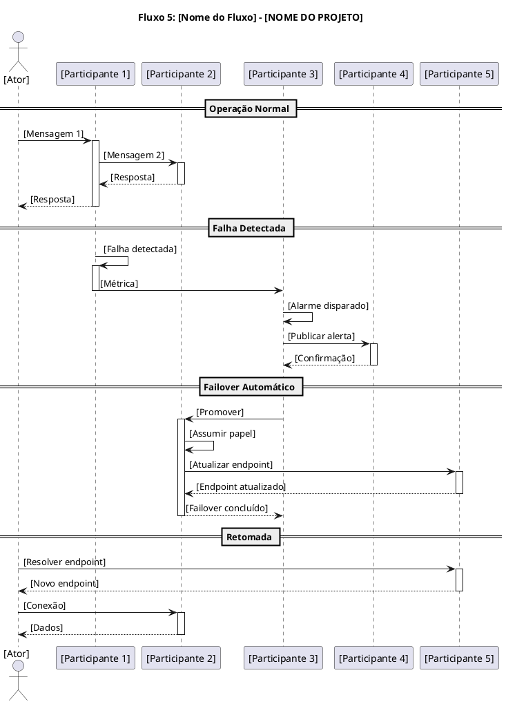

#### 3.5.4. Diagrama de Comunicação

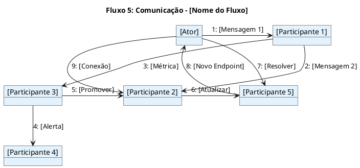

#### 3.5.5. Tabela de Mensagens

| **#** | **De** | **Para** | **Mensagem** | **Protocolo** | **Requisito** |
| :--- | :--- | :--- | :--- | :--- | :--- |
| 1 | [Ator] | [P1] | [Mensagem] | [Protocolo] | [Requisito] |
| 2 | [P1] | [P2] | [Mensagem] | [Protocolo] | [Requisito] |
| 3 | [P1] | [P3] | [Métrica] | [Protocolo] | - |
| 4 | [P3] | [P4] | [Alerta] | [Protocolo] | - |
| 5 | [P3] | [P2] | [Promover] | [Protocolo] | [Requisito] |
| 6 | [P2] | [P5] | [Atualizar] | [Protocolo] | - |
| 7 | [Ator] | [P5] | [Resolver] | [Protocolo] | - |
| 8 | [P5] | [Ator] | [Novo Endpoint] | [Protocolo] | - |
| 9 | [Ator] | [P2] | [Conexão] | [Protocolo] | [Requisito] |

#### 3.5.6. Riscos e Mitigações

| **Risco** | **Probabilidade** | **Impacto** | **Mitigação** |
| :--- | :--- | :--- | :--- |
| [Risco 1] | [Alta/Média/Baixa] | [Alto/Médio/Baixo] | [Mitigação] |
| [Risco 2] | [Alta/Média/Baixa] | [Alto/Médio/Baixo] | [Mitigação] |
| [Risco 3] | [Alta/Média/Baixa] | [Alto/Médio/Baixo] | [Mitigação] |

---

### 3.6. FLUXO 6: [NOME DO FLUXO 6]

#### 3.6.1. Descrição

[Descrever o fluxo em detalhes.]

#### 3.6.2. Requisitos Atendidos

| **Requisito** | **Valor** | **Fonte** |
| :--- | :--- | :--- |
| [Requisito 1] | [Valor] | Requisitos Suplementares |
| [Requisito 2] | [Valor] | Requisitos Suplementares |
| [Requisito 3] | [Valor] | Requisitos Suplementares |

#### 3.6.3. Diagrama de Sequência

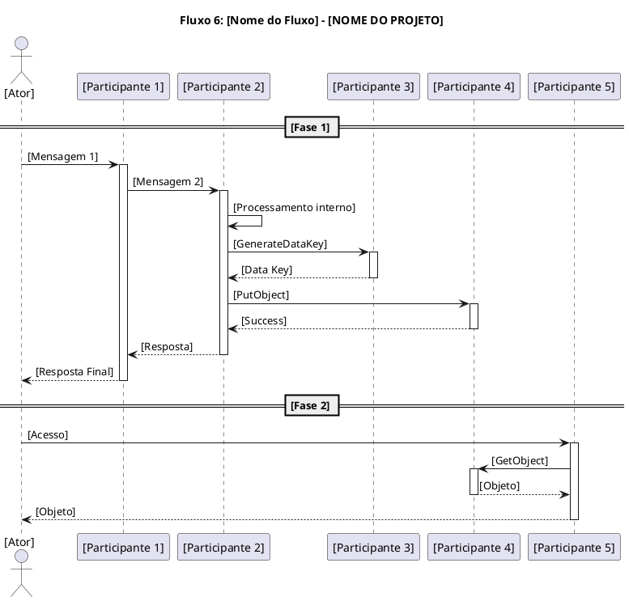

#### 3.6.4. Diagrama de Comunicação

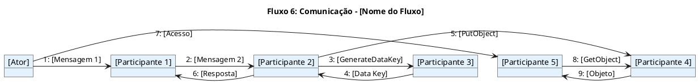

#### 3.6.5. Tabela de Mensagens

| **#** | **De** | **Para** | **Mensagem** | **Protocolo** | **Requisito** |
| :--- | :--- | :--- | :--- | :--- | :--- |
| 1 | [Ator] | [P1] | [Mensagem] | [Protocolo] | [Requisito] |
| 2 | [P1] | [P2] | [Mensagem] | [Protocolo] | [Requisito] |
| 3 | [P2] | [P3] | [GenerateDataKey] | [Protocolo] | [Requisito] |
| 4 | [P3] | [P2] | [Data Key] | [Protocolo] | - |
| 5 | [P2] | [P4] | [PutObject] | [Protocolo] | - |
| 6 | [P2] | [P1] | [Resposta] | [Protocolo] | - |
| 7 | [Ator] | [P5] | [Acesso] | [Protocolo] | - |
| 8 | [P5] | [P4] | [GetObject] | [Protocolo] | - |
| 9 | [P4] | [P5] | [Objeto] | [Protocolo] | - |

#### 3.6.6. Riscos e Mitigações

| **Risco** | **Probabilidade** | **Impacto** | **Mitigação** |
| :--- | :--- | :--- | :--- |
| [Risco 1] | [Alta/Média/Baixa] | [Alto/Médio/Baixo] | [Mitigação] |
| [Risco 2] | [Alta/Média/Baixa] | [Alto/Médio/Baixo] | [Mitigação] |
| [Risco 3] | [Alta/Média/Baixa] | [Alto/Médio/Baixo] | [Mitigação] |

---

## 4. DIAGRAMA DE CLASSES CONSOLIDADO

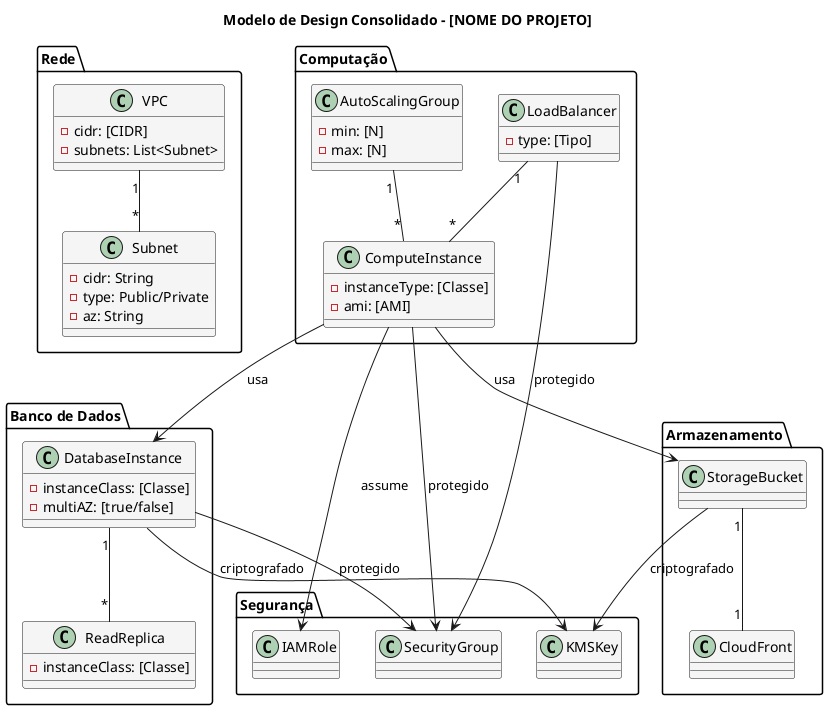

---

## 5. MATRIZ DE RASTREAMENTO CONSOLIDADA

| **Fluxo** | **Requisito (Doc. Suplementar)** | **Caso de Uso (Semana 3)** | **Pacote (Semana 4)** | **Classe (Semana 5/6)** | **Serviços AWS** |
| :--- | :--- | :--- | :--- | :--- | :--- |
| Fluxo 1 | [Requisito] | [UC-ARQ-XXX] | [Pacote] | [Classe] | [Serviços] |
| Fluxo 2 | [Requisito] | [UC-ARQ-XXX] | [Pacote] | [Classe] | [Serviços] |
| Fluxo 3 | [Requisito] | [UC-ARQ-XXX] | [Pacote] | [Classe] | [Serviços] |
| Fluxo 4 | [Requisito] | [UC-ARQ-XXX] | [Pacote] | [Classe] | [Serviços] |
| Fluxo 5 | [Requisito] | [UC-ARQ-XXX] | [Pacote] | [Classe] | [Serviços] |
| Fluxo 6 | [Requisito] | [UC-ARQ-XXX] | [Pacote] | [Classe] | [Serviços] |

---

## 6. CONSIDERAÇÕES FINAIS

### 6.1. Lições Aprendidas

- Os **diagramas de sequência** demonstram a ordem cronológica das mensagens entre componentes.
- Os **diagramas de comunicação** complementam a visão estrutural das interações.
- Os **fluxos críticos** cobrem os principais cenários do projeto.
- A **consolidação da arquitetura** valida a coerência entre todos os artefatos produzidos.
- O **CloudWatch** aparece em todos os fluxos como componente transversal de monitoramento.

### 6.2. Próximos Passos

- **Semana 8:** Consolidação Final do Modelo de Design e Revisão do DAS.
- **Semana 9:** Estratégias de Deploy (Blue-Green, Canary, Rolling) e CI/CD.
- **Semana 10:** Introdução a Containers (Docker) e Orquestração (ECS/EKS).

---

## 7. APROVAÇÕES

| **Função** | **Nome** | **Data** | **Assinatura** |
| :--- | :--- | :--- | :--- |
| Arquiteto de Soluções | | | |
| Arquiteto de Design | | | |
| Professor Responsável | | | |
| Coordenador do Curso | | | |

---

## 8. HISTÓRICO DE VERSÕES

| **Versão** | **Data** | **Autor** | **Descrição das Alterações** |
| :--- | :--- | :--- | :--- |
| 0.1 | [DD/MM/AAAA] | [Nome do Grupo] | Criação inicial do documento. |
| 1.0 | [DD/MM/AAAA] | [Nome do Grupo] | Versão completa com todos os fluxos. |

---

**FIM DO DOCUMENTO**

---

## INSTRUÇÕES DE PREENCHIMENTO

### Como Utilizar Este Modelo

1. **Substitua os placeholders** `[NOME DO PROJETO]`, `[DD/MM/AAAA]`, `[Nome do Grupo]` pelas informações do seu projeto.
2. **Adapte os fluxos** conforme as necessidades específicas do seu projeto (nem todos terão 6 fluxos).
3. **Preencha as tabelas de mensagens** com os detalhes do seu caso.
4. **Utilize os diagramas PlantUML** como base, adaptando os participantes e mensagens.
5. **Documente os riscos** e mitigações para cada fluxo.
6. **Valide a consistência** com os artefatos das semanas anteriores.

### Critérios de Avaliação

| **Critério** | **Peso** | **Descrição** |
| :--- | :--- | :--- |
| **Completude dos Fluxos** | 25% | Todos os fluxos críticos estão modelados? |
| **Diagramas PlantUML** | 20% | Os diagramas estão corretos e completos? |
| **Tabelas de Mensagens** | 20% | As mensagens estão detalhadas e corretas? |
| **Justificativas Técnicas** | 20% | As decisões são bem fundamentadas? |
| **Riscos e Mitigações** | 15% | Os riscos estão identificados e mitigados? |