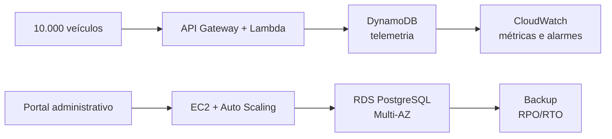

<!-- _class: lead -->

# Requisitos Não-Funcionais
## no contexto de nuvem

### Da visão de negócio às métricas de arquitetura

**Case central:** SwiftTrack IoT  
**Projeto de Cloud | Fase de Inception**

---

## Objetivos da aula

Ao final, você deverá conseguir:

- distinguir requisitos **funcionais** e **não-funcionais**;
- identificar atributos de qualidade relevantes para a nuvem;
- transformar necessidades vagas em **métricas verificáveis**;
- relacionar requisitos a riscos, custos e decisões arquiteturais;
- preparar a base do **Documento de Requisitos Suplementares**.

---

## O que o sistema faz?

### Requisitos funcionais

Descrevem **comportamentos e serviços** que o sistema oferece.

| SwiftTrack precisa... | Exemplo de funcionalidade |
|---|---|
| receber telemetria | aceitar dados GPS dos veículos |
| guardar histórico | consultar rotas anteriores |
| operar o negócio | cadastrar frotas e emitir faturas |
| informar usuários | exibir dashboards e alertas |

> Pergunta-chave: **qual capacidade o sistema entrega?**

---

## Como o sistema deve operar?

### Requisitos não-funcionais

Descrevem **qualidade, restrições e condições de operação**.

| Necessidade | Requisito mensurável |
|---|---|
| tempo real | p95 da ingestão menor que **80 ms** |
| alta concorrência | suportar **5.000 eventos/s** |
| continuidade | disponibilidade da API de **99,95%** |
| privacidade | dados protegidos conforme a **LGPD** |
| orçamento | custo operacional menor que **US$ 1.500/mês** |

> Requisito vago orienta pouco. **Número testável orienta a arquitetura.**

---

## O desafio da SwiftTrack

### Uma visão que precisa ser traduzida

> “Monitorar 10.000 veículos em tempo real sem derrubar o sistema administrativo.”

| Expressão de negócio | Pergunta técnica |
|---|---|
| “em tempo real” | Qual latência é aceitável? |
| “10.000 veículos” | Qual throughput e crescimento esperado? |
| “sem derrubar” | Qual disponibilidade e isolamento? |
| “dados de motoristas” | Como proteger e auditar o acesso? |
| “custo controlado” | Qual limite mensal e por evento? |

---

## Oito categorias para investigar

| Categoria | Pergunta de descoberta |
|---|---|
| **Desempenho** | Qual velocidade e volume? |
| **Disponibilidade** | Quanto tempo pode ficar indisponível? |
| **Confiabilidade** | Como evitar e recuperar falhas? |
| **Segurança** | Quem acessa quais dados? |
| **Escalabilidade** | O que acontece quando a demanda cresce? |
| **Usabilidade** | Como saberemos que é fácil operar? |
| **Manutenibilidade** | Quanto tempo leva para alterar ou corrigir? |
| **Custo** | Qual limite e qual trade-off é aceitável? |

---

## Da frase ao requisito verificável

### Um pequeno roteiro

1. **Encontre o ator e o contexto:** quem usa, quando e para quê?
2. **Escolha o indicador:** latência, percentual, eventos/s, dólares.
3. **Defina a condição de medição:** p95, horário de pico, mês, região.
4. **Fixe o alvo e o limite:** valor que pode ser testado.
5. **Registre o risco e a justificativa:** por que esse número importa?

**Vago:** “A API deve ser rápida.”  
**Verificável:** “A API deve responder a 95% das consultas do dashboard em até **200 ms**, em horário de pico.”

---

## Métricas de desempenho

### Não confunda velocidade com capacidade

- **Latência:** tempo de uma operação, medido em milissegundos.
- **Throughput:** quantidade processada por unidade de tempo, como eventos/s.
- **Concorrência:** operações ou usuários ativos ao mesmo tempo.
- **Percentis:** p95 mostra o tempo abaixo do qual estão 95% das respostas.

| SLO SwiftTrack | Indicador |
|---|---|
| Ingestão em tempo real | p95 menor que **80 ms** |
| Pico de telemetria | mais de **5.000 eventos/s** |
| Dashboard operacional | p95 menor que **200 ms** |

---

## Disponibilidade e confiabilidade

### “Disponível” precisa de uma janela de medição

**Disponibilidade** mede quanto tempo o serviço está operacional.  
**Confiabilidade** considera a capacidade de continuar e se recuperar de falhas.

| Meta | Downtime aproximado |
|---|---|
| 99% | 7 h 18 min/mês |
| 99,9% | 43 min 12 s/mês |
| 99,95% | 21 min 36 s/mês |

**RPO:** quantidade máxima de dados que pode ser perdida.  
**RTO:** tempo máximo aceitável para restaurar o serviço.

SwiftTrack: **RPO menor que 15 min** e **RTO menor que 1 h**.

---

## Segurança como requisito de qualidade

### Controle técnico + evidência

- **Identidade:** MFA para administradores e RBAC por função.
- **Trânsito:** HTTPS com TLS para APIs públicas.
- **Repouso:** criptografia de RDS, DynamoDB, S3 e backups.
- **Segredos:** credenciais no Secrets Manager, nunca no código.
- **Auditoria:** registrar acessos e operações administrativas.
- **LGPD:** minimizar coleta, restringir acesso e definir retenção.

> “Seguro” só é útil quando podemos verificar **o que**, **contra quem** e **como**.

---

## O requisito influencia a arquitetura

**Separar ingestão e gestão** reduz o risco de a escrita massiva de telemetria derrubar o portal.

---

## Trade-offs: qualidade tem custo

### Requisitos não existem isoladamente

| Decisão | Benefício | Pressão criada |
|---|---|---|
| RDS Multi-AZ | maior disponibilidade | custo maior |
| mais réplicas | mais capacidade de leitura | operação e custo |
| retenção longa | histórico completo | armazenamento maior |
| menor latência | melhor experiência | mais recursos |

Para a SwiftTrack, o grupo deve justificar **qual requisito é inegociável** e **qual pode ser flexibilizado** para respeitar US$ 1.500/mês.

---

## Atividade: transforme a visão em SLO

Em grupos, escolha uma categoria e preencha:

| Campo | Resposta do grupo |
|---|---|
| Necessidade de negócio | |
| SLO proposto | |
| Métrica e janela de medição | |
| Justificativa | |
| Risco se não cumprir | |
| Serviço AWS envolvido | |

**Critério:** o SLO deve ser mensurável, realista e ligado a uma decisão arquitetural.

---

## Fechamento

### Checklist de qualidade

- O requisito diz **o que medir**?
- Existe um **alvo numérico**?
- A janela e o método de medição estão claros?
- O valor está ligado a uma necessidade do negócio?
- O risco de não cumprir foi explicitado?
- O custo e os conflitos com outros requisitos foram discutidos?

### Próximo artefato

Consolidar as decisões no **Documento de Requisitos Suplementares**, incluindo desempenho, confiabilidade, segurança, operação, manutenção e custo.
